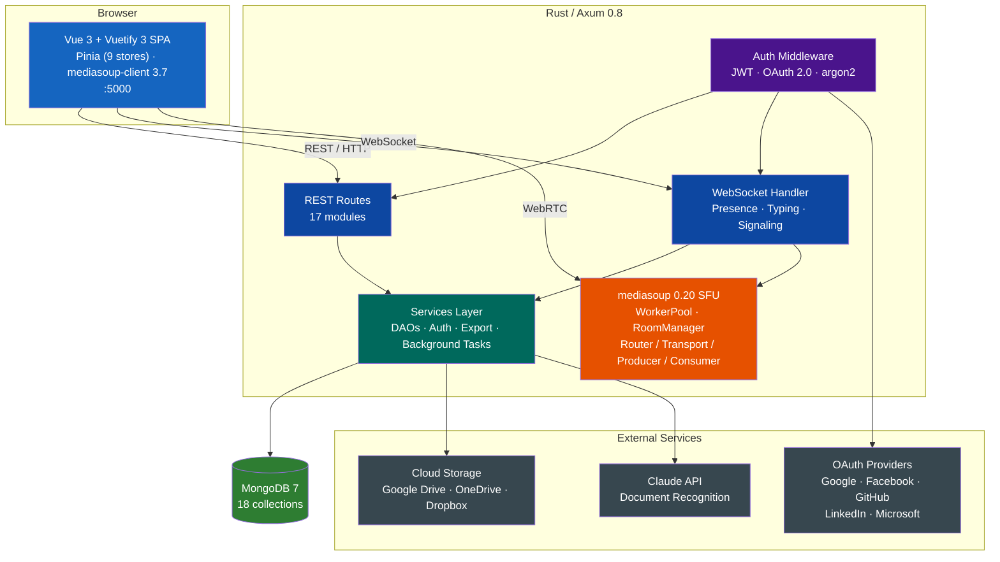

# Roomler2

Real-time communication and collaboration platform with multi-tenancy, channels, chat, video conferencing (mediasoup WebRTC SFU), file sharing, cloud storage integrations, and AI-powered document recognition.

## Features

| Category | Feature | Status |
|----------|---------|--------|
| **Multi-Tenancy** | Organizations with plans (Free/Pro/Business/Enterprise) | :white_check_mark: |
| | Roles & permissions (Owner, Admin, Moderator, Member) | :white_check_mark: |
| | Invite system (shareable links, email invites) | :white_check_mark: |
| | OAuth login (Google, Facebook, GitHub, LinkedIn, Microsoft) | :white_check_mark: |
| **Channels** | Hierarchical channel tree (8 types) | :white_check_mark: |
| | Category, Text, Voice, Announcement, Forum, Stage, DM, GroupDM | :white_check_mark: |
| | Channel explore & member management | :white_check_mark: |
| **Real-Time Chat** | Threaded messages with replies | :white_check_mark: |
| | Reactions (unicode + custom emoji) | :white_check_mark: |
| | Mentions, embeds, attachments, pinning | :white_check_mark: |
| | Typing indicators & presence | :white_check_mark: |
| **Video Conferencing** | mediasoup WebRTC SFU | :white_check_mark: |
| | Instant / Scheduled / Recurring / Persistent meetings | :white_check_mark: |
| | Multiple producers/consumers per participant | :white_check_mark: |
| | Recordings & transcriptions | :white_check_mark: |
| **File Management** | Versioned uploads, multipart upload | :white_check_mark: |
| | Cloud sync (Google Drive, OneDrive, Dropbox) | :white_check_mark: |
| | AI document recognition (Claude API) | :white_check_mark: |
| **Export** | Conversation export to XLSX | :white_check_mark: |
| | PDF export (custom raw PDF 1.4 generator) | :white_check_mark: |
| | Background task processing | :white_check_mark: |
| **WebSocket** | Live presence & typing indicators | :white_check_mark: |
| | Real-time message delivery | :white_check_mark: |
| | Media signaling (join/produce/consume) | :white_check_mark: |
| **Frontend** | Vue 3 + Vuetify 3 SPA | :white_check_mark: |
| | 8 Pinia stores, 10 views | :white_check_mark: |
| | Dark/Light theme, i18n | :white_check_mark: |
| | mediasoup-client composable + VideoTile | :white_check_mark: |

## Tech Stack

| Layer | Technology |
|-------|-----------|
| **Backend** | Rust (edition 2024), Axum 0.8, Tokio |
| **Frontend** | Vue 3, Vuetify 3, Pinia, Vue Router, vue-i18n |
| **Database** | MongoDB 7 (mongodb 3.2 driver) |
| **WebRTC** | mediasoup 0.20 (SFU), mediasoup-client 3.7 |
| **Auth** | JWT (argon2 hashing), httpOnly cookies, OAuth 2.0 |
| **AI** | Claude API (document recognition) |
| **Cloud** | Google Drive, OneDrive, Dropbox (OAuth2 + async_trait) |
| **Testing** | 77 Rust integration tests, 24 Playwright E2E tests |
| **Infrastructure** | Docker Compose (MongoDB, Redis, MinIO, Coturn) |

## Architecture



## Quick Start

```bash
# 1. Start infrastructure
docker-compose up -d    # MongoDB, Redis, MinIO, Coturn

# 2. Configure
cp .env.example .env    # Edit with your settings

# 3. Run backend
cargo build && cargo run   # API at http://localhost:3000

# 4. Run frontend
cd ui && npm install && npm run dev   # UI at http://localhost:5173
```

## Documentation

| Document | Description |
|----------|-------------|
| [Architecture](docs/architecture.md) | System design, crate graph, request flow |
| [Data Model](docs/data-model.md) | All 18 entities, ER diagram, indexes |
| [API Reference](docs/api.md) | REST endpoints, request/response schemas |
| [Frontend](docs/ui.md) | Routes, components, Pinia stores |
| [Real-Time](docs/real-time.md) | WebSocket protocol, presence, media signaling |
| [Testing](docs/testing.md) | 77 integration tests, 24 E2E tests |
| [Deployment](docs/deployment.md) | Docker Compose, environment variables |

## License

MIT
