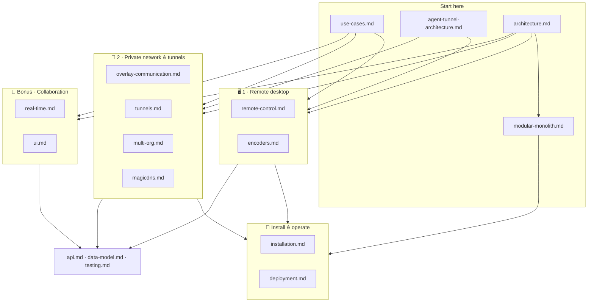

# Roomler AI — documentation index

Roomler is three products on one platform, in this order: **1 · desktop sharing &
remote control**, **2 · your own secure private network** (WireGuard overlay,
tunnels, SOCKS5), and — as the included bonus — **video conferencing & team
collaboration**. The map below shows how the docs hang together; the tables list
every document with its audience.

> **Looking for the USER documentation?** It is at
> **[roomler.ai/docs](https://roomler.ai/docs/)** — per-OS install guides,
> getting started, security and access control, troubleshooting and an FAQ,
> written for people using the product. Source lives in
> [`ui/docs/content/`](../ui/docs/content/) (FR-60, #1165).
>
> **This tree is the ENGINEERING record**: design decisions, field evidence and
> the reasoning behind them, written for whoever maintains the daemon. The two
> are deliberately separate content sets with different audiences — the user
> docs link out to these for depth, and nothing here is republished there.

> **Not an engineer?** Start with [use-cases.md](use-cases.md) — plain-language,
> scenario by scenario, with pictures. The main [README](../README.md) has the
> product tour.

## Start here

| Doc | What it covers |
|---|---|
| [use-cases.md](use-cases.md) | Scenario walkthroughs across all three pillars in plain language, plus the permission model |
| [self-hosting.md](self-hosting.md) | Running the whole product yourself — one compose file, TLS termination, the conference media-port caveat, upgrades and backups |
| [compare/](compare/README.md) | Head-to-head against Tailscale, RustDesk, TeamViewer, MeshCentral and NetBird — each page naming what the other product does better, first |
| [agent-tunnel-architecture.md](agent-tunnel-architecture.md) | The remote-access stack (daemon + CLI + coordination) in five minutes — written for end users and operators |
| [architecture.md](architecture.md) | The whole system: control plane vs the three data planes, workspace crate map, deployment topology |
| [modular-monolith.md](modular-monolith.md) | How the server is composed (FR-69): `roomler-core` + six modules behind one `Module` contract, the DAG, the five build profiles and what each leaves out, runtime capability gating, wire ownership, the hooks that carry the inverse cascades, and the composition baseline that gates every move — and (FR-75) how each profile is proven to CARRY TRAFFIC rather than merely link: a throwaway cell per profile whose 404-vs-401 door probes assert every absence positively, then chat + a real call, remote-desktop frames, and a two-agent overlay ping |

## 🖥️ 1 · Desktop sharing & remote control

*Any of your machines, live in a browser tab — nothing to install on the viewing
side, consent-gated, end-to-end encrypted.*

| Doc | What it covers |
|---|---|
| [remote-control.md](remote-control.md) | Full design: topology, agent internals, `rc:*` signalling, consent/security model, latency budget |
| [encoders.md](encoders.md) | Codec × platform × backend matrix, the hardware-encoder cascade, rate control, capture backends, viewer decode paths |
| [rate-control.md](rate-control.md) | How a session spends its bits: the Priority dial, the per-session control loops, why resolution never flips mid-motion (rc.445), crisp-at-rest, config reference |

## 🔐 2 · Your own secure private network

*All your devices on one private, encrypted network with stable names — plus
port forwards, SOCKS5, SSH without sshd, and exit nodes on top.*

| Doc | What it covers |
|---|---|
| [overlay-communication.md](overlay-communication.md) | **Start here for the overlay** — every carrier path (LAN, public, hole-punch, relay, DERP), inside and outside a corporate VPN, with field-proof |
| [overlay-nat-traversal.md](overlay-nat-traversal.md) | The carrier cascade mechanics: NAT-type probing, srflx hole-punch, cooldowns, PathMonitor |
| [overlay-exit-nodes.md](overlay-exit-nodes.md) | Tailscale-style exit nodes: full-egress routing (v4+v6+DNS) with the never-self-wedge safety model |
| [overlay-wfp.md](overlay-wfp.md) | Windows: surviving a Group-Policy-locked firewall via the Windows Filtering Platform |
| [multi-org.md](multi-org.md) | One device in N organizations: `[[orgs]]`, address blocks, the shared carrier plane, mux NAT |
| [tunnels.md](tunnels.md) | Concepts & protocol: forwards, SOCKS5 (TCP+UDP), mesh mode, declared routes, transports, LocalAPI, CLI |
| [tunnel-install.md](tunnel-install.md) | Step-by-step runbook: install, enroll, ACL policy, open and test a forward from a corporate network |
| [fleet-rpc.md](fleet-rpc.md) | `roomler exec` remote command execution: transport, the four default-deny gates, audit |
| [device-naming.md](device-naming.md) | Fleet name vs MagicDNS label, admin rename + overlay propagation, display_name/tags, the rehydrate-clobber rule, rename-proof exit-node pinning |
| [magicdns.md](magicdns.md) | Resolving peers by name: the resolver and the OS steer as two halves that both must be live, why the steer is gated on the bind (a dead `:53` blackholes the domain host-wide), per-platform steering, the resolver-lifecycle failure modes — and the three diagnostic tools that give confident wrong answers here |
| [ephemeral-nodes.md](ephemeral-nodes.md) | Devices that remove themselves (CI runners, containers): reusable enrollment keys with all four controls, the reaper, clean-stop self-removal, and why a restart is a new device |
| [roomler-ssh.md](roomler-ssh.md) | SSH into any node by overlay address with no `sshd` and no bound port — why the packets are intercepted below the OS, the four default-deny gates, interactive shells on Unix and Windows, `sftp`/`scp`, port forwarding, and the audit + activity records |
| [remote-config.md](remote-config.md) | **PLAN** — enabling exec / SSH from the dashboard without making gate 4 server-settable: the device-local opt-in, why server-derived state was rejected, primary-only under multi-org, and who may flip a switch they cannot themselves walk through |

## 💬 Bonus · Video conferencing & team collaboration

*Rooms, threaded chat, and HD calls — included with the platform, running on the
same accounts and server.*

| Doc | What it covers |
|---|---|
| [real-time.md](real-time.md) | The WebSocket surfaces: user events, presence, mediasoup signalling, the `rc:*` agent protocol, DERP |
| [ui.md](ui.md) | Frontend map: views, stores, composables, the remote-desktop viewer, observability components |

## 🔧 Install & operate

| Doc | What it covers |
|---|---|
| [installation.md](installation.md) | Every install path: wizard, MSI flavours, `.deb`/`.pkg`, terminal installers, enrollment, service modes, self-update |
| [code-signing.md](code-signing.md) | How every published artifact is signed: Azure Artifact Signing over GitHub OIDC, macOS notarisation, GPG + build provenance, and the operator scripts that (re)establish the credentials |
| [linux-self-update.md](linux-self-update.md) | Design of the Linux self-update path (tarball as the universal artifact) |
| [deployment.md](deployment.md) | Deploying the server: Docker image and its profiles, the hosted-image pipeline (built on Actions, served from GHCR, promoted by a dispatch — FR-73), dev compose stack, environment, health, release pipelines |
| [multi-pod-scale-out.md](multi-pod-scale-out.md) | The settled multi-pod architecture: identity, tenant-affinity routing, mediasoup scale ladder |
| [operator-systemcontext-smoke.md](operator-systemcontext-smoke.md) | Operator checklist: verifying Windows SystemContext (pre-logon control) on a field host |
| [testing.md](testing.md) | Test suites and harnesses: integration, unit, E2E, capture smoke, k8s E2E lane |
| [business-model.md](business-model.md) | How the project earns: the three revenue mechanisms, what actually costs money (and what deliberately does not), the tier ladder and the measure-then-price sequence |
| [newsletter.md](newsletter.md) | The subscriber list and the sending program (FR-39/FR-58): public subscribe/confirm/unsubscribe + RFC-8058 one-click, the platform-admin issue pipeline (claim-first ledger, preview = the sent bytes), and the ops prerequisites for a real campaign |
| [api.md](api.md) | Every HTTP route (method + path + purpose) and the auth model |
| [data-model.md](data-model.md) | Every MongoDB collection with ER diagrams, indexes, TTLs |

## 📐 Design records

Point-in-time design documents for features that are in flight or deliberately
deferred. They record *why*, not current behaviour — the feature docs above stay
authoritative.

| Doc | Status |
|---|---|
| [overlay-session-proof.md](overlay-session-proof.md) | In flight — moving the network plane out of the Windows session (`netd`, flag-off scaffold) |
| [overlay-warm-relay.md](overlay-warm-relay.md) | Shipping — a UDP relay leg that survives the corporate VPN (C4) |
| [overlay-symmetric-punch.md](overlay-symmetric-punch.md) | Design — symmetric-NAT-aware punch completion via observed-source promotion |
| [moq-remote-desktop-evaluation.md](moq-remote-desktop-evaluation.md) | Deferred — Media-over-QUIC evaluated for the remote desktop; revisit criteria inside |
