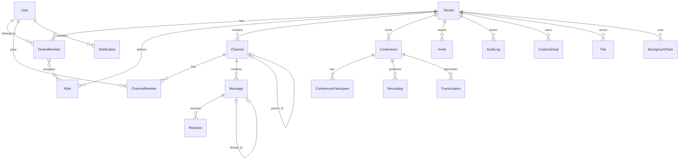

# Data Model

Roomler2 uses MongoDB with 18 collections. All models use `ObjectId` for `_id` and include `created_at` / `updated_at` timestamps.

## ER Diagram

## Entities

### User

Collection: `users`

| Field | Type | Description |
|-------|------|-------------|
| `_id` | ObjectId | Primary key |
| `email` | String | Unique |
| `username` | String | Unique |
| `display_name` | String | Display name |
| `avatar` | Option\<String\> | Avatar URL |
| `password_hash` | Option\<String\> | Argon2 hash (omitted in serialization) |
| `status` | UserStatusInfo | Custom status text + emoji + expiry |
| `presence` | Presence | `online`, `idle`, `dnd`, `offline`, `invisible` |
| `locale` | String | Default: `en-US` |
| `timezone` | String | Default: `UTC` |
| `is_verified` | bool | Email verification |
| `is_mfa_enabled` | bool | MFA flag |
| `last_active_at` | Option\<DateTime\> | Last activity |
| `oauth_providers` | Vec\<OAuthProvider\> | OAuth connections (provider, provider_id, tokens) |
| `notification_preferences` | NotificationPrefs | email, push, desktop, mute_all |
| `created_at` | DateTime | |
| `updated_at` | DateTime | |
| `deleted_at` | Option\<DateTime\> | Soft delete |

### Tenant

Collection: `tenants`

| Field | Type | Description |
|-------|------|-------------|
| `_id` | ObjectId | Primary key |
| `name` | String | Organization name |
| `slug` | String | Unique URL slug |
| `description` | Option\<String\> | |
| `icon` | Option\<String\> | |
| `owner_id` | ObjectId | Creator user |
| `plan` | Plan | `free`, `pro`, `business`, `enterprise` |
| `features` | Vec\<String\> | Enabled feature flags |
| `settings` | TenantSettings | locale, notifications, MFA, guest access, max_members, file_upload_limit |
| `billing` | Option\<BillingInfo\> | customer_id, subscription_id, period_end |
| `integrations` | Option\<IntegrationSettings\> | Google Drive, OneDrive, Dropbox OAuth credentials |
| `is_archived` | bool | |
| `created_at` | DateTime | |
| `updated_at` | DateTime | |
| `deleted_at` | Option\<DateTime\> | Soft delete |

### TenantMember

Collection: `tenant_members`

| Field | Type | Description |
|-------|------|-------------|
| `_id` | ObjectId | Primary key |
| `tenant_id` | ObjectId | |
| `user_id` | ObjectId | |
| `nickname` | Option\<String\> | Tenant-specific nickname |
| `role_ids` | Vec\<ObjectId\> | Assigned roles |
| `joined_at` | DateTime | |
| `is_pending` | bool | Pending acceptance |
| `is_muted` | bool | |
| `notification_override` | Option\<NotificationLevel\> | `all`, `mentions`, `nothing` |
| `invited_by` | Option\<ObjectId\> | |
| `last_seen_at` | Option\<DateTime\> | |
| `created_at` | DateTime | |
| `updated_at` | DateTime | |

### Role

Collection: `roles`

| Field | Type | Description |
|-------|------|-------------|
| `_id` | ObjectId | Primary key |
| `tenant_id` | ObjectId | |
| `name` | String | Unique per tenant |
| `description` | Option\<String\> | |
| `color` | Option\<u32\> | Display color |
| `position` | u32 | Sort order |
| `permissions` | u64 | Bitfield (24 flags, see [Use Cases](use-cases.md)) |
| `is_default` | bool | Auto-assigned to new members |
| `is_managed` | bool | System-managed, cannot be deleted |
| `is_mentionable` | bool | Can be @mentioned |
| `is_hoisted` | bool | Displayed separately in member list |
| `created_at` | DateTime | |
| `updated_at` | DateTime | |

### Channel

Collection: `channels`

| Field | Type | Description |
|-------|------|-------------|
| `_id` | ObjectId | Primary key |
| `tenant_id` | ObjectId | |
| `parent_id` | Option\<ObjectId\> | Parent channel (for hierarchy) |
| `channel_type` | ChannelType | `category`, `text`, `voice`, `announcement`, `forum`, `stage`, `dm`, `group_dm` |
| `name` | String | |
| `path` | String | Unique per tenant (hierarchical path) |
| `topic` | Option\<TopicInfo\> | Topic text, set_by, set_at |
| `purpose` | Option\<String\> | |
| `icon` | Option\<String\> | |
| `position` | u32 | Sort order within parent |
| `is_private` | bool | |
| `is_archived` | bool | |
| `is_read_only` | bool | |
| `is_default` | bool | Auto-join for new members |
| `permission_overwrites` | Vec\<PermissionOverwrite\> | Per-role or per-user allow/deny overrides |
| `tags` | Vec\<String\> | |
| `media_settings` | Option\<MediaSettings\> | bitrate, user_limit, video_quality_mode |
| `creator_id` | ObjectId | |
| `last_message_id` | Option\<ObjectId\> | |
| `last_activity_at` | Option\<DateTime\> | |
| `member_count` | u32 | |
| `message_count` | u64 | |
| `created_at` | DateTime | |
| `updated_at` | DateTime | |
| `deleted_at` | Option\<DateTime\> | Soft delete |

### ChannelMember

Collection: `channel_members`

| Field | Type | Description |
|-------|------|-------------|
| `_id` | ObjectId | Primary key |
| `tenant_id` | ObjectId | |
| `channel_id` | ObjectId | |
| `user_id` | ObjectId | |
| `joined_at` | DateTime | |
| `last_read_message_id` | Option\<ObjectId\> | Last message the user has read |
| `last_read_at` | Option\<DateTime\> | |
| `unread_count` | u32 | |
| `mention_count` | u32 | |
| `notification_override` | Option\<NotificationLevel\> | |
| `is_muted` | bool | |
| `is_pinned` | bool | Pinned in sidebar |
| `created_at` | DateTime | |
| `updated_at` | DateTime | |

### Message

Collection: `messages`

| Field | Type | Description |
|-------|------|-------------|
| `_id` | ObjectId | Primary key |
| `tenant_id` | ObjectId | |
| `channel_id` | ObjectId | |
| `thread_id` | Option\<ObjectId\> | Parent message (if reply in thread) |
| `is_thread_root` | bool | Whether this message started a thread |
| `thread_metadata` | Option\<ThreadMetadata\> | reply_count, last_reply_at, participant_ids, is_locked, is_archived |
| `author_id` | ObjectId | |
| `author_type` | AuthorType | `user`, `bot`, `webhook`, `system` |
| `content` | String | |
| `content_type` | ContentType | `text`, `markdown`, `rich_text` |
| `message_type` | MessageType | `default`, `system_join`, `system_leave`, `system_pin`, `call`, `reply` |
| `embeds` | Vec\<Embed\> | URL previews, rich embeds |
| `attachments` | Vec\<MessageAttachment\> | file_id, filename, content_type, size, url |
| `mentions` | Mentions | users, roles, channels, everyone, here |
| `reaction_summary` | Vec\<ReactionSummary\> | emoji + count aggregation |
| `referenced_message_id` | Option\<ObjectId\> | Quoted/replied message |
| `is_pinned` | bool | |
| `is_edited` | bool | |
| `edited_at` | Option\<DateTime\> | |
| `nonce` | Option\<String\> | Client deduplication |
| `created_at` | DateTime | |
| `updated_at` | DateTime | |
| `deleted_at` | Option\<DateTime\> | Soft delete |

### Reaction

Collection: `reactions`

| Field | Type | Description |
|-------|------|-------------|
| `_id` | ObjectId | Primary key |
| `tenant_id` | ObjectId | |
| `channel_id` | ObjectId | |
| `message_id` | ObjectId | |
| `user_id` | ObjectId | |
| `emoji` | EmojiRef | emoji_type (`unicode` / `custom`), value, custom_emoji_id |
| `created_at` | DateTime | |

### Conference

Collection: `conferences`

| Field | Type | Description |
|-------|------|-------------|
| `_id` | ObjectId | Primary key |
| `tenant_id` | ObjectId | |
| `channel_id` | Option\<ObjectId\> | Associated channel |
| `subject` | String | Meeting title |
| `description` | Option\<String\> | |
| `conference_type` | ConferenceType | `instant`, `scheduled`, `recurring`, `persistent` |
| `status` | ConferenceStatus | `scheduled`, `in_progress`, `ended`, `cancelled` |
| `start_time` | Option\<DateTime\> | Planned start |
| `end_time` | Option\<DateTime\> | Planned end |
| `actual_start_time` | Option\<DateTime\> | |
| `actual_end_time` | Option\<DateTime\> | |
| `duration` | Option\<u32\> | Minutes |
| `timezone` | Option\<String\> | |
| `recurrence` | Option\<Recurrence\> | pattern (daily/weekly/monthly), interval, days_of_week, end_date |
| `join_url` | String | |
| `meeting_code` | String | Unique |
| `passcode` | Option\<String\> | |
| `waiting_room` | bool | |
| `organizer_id` | ObjectId | |
| `co_organizer_ids` | Vec\<ObjectId\> | |
| `settings` | ConferenceSettings | host_video, participant_video, mute_on_entry, chat, screen_share, auto_recording, auto_transcription, max_participants |
| `participant_count` | u32 | |
| `peak_participant_count` | u32 | |
| `created_at` | DateTime | |
| `updated_at` | DateTime | |

### ConferenceParticipant

Collection: `conference_participants`

| Field | Type | Description |
|-------|------|-------------|
| `_id` | ObjectId | Primary key |
| `tenant_id` | ObjectId | |
| `conference_id` | ObjectId | |
| `user_id` | Option\<ObjectId\> | None for external guests |
| `display_name` | String | |
| `email` | Option\<String\> | |
| `is_external` | bool | |
| `role` | ParticipantRole | `organizer`, `co_organizer`, `presenter`, `attendee` |
| `sessions` | Vec\<ParticipantSession\> | joined_at, left_at, duration, device_type |
| `is_muted` | bool | |
| `is_video_on` | bool | |
| `is_screen_sharing` | bool | |
| `is_hand_raised` | bool | |
| `total_duration` | u32 | Seconds |
| `created_at` | DateTime | |
| `updated_at` | DateTime | |

### Recording

Collection: `recordings`

| Field | Type | Description |
|-------|------|-------------|
| `_id` | ObjectId | Primary key |
| `tenant_id` | ObjectId | |
| `conference_id` | ObjectId | |
| `recording_type` | RecordingType | `video`, `audio`, `screen_share`, `chat_log` |
| `status` | RecordingStatus | `processing`, `available`, `failed`, `deleted` |
| `file` | StorageFile | provider, bucket, key, url, content_type, size, duration, resolution |
| `started_at` | DateTime | |
| `ended_at` | DateTime | |
| `visibility` | Visibility | `private`, `members`, `organization` |
| `allow_download` | bool | Default: true |
| `expires_at` | Option\<DateTime\> | |
| `created_at` | DateTime | |
| `updated_at` | DateTime | |
| `deleted_at` | Option\<DateTime\> | Soft delete |

### Transcription

Collection: `transcriptions`

| Field | Type | Description |
|-------|------|-------------|
| `_id` | ObjectId | Primary key |
| `tenant_id` | ObjectId | |
| `conference_id` | ObjectId | |
| `recording_id` | Option\<ObjectId\> | |
| `status` | TranscriptionStatus | `processing`, `available`, `failed` |
| `language` | String | |
| `format` | TranscriptFormat | `vtt`, `srt`, `json` |
| `content_url` | String | |
| `segments` | Vec\<TranscriptSegment\> | speaker_id, speaker_name, start_time, end_time, text, confidence |
| `summary` | Option\<String\> | AI-generated summary |
| `action_items` | Vec\<ActionItem\> | text, assignee, due_date, completed |
| `created_at` | DateTime | |
| `updated_at` | DateTime | |

### File

Collection: `files`

| Field | Type | Description |
|-------|------|-------------|
| `_id` | ObjectId | Primary key |
| `tenant_id` | ObjectId | |
| `uploaded_by` | ObjectId | |
| `context` | FileContext | context_type (message/document/profile/channel/conference), entity_id, channel_id |
| `filename` | String | |
| `display_name` | Option\<String\> | |
| `description` | Option\<String\> | |
| `storage_provider` | StorageProvider | `s3`, `minio`, `local` |
| `storage_bucket` | String | |
| `storage_key` | String | |
| `url` | String | |
| `content_type` | String | MIME type |
| `size` | u64 | Bytes |
| `checksum` | Option\<String\> | |
| `dimensions` | Option\<Dimensions\> | width, height (images/videos) |
| `duration` | Option\<u32\> | Seconds (audio/video) |
| `thumbnails` | Vec\<Thumbnail\> | size, url, width, height |
| `version` | u32 | Default: 1 |
| `previous_version_id` | Option\<ObjectId\> | Version chain |
| `is_current_version` | bool | Default: true |
| `external_source` | Option\<ExternalSource\> | provider (google_drive/onedrive/dropbox), external_id, external_url, sync_status |
| `scan_status` | ScanStatus | `pending`, `clean`, `malware`, `skipped` |
| `visibility` | Visibility | `private`, `members`, `organization` |
| `recognized_content` | Option\<RecognizedContent\> | raw_text, structured_data, document_type, confidence, processed_at |
| `created_at` | DateTime | |
| `updated_at` | DateTime | |
| `deleted_at` | Option\<DateTime\> | Soft delete |

### Invite

Collection: `invites`

| Field | Type | Description |
|-------|------|-------------|
| `_id` | ObjectId | Primary key |
| `tenant_id` | ObjectId | |
| `channel_id` | Option\<ObjectId\> | Channel-scoped invite |
| `code` | String | Unique invite code |
| `inviter_id` | ObjectId | |
| `target_email` | Option\<String\> | Specific recipient |
| `target_user_id` | Option\<ObjectId\> | |
| `max_uses` | Option\<u32\> | |
| `use_count` | u32 | |
| `expires_at` | Option\<DateTime\> | |
| `assign_role_ids` | Vec\<ObjectId\> | Roles to assign on acceptance |
| `status` | InviteStatus | `active`, `expired`, `revoked`, `exhausted` |
| `created_at` | DateTime | |
| `updated_at` | DateTime | |

### BackgroundTask

Collection: `background_tasks`

| Field | Type | Description |
|-------|------|-------------|
| `_id` | ObjectId | Primary key |
| `tenant_id` | ObjectId | |
| `user_id` | ObjectId | |
| `task_type` | String | |
| `category` | TaskCategory | `recording`, `transcription`, `export`, `import`, `recognition` |
| `status` | TaskStatus | `pending`, `processing`, `completed`, `failed`, `expired` |
| `params` | JSON | Task-specific parameters |
| `logs` | Vec\<String\> | Execution logs |
| `progress` | u8 | 0-100 |
| `file_path` | Option\<String\> | Output file path |
| `file_name` | Option\<String\> | Output file name |
| `error` | Option\<String\> | Error message if failed |
| `started_at` | Option\<DateTime\> | |
| `completed_at` | Option\<DateTime\> | |
| `expires_at` | DateTime | |
| `created_at` | DateTime | |
| `updated_at` | DateTime | |

### AuditLog

Collection: `audit_logs`

| Field | Type | Description |
|-------|------|-------------|
| `_id` | ObjectId | Primary key |
| `tenant_id` | ObjectId | |
| `actor_id` | Option\<ObjectId\> | Who performed the action |
| `actor_type` | ActorType | `user`, `bot`, `system`, `webhook` |
| `action` | String | e.g. `channel.create`, `message.delete` |
| `target_type` | String | e.g. `channel`, `message` |
| `target_id` | Option\<ObjectId\> | |
| `changes` | Vec\<AuditChange\> | field, old_value, new_value |
| `metadata` | AuditMetadata | ip, user_agent, reason |
| `created_at` | DateTime | |

### Notification

Collection: `notifications`

| Field | Type | Description |
|-------|------|-------------|
| `_id` | ObjectId | Primary key |
| `tenant_id` | ObjectId | |
| `user_id` | ObjectId | Recipient |
| `notification_type` | NotificationType | `message`, `mention`, `reaction`, `invite`, `call`, `task_complete` |
| `title` | String | |
| `body` | String | |
| `link` | Option\<String\> | Deep link |
| `source` | NotificationSource | entity_type, entity_id, actor_id |
| `is_read` | bool | |
| `read_at` | Option\<DateTime\> | |
| `created_at` | DateTime | |

### CustomEmoji

Collection: `custom_emojis`

| Field | Type | Description |
|-------|------|-------------|
| `_id` | ObjectId | Primary key |
| `tenant_id` | ObjectId | |
| `name` | String | Unique per tenant |
| `image_url` | String | |
| `is_animated` | bool | |
| `creator_id` | ObjectId | |
| `allowed_role_ids` | Option\<Vec\<ObjectId\>\> | Restrict to specific roles |
| `created_at` | DateTime | |
| `updated_at` | DateTime | |

## Indexes

| Collection | Keys | Unique |
|------------|------|--------|
| `tenants` | `{ slug: 1 }` | Yes |
| `tenants` | `{ owner_id: 1 }` | No |
| `users` | `{ email: 1 }` | Yes |
| `users` | `{ username: 1 }` | Yes |
| `tenant_members` | `{ tenant_id: 1, user_id: 1 }` | Yes |
| `tenant_members` | `{ user_id: 1 }` | No |
| `roles` | `{ tenant_id: 1, name: 1 }` | Yes |
| `roles` | `{ tenant_id: 1, position: 1 }` | No |
| `channels` | `{ tenant_id: 1, parent_id: 1, position: 1 }` | No |
| `channels` | `{ tenant_id: 1, path: 1 }` | Yes |
| `channels` | `{ tenant_id: 1, name: 1, channel_type: 1 }` | No |
| `channels` | `{ tenant_id: 1, is_default: 1 }` | No |
| `channel_members` | `{ channel_id: 1, user_id: 1 }` | Yes |
| `channel_members` | `{ user_id: 1, tenant_id: 1 }` | No |
| `messages` | `{ channel_id: 1, created_at: -1 }` | No |
| `messages` | `{ thread_id: 1, created_at: 1 }` | No |
| `messages` | `{ tenant_id: 1, author_id: 1, created_at: -1 }` | No |
| `messages` | `{ channel_id: 1, is_pinned: 1 }` | No |
| `messages` | `{ mentions.users: 1 }` | No |
| `reactions` | `{ message_id: 1, emoji.value: 1, user_id: 1 }` | Yes |
| `conferences` | `{ tenant_id: 1, status: 1, start_time: -1 }` | No |
| `conferences` | `{ organizer_id: 1, start_time: -1 }` | No |
| `conferences` | `{ meeting_code: 1 }` | Yes |
| `conference_participants` | `{ conference_id: 1, user_id: 1 }` | No |
| `conference_participants` | `{ user_id: 1, tenant_id: 1 }` | No |
| `recordings` | `{ conference_id: 1, recording_type: 1 }` | No |
| `recordings` | `{ tenant_id: 1, status: 1 }` | No |
| `transcriptions` | `{ conference_id: 1 }` | No |
| `transcriptions` | `{ tenant_id: 1, status: 1 }` | No |
| `files` | `{ tenant_id: 1, context.context_type: 1, context.entity_id: 1 }` | No |
| `files` | `{ tenant_id: 1, uploaded_by: 1, created_at: -1 }` | No |
| `files` | `{ tenant_id: 1, context.channel_id: 1, created_at: -1 }` | No |
| `files` | `{ external_source.provider: 1, external_source.external_id: 1 }` | No |
| `invites` | `{ code: 1 }` | Yes |
| `invites` | `{ tenant_id: 1, status: 1 }` | No |
| `background_tasks` | `{ tenant_id: 1, user_id: 1, status: 1 }` | No |
| `audit_logs` | `{ tenant_id: 1, created_at: -1 }` | No |
| `audit_logs` | `{ tenant_id: 1, action: 1, created_at: -1 }` | No |
| `audit_logs` | `{ tenant_id: 1, actor_id: 1, created_at: -1 }` | No |
| `notifications` | `{ user_id: 1, is_read: 1, created_at: -1 }` | No |
| `notifications` | `{ tenant_id: 1, user_id: 1 }` | No |
| `custom_emojis` | `{ tenant_id: 1, name: 1 }` | Yes |
