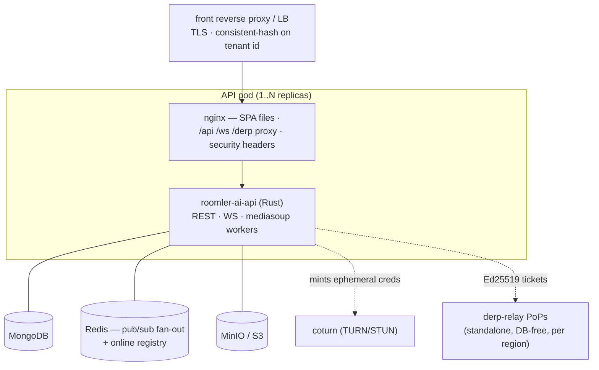
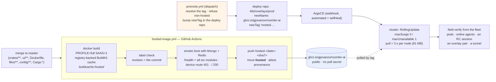

# Deployment

Deploying the Roomler server and its supporting infrastructure. The native fleet
(agents, CLI, wizard) is *not* part of the server image — it ships through GitHub
Releases and the server's installer proxies ([installation.md](installation.md)).
*As of 0.3.0-rc.381.*

## Topology



## The server image

One multi-stage `Dockerfile`:

1. `rust:1.95-bookworm` (the toolchain `rust-toolchain.toml` pins) — builds
   `roomler-ai-api` (+ `derp-relay`) in three layers (FR-73 P1b): `chef` (toolchain +
   `cargo-chef`), `planner` (the dependency recipe from the manifests) and `builder`
   (`cargo chef cook` = every dependency, the mediasoup C++ worker included, as ONE
   cached layer; then the real build over only the Rust sources — a UI-only change
   never touches a Rust layer). Two build args select the composition (FR-69 P8):
   `PROFILE` (`full` | `collab` | `remote` | `mesh` | `access`, the Cargo feature
   aggregate the api crate is built with) and `SAAS` (`1` adds the hosted service's
   billing + newsletter module). **The hosted build passes `PROFILE=full SAAS=1`** —
   also the defaults; the self-host publish workflow passes `SAAS=0` and asserts it.
2. `oven/bun:1` — builds the Vue SPA
3. `debian:trixie-slim` — runtime: **nginx + the binary in one image**, SPA at
   `/var/www/roomler-ai`, nginx config from `files/nginx-pod.conf` (SPA fallback,
   API/WS proxy, security headers incl. HSTS + CSP), `EXPOSE 80`

## The hosted image pipeline (FR-73)

Since 2026-09-05 the hosted image is **built by GitHub Actions on every merge to `master`**,
served from the public package on GHCR, and **promoted to prod by a dispatch** — the build host
no longer builds or serves it ([FR-73](fr/FR-73-image-build-on-github.md)).



| Step | Who | Measured (first day) |
|---|---|---|
| build → tag on GHCR | the workflow, on every merge | cold 13 min 37 s build / 15 min 01 s merge → tag (the `COPY . .` Dockerfile), 17 min 42 s cold with the chef layers' first export; **warm: a Rust change 6 min 49 s, a UI-only change 1 min 04 s, no change 10 s** (the cache holds the previous build's layers, so consecutive merges reuse what they share) |
| promote | a human, `gh workflow run promote.yml -f tag=…` (empty tag = the `hosted` pointer) | runs in the `release` environment, whose secret `DEPLOY_REPO_TOKEN` it uses after proving write access with a dry-run push (verified 2026-09-06); without the secret the job prints the exact bump |
| roll | ArgoCD, one pod at a time | 20 s from the deploy-repo push to both pods on the new image; pulls 3.3 s / 2.7 s per node |
| verify | from the fleet, after every roll | the workflow only proves the public `/health` kept answering |

Two things the lane never does: it never writes `latest` (that is the self-host `full` image
without `saas`, owned by `publish-selfhost-image.yml`), and it never deploys — a roll re-homes
every long-lived socket on the replaced pod (agents, RC sessions, tunnels, DERP), so which merge
becomes prod, and when, stays a decision. Retention on GHCR is `ghcr-retention.yml` (Mondays):
untagged BuildKit cache manifests and `hosted-*` tags beyond the newest 20 — never `latest`, `v*`,
a per-arch or per-profile tag, `buildcache-*`, or an attestation (GHCR stores those untagged,
referenced by a `sha256-<subject>` index; the job reads each candidate's manifest back and deletes
only cache configs).

**Break-glass** (a GitHub outage, or a fix that must not wait for a runner): the build host's
recipe in `CLAUDE.md` still works — build, push to the build host's own registry, then set **both**
`newName: registry.roomler.ai/roomler-ai` and `newTag` in the deploy repo. `promote` refuses until
`newName` is switched back to GHCR. Rehearsed after the switch on 2026-09-05: a warm build of
master in 9 min 38 s, pushed in 9 s, not deployed.

## Development stack

```bash
docker compose up -d
```

| Service | Port | Purpose |
|---|---|---|
| `mongo:7` | 27019→27017 | database (dev credentials in the compose file) |
| `redis:7-alpine` | 6379 | pub/sub + presence |
| `minio/minio` | 9000 (API) / 9001 (console) | S3-compatible file storage |
| `coturn/coturn` | host network | TURN relay (`turnserver.conf` — rotate the shared secret!) |

Then `cargo run --bin roomler-ai-api` (API :3000) and `cd ui && bun run dev`
(SPA :5000, proxying `/api` + `/ws` to :5001).

## Configuration

Everything is env-configurable with the `ROOMLER__` prefix (double underscore =
nesting), loaded via the `config` crate. The ones that matter first:

| Variable | Purpose |
|---|---|
| `ROOMLER__DATABASE__URL` | MongoDB connection string |
| `ROOMLER__JWT__SECRET` | **Must be set in production** — with `ROOMLER__APP__ENVIRONMENT=production` the server refuses to boot on the default |
| `ROOMLER__JWT__PREVIOUS_SECRETS` | Comma-separated retired secrets that still **verify** but no longer sign. See [Rotating the JWT secret](#rotating-the-jwt-secret) |
| `ROOMLER__APP__FRONTEND_URL` | Public origin (also the CORS default — unset `cors_origins` allows only this origin) |
| `ROOMLER__APP__CORS_ORIGINS` | Explicit allow-list; `"*"` = deliberate permissive mode (warns) |
| `ROOMLER__TURN__SHARED_SECRET` | coturn REST-auth secret (never committed) |
| `ROOMLER__MEDIASOUP__ANNOUNCED_IP_MAP` | `<node_ip>=<public_ip>,…` — per-pod announced IP resolution for multi-node clusters |
| `ROOMLER__STRIPE__*` / `ROOMLER__CLAUDE__*` / `ROOMLER__S3__*` / SMTP / OAuth | Integrations |

Rate limiting (per-IP governor + per-account brute-force gate) and JWT TTLs are
also settings — see `crates/config/src/settings.rs` for the full surface.

### Rotating the JWT secret

One secret signs six audiences (access, refresh, agent-enrollment, agent,
tunnel-enrollment, tunnel-client). Changing it used to invalidate every live
token at once — including every enrolled agent's **one-year** token, i.e. a
fleet-wide re-enrollment by hand. `previous_secrets` makes it a rolling change:

```bash
# 1. Both verify; only the new one signs. Restart/roll the pods.
ROOMLER__JWT__SECRET=<new>
ROOMLER__JWT__PREVIOUS_SECRETS=<old>

# 2. Wait out the longest TTL still in flight, or re-issue ahead of it:
#    access 7 d · refresh 30 d · agent + tunnel-client 1 YEAR.
#    Agent tokens are re-minted on re-enrollment; there is no bulk re-issue yet,
#    so in practice step 3 waits a year unless you re-enroll.

# 3. Drop the old key. Only now is the old secret actually powerless.
ROOMLER__JWT__PREVIOUS_SECRETS=
```

Startup logs `jwt: signing key signing_kid=… verify_keys=N`. A correct rotation
reads as **`verify_keys` 1 → 2 with a changed `signing_kid`**; a changed
`signing_kid` with `verify_keys=1` is the flag day — every live token just died.

⚠️ **This is not revocation.** Until step 3, tokens signed with the old secret
are still accepted, so a *leaked* secret is not contained by step 1 alone. What
rotation buys is that step 3 is reachable at all: an emergency cut-over can be
staged (re-issue on the new key, then drop the old) instead of being one
outage-shaped event.

⚠️ Listing the default `change-me-in-production` in `previous_secrets` is
refused under `ROOMLER__APP__ENVIRONMENT=production` — a retired secret forges
exactly as well as a current one.

⚠️ Tokens minted before `kid` shipped carry no key hint, so they are tried
against every configured key. That is what lets a year-old agent token survive
a rotation, and it is why the fallback is not an optimisation to remove.

## Health & probes

| Endpoint | Meaning |
|---|---|
| `GET /health` | Liveness/startup — cheap process-alive 200 (never flaps on dependency blips) |
| `GET /health/ready` | Readiness — Mongo ping + Redis round-trip + a live pub/sub subscription; 503 with per-check detail otherwise |

## Scaling beyond one pod

The multi-pod design is settled and documented in
[multi-pod-scale-out.md](multi-pod-scale-out.md). The short version:

- WS sessions, the rc/tunnel hubs, DERP sockets, and mediasoup rooms are
  **pod-local**; chat/notifications/presence fan out via Redis.
- The front LB keeps a tenant's users, agents, and rooms on one pod with a
  **consistent hash on the tenant id** (`/ws` and `/derp` accept a `tid=` hint);
  plain HTTP keeps per-request failover.
- Startup maintenance is leader-gated behind a Mongo lease; the online registry
  (Redis) backs offline push/email dedupe.

## Relay infrastructure

- **coturn** — TURN/STUN for remote-desktop and tunnel fallback paths. The server
  mints ephemeral HMAC credentials (`/api/turn/credentials`); multi-region
  topology is served from `/api/relay/regions`.
- **DERP PoPs** — `cargo build -p derp-relay` produces the standalone regional
  relay: DB-free, no JWT secret, authenticates agents by server-minted Ed25519
  tickets. One small VM per region is enough; it forwards WireGuard ciphertext it
  cannot read.

## Release pipelines (native fleet)

Tag-triggered GitHub workflows build, sign, and publish the native artifacts;
the server proxies the downloads and gets a cache-bust ping
(`POST /api/releases/refresh`) on publish:

| Workflow | Tag | Artifacts |
|---|---|---|
| `release-agent.yml` | `agent-v*` | Windows MSIs (perUser + perMachine) + `roomler-desktop` companion; Linux `.deb`/tarball (x86_64 **and** aarch64); macOS `.pkg` (arm64) |
| `release-tunnel.yml` | `tunnel-v*` | `roomler` CLI: Windows zip, Linux tarball + `.deb`, macOS universal tarball |
| `release-setup.yml` | `setup-v*` | The install wizard: Linux/macOS tarballs, signed Windows EXE zip |

All assets carry `.sha256`, GPG `.asc`, and SLSA provenance; releases are
published non-prerelease so `/releases/latest` stays resolvable for the fleet's
auto-updaters.
