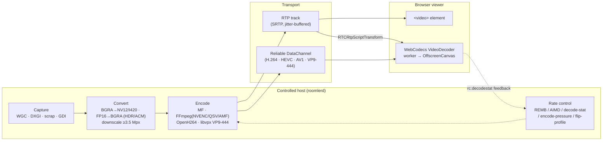
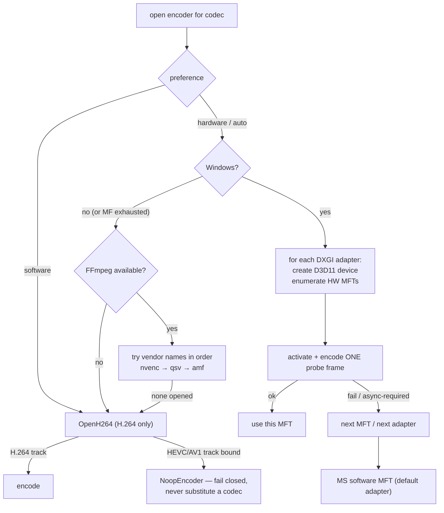
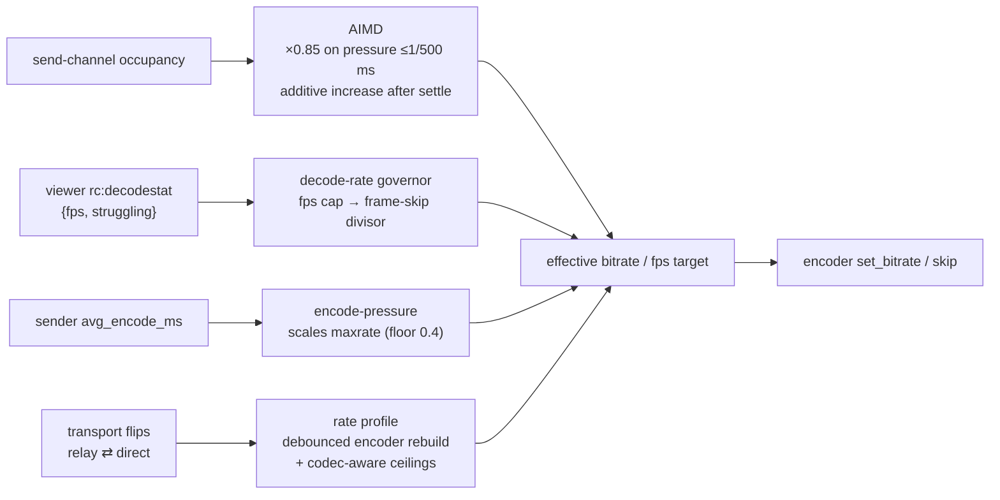

# Encoders & the Video Pipeline

Everything between the remote host's framebuffer and the viewer's canvas: capture
backends, the encoder cascade, codecs per platform, rate control, and the browser
decode paths. Agent side lives in `agents/roomlerd/src/{capture,encode}/`;
viewer side in `ui/src/composables/useRemoteControl.ts` + `ui/src/workers/`.
*As of 0.3.0-rc.381.*

## The pipeline



Two transport families with different latency behaviour:

- **RTP track** — standard WebRTC video. Simple and universal, but Chrome's
  `<video>` pipeline enforces a ~80 ms jitter-buffer floor.
- **Reliable DataChannel bitstream** — the agent sends encoded access units over
  an ordered DC; a worker feeds WebCodecs and paints an OffscreenCanvas. This
  bypasses the jitter buffer entirely and is how HEVC, AV1, VP9 4:4:4, and
  low-latency H.264 ship.

## Codec × backend × platform

| Codec | Windows | Linux | macOS | Notes |
|---|---|---|---|---|
| **H.264** | MF HW MFTs → MF SW MFT · FFmpeg `h264_nvenc→h264_qsv→h264_amf` · OpenH264 SW | FFmpeg HW (if present) · OpenH264 SW | OpenH264 SW | The universal baseline; RTP or DC |
| **HEVC** | FFmpeg `hevc_nvenc→hevc_qsv→hevc_amf` · MF HEVC | FFmpeg | — (SW fallback only) | DC-only; offered when *agent HW encode ×viewer HW decode* both hold |
| **AV1** | FFmpeg `av1_nvenc→av1_qsv→av1_amf` · MF AV1 | FFmpeg | — | DC-only; fail-closed (no silent codec substitution) |
| **VP9 4:4:4** | libvpx SW (profile 1) · FFmpeg `vp9_qsv` | libvpx SW | libvpx SW | Chroma-full screen content ("crystal-clear" text); DC-only |
| **Opus (audio)** | WASAPI loopback → Opus | PulseAudio monitor → Opus | not implemented | Opt-in per session; 48 kHz stereo, 20 ms |

Hardware vendors are reached **through** two frameworks — there are no dedicated
NVENC/QSV/AMF modules: Media Foundation enumerates HW MFTs per GPU adapter, and
FFmpeg (a minimal vendored build containing exactly the ten encoder names above)
tries vendor encoders in cascade order. VAAPI and VideoToolbox are not wired —
Linux/macOS hardware paths exist only where FFmpeg's NVENC/QSV names resolve.

## Selection cascade

Preference resolution: **CLI `--encoder` > env (`ROOMLERD_ENCODER` /
`ROOMLERD_ENCODER`) > `encoder_preference` in config.toml > `auto`**. Values:
`auto` | `hardware` (`hw`/`mf`) | `software` (`sw`/`openh264`).



Key properties:

- **Probe, don't trust**: every candidate encoder must actually encode a frame
  before it is selected. The same real-activation probing runs once at startup
  (`encode/caps.rs`, 480×270) to build the capability set advertised in
  `rc:agent.hello` — the browser is never offered a codec the host can't produce.
- **Fail closed**: once a session's track is bound to `video/HEVC` or `video/AV1`,
  an encoder failure yields a null encoder rather than silently switching
  bitstreams.
- **Escape hatch**: `ROOMLERD_HW_AUTO=0` reverts `auto` to software-first
  without a rebuild.
- Advertised labels look like `mf-h264-hw`, `ffmpeg-hevc_nvenc`, `openh264-sw`,
  `libvpx-vp9-444-sw`; transports like `data-channel-hevc`, `data-channel-h264`.

### Hardware quirks the cascade routes around

| Hardware | Behaviour |
|---|---|
| NVIDIA RTX 5090 (Blackwell) | `ActivateObject` returns `0x8000FFFF` for the MF H.264/HEVC/AV1 MFTs — FFmpeg NVENC works, MF does not; the cascade lands there. AV1 has no MF alternative and is filtered from caps by the probe |
| Intel Iris Xe | MF HW MFT is async-only; the async-unlock path handles it, FFmpeg QSV (`hevc_qsv`, `vp9_qsv`) proven in the field |
| NVIDIA idle P-states | First seconds of a session encode at ~20 ms/frame until clocks ramp — `gpu_clock.rs` pins graphics clocks via NVML for exactly the session's lifetime (the Parsec "boost" trick) |
| Windows 11 ACM / HDR desktops | Desktop Duplication hands out FP16 scRGB frames; `fp16.rs` converts scRGB→BGRA8 sRGB so capture doesn't fall back or ship corrupt stripes |
| WSL (libcuda stub, no driver) | `hevc_nvenc` **dlopens successfully** and then SEGVs when `cuInit(0)` fails. Contained since rc.433 by the child-process probe below — the host loses its HW advertisement, not its daemon |

### The probe runs in a CHILD PROCESS (rc.433)

A capability probe is untrusted third-party code by definition — vendor drivers
and, through them, GPU firmware. It does not belong in the daemon's address
space, so `encode::caps::detect()` spawns `roomlerd caps-probe` (a hidden
subcommand), reads one `ROOMLER_CAPS_JSON:{…}` line from its stdout, and treats
**any** failure as *every hardware codec is unavailable*:

| Outcome | Verdict |
|---|---|
| non-zero exit, or killed by a signal | no HW advertised (logged at ERROR with the status) |
| still running after 60 s | killed; no HW advertised |
| could not spawn / output unparseable | no HW advertised |
| clean exit with a marked line | those caps, as reported |

The fallback is `compute_caps(false)` — everything computable without a driver
call. The agent stays a working agent (files, input, RPC, software codecs); it
just stops claiming hardware it has no evidence for, which is the honest
reading and costs a session nothing worse than a software encode.

**What it replaces.** In-process, a fault took `roomlerd` down and the service
manager restarted it straight back into the same probe — a crash-**loop**, not
a degraded agent. Observed 2026-08-20 on the WSL sibling: WSL ships
`/usr/lib/wsl/lib/libcuda.so.1` as a stub with no usable driver, which puts
nvenc in the **loaded-but-unusable** state — the `dlopen` succeeds, so the "not
available" branch is never taken, and the failure path from `cuInit(0)`
crashes. Hosts with *no* libcuda (`ldconfig -p | grep -c libcuda` = 0) took the
clean dlopen-failed branch, which is why this stayed latent: the probe only
runs at startup, so a long-lived agent never re-enters it and the crash appears
at the next restart, looking like whatever shipped most recently.

⚠️ `ROOMLERD_HW_AUTO=0` and `ROOMLERD_ENCODER=software` do **not**
skip the probe. Those select an encoder; the probe enumerates what to
*advertise* and always runs.

Implementation notes worth keeping:

- The child sets `ROOMLERD_CAPS_CHILD=1`; `detect()` seeing that computes
  in-process, so nothing can recurse into an endless spawn.
- stdout is **marker-parsed, not last-line-parsed** — the daemon logs to stdout,
  so "the last line" would have been a log line on the very first run.
- The child's **stderr is inherited on purpose**: its per-codec probe lines are
  the record of *which* codec died, and they belong in the daemon log directly
  above the verdict.
- Verified by fault injection before shipping: with the child aborting, the
  parent logged `the probe child DIED`, fell back to no-HW caps and exited 0.

## Capture backends

Cascade (first that works wins): synthetic (CI, env-gated) → **SystemContext**
(service worker on Windows — adapter-bound DXGI that picks the adapter *owning the
primary output*, fixing Optimus hybrid GPUs, with a GDI `BitBlt` fallback after
three consecutive hard errors) → **Windows.Graphics.Capture** (hardware cursor,
dirty regions on Win11) → **scrap** (DXGI duplication / X11 XShm / CoreGraphics)
→ noop. A `DownscalePolicy` box-filters very large desktops (>~3.5 Mpx) before
encode. Cursor shapes ride a dedicated channel and render viewer-side.

With multiple concurrent viewers of one host, DC sessions with an identical
profile (transport × codec × chroma) **share one capture + one encoder**
(`media_share.rs`) — followers tap the owner's stream instead of doubling GPU
cost and DXGI duplication seats.

## Rate control

Two independent regimes:

**RTP track** — standard congestion feedback: RTCP **REMB** × 0.85 safety factor
with ±15 % hysteresis, floored at the minimum bitrate.

**DataChannel paths** — no REMB exists, so four cooperating controllers
(`encode/{aimd,viewer_rate,encode_pressure,rate_profile}.rs`):



- Bitrate clamps: 1.5–40 Mbps; initial target ≈ `w·h·fps·0.20` bits.
- Relayed (TURN) sessions are capped (~3 Mbps, 1280 px long edge) **unless** the
  relay is loopback/mesh-local — the agent hosts its own loopback TURN server, so
  "relayed" via localhost stays uncapped.
- The viewer's priority dial (balanced / sharper / smoother) trades resolution
  caps against fluidity; H.264 gets a ~150 % bitrate ceiling relative to
  HEVC/AV1 plus a sharper CQ bias to compensate for the older codec.
- A confirmed relay⇄direct transport flip rebuilds capture+encoder on a debounce
  (2 consecutive confirmations, 60 s cooldown) so the profile matches the path.

## Building the FFmpeg backend locally on Windows (FR-77 P0)

The `ffmpeg-encoder` feature links the **vendored** FFmpeg (static-md, LGPL,
minimal) — the same zip `release-agent.yml` fetches — so a local build must stage
that tree, not a system FFmpeg. `scripts/dev-ffmpeg-windows.ps1` does what the
workflow's "Fetch vendored FFmpeg" step does, on a dev box:

```powershell
pwsh scripts/dev-ffmpeg-windows.ps1          # download + verify + stage under C:\ffmpeg-pin, once
# in a vcvars64 / "x64 Native Tools" shell (bindgen wants MSVC's stdint.h):
Invoke-Expression (pwsh scripts/dev-ffmpeg-windows.ps1 -Env | Out-String)
cargo build -p roomlerd --release --features "full-hw,vp9-444,system-context,ffmpeg-encoder,overlay-l3,overlay-netstack,ssh-server"
.\target\release\roomlerd.exe encoder-smoke --encoder hardware --codec hevc
```

It stages FFmpeg under `C:\ffmpeg-pin\installed\x64-windows-static-md` and libvpx
next to it, rewrites the `.pc` prefixes, and provides `pkg-config.exe` (vcpkg's
`pkgconf` **with its `pkgconf-N.dll`**, renamed — what CI does). Three things the
first run on the dev box taught, all encoded in the script: the env must carry
`CMAKE_POLICY_VERSION_MINIMUM=3.5` (audiopus_sys' bundled libopus under CMake ≥ 3.31)
and `LIBCLANG_PATH` (bindgen); and **`FFMPEG_DIR` must stay unset** — with it,
`ffmpeg-sys-next` skips pkg-config and the `.pc`'s `-lvpl -ladvapi32 -lole32` never
reach the linker (LNK1120 with every `MFX*` symbol unresolved). The recipe needs
`ffmpeg-next ≥ 9.0`: the 8.1 crate does not link `vpl.lib` from the static tree on
native Windows at all, which is why the WSL route used to be the only proven one.
Measured on the dev box (RTX 5090 Laptop + Radeon 610M, 2026-09-07): incremental
build 3 min, `encoder-smoke --codec hevc` → `hevc_nvenc` PASS, the probe advertises the
same set as the shipped build. `-FfmpegRelease` / `-FfmpegAsset` pin any
published vendored build, which is also the rollback recipe. The FFmpeg **command
line** for experiments is a different thing: `winget install Gyan.FFmpeg` (a GPL full
build, never shipped) gives `ffmpeg -encoders` for a quick look at what a box's
drivers expose.

## Viewer decode paths

The browser probes per-codec **software and hardware** decode support and exposes
the render paths documented in [ui.md](ui.md#the-remote-desktop-viewer-useremotecontrolts):
classic `<video>`, WebCodecs-over-RTP (`RTCRtpScriptTransform`), and the DC worker
paths (`rc-webcodecs-worker`, `rc-hevc-worker`, `rc-vp9-444-worker`). Per-hop
timings (forward / decode / paint) are instrumented by `rc-hop-stats` and shown in
the opt-in diagnostics HUD. Decoder stats flow back to the agent and close the
rate-control loop.

## Input & audio (the non-video channels)

- **Input injection**: enigo (SendInput / XTest+uinput / CGEventPost) for the
  interactive session; a dedicated SystemContext backend injects from a
  `SetThreadDesktop`-bound thread for lock screen / UAC / pre-logon on Windows;
  keyboard-layout auto-switch matches the viewer's layout.
- **Audio**: opt-in per session — WASAPI loopback (Windows) or PulseAudio monitor
  (Linux) → Opus 48 kHz stereo in 20 ms packets on a sendonly track. macOS capture
  is not implemented.

## Appendix — why VP9 4:4:4 uses raw libvpx FFI

The `vpx-encode 0.6` wrapper hardcoded I420 (profile 0 = 4:2:0) and exposed
neither `g_profile` nor runtime bitrate — profile-1 bytes were unreachable, and
the default `g_lag_in_frames` (~25 buffered frames) meant no packets emerged on
first encode. `encode/libvpx.rs` therefore binds `env-libvpx-sys` directly:

- `vpx_codec_enc_config_default` then override `g_profile=1`,
  `g_lag_in_frames=0` (zero-latency), 8-bit depth, CBR, `kf_max_dist=240`;
- controls tuned for screen content: `VP8E_SET_CPUUSED` (speed), 
  `VP9E_SET_TUNE_CONTENT=SCREEN`, `AQ_MODE=0`, `TILE_COLUMNS=2`,
  `FRAME_PARALLEL_DECODING=1`, `STATIC_THRESHOLD=100`, `NOISE_SENSITIVITY=0`;
- per-frame `vpx_image_t` built manually with three plane pointers
  (`VPX_IMG_FMT_I444`, zero chroma shift), `VPX_EFLAG_FORCE_KF` on the first
  frame and on keyframe requests, drained via `vpx_codec_get_cx_data`;
- runtime bitrate by mutating `rc_target_bitrate` +
  `vpx_codec_enc_config_set` (a no-op in the old wrapper);
- **FR-74 P3 — a worst-quality cap on direct transports**: `rc_max_quantizer`
  16 (q-index 64) via `Vp9Encoder::set_max_quantizer`, applied at encoder open
  and re-applied on every transport flip (relay keeps libvpx's 63). libvpx's
  one-pass CBR + screen tune treats every mouse-wheel notch of a text scroll as
  a scene change, resets q to 255 and walks it back ~7 q-index per frame, so a
  choppy scroll was rendered at the worst quality while spending a fifth of its
  target (measured offline against the real encoder, four rounds; spec §P3).
  The cap holds the notch frames at q 64; the steady scroll still refines to
  q 0 inside the budget and idle stays lossless. Env
  `ROOMLERD_VP9_DIRECT_MAX_Q` (63 = pre-P3).

Bindgen (`vp9-444-bindgen` feature) generates bindings against system headers on
Linux/macOS; Windows links the vendored prebuilt libvpx.
