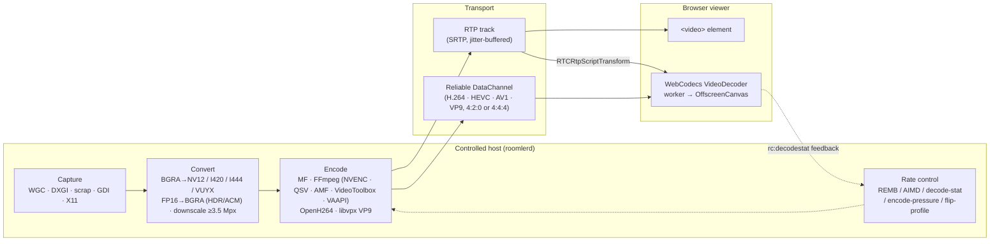
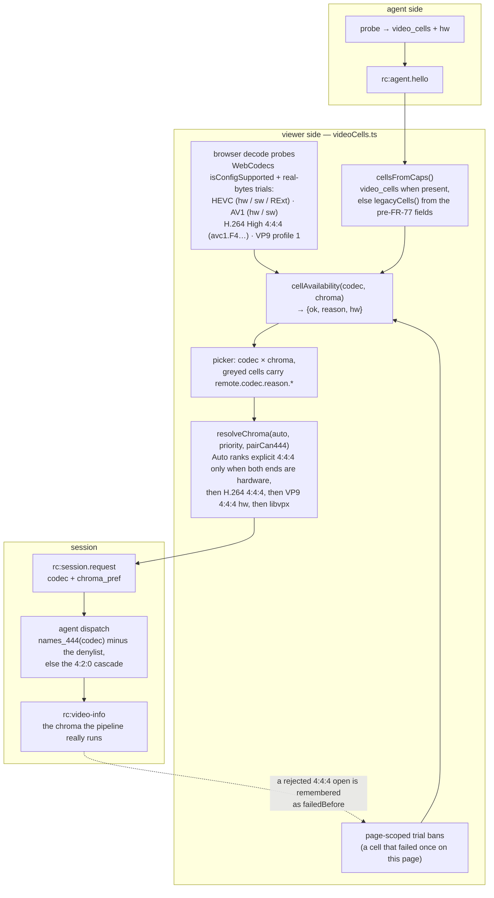
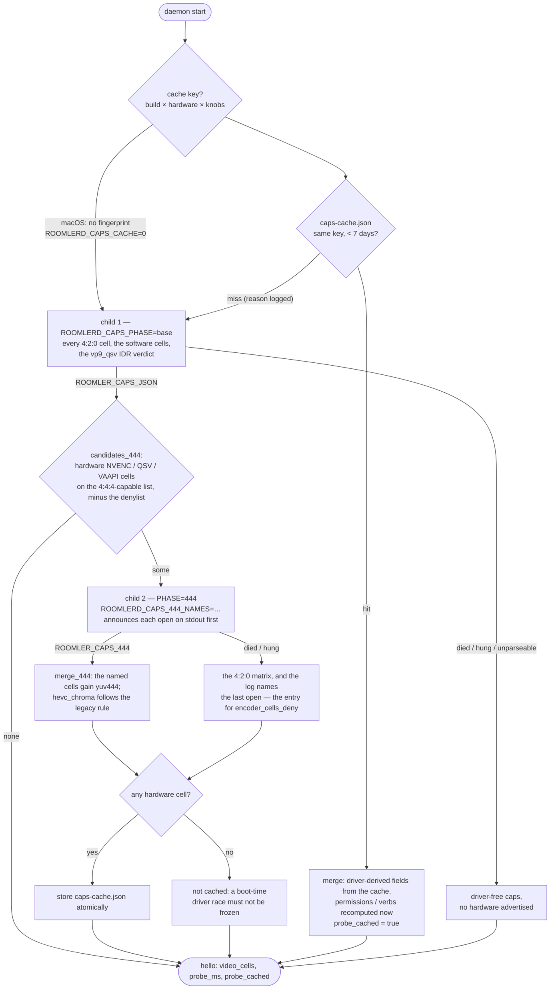
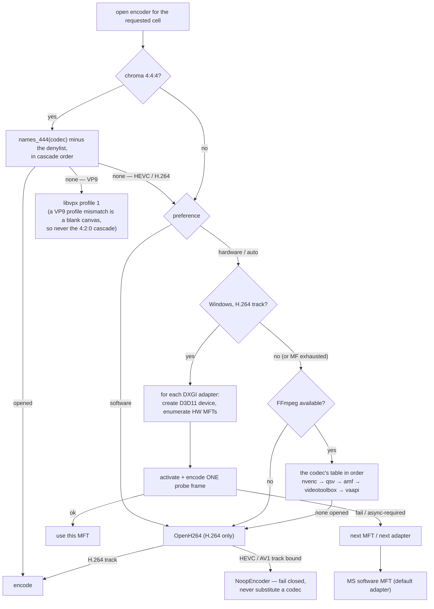
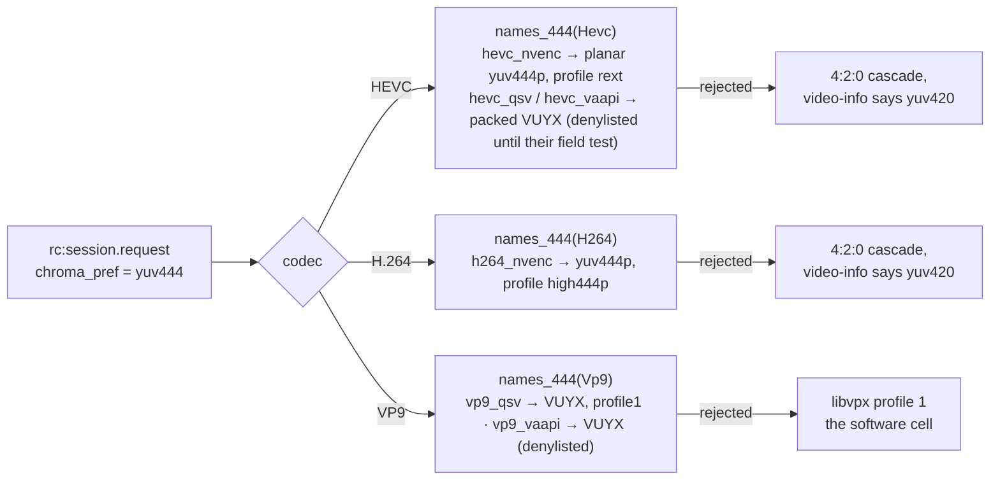
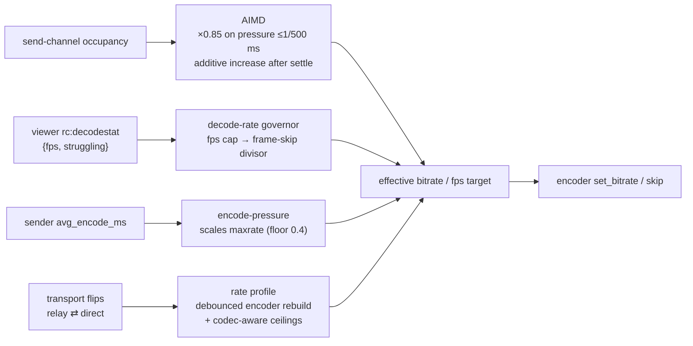

# Encoders & the Video Pipeline

Everything between the remote host's framebuffer and the viewer's canvas: capture
backends, the **cell matrix** a host advertises and how the viewer resolves it, the
probe that discovers it, the encoder cascade per platform, rate control, and the
browser decode paths. Agent side lives in `agents/roomlerd/src/{capture,encode}/`;
viewer side in `ui/src/composables/{useRemoteControl,videoCells}.ts` + `ui/src/workers/`.
*As of 0.4.87 (FR-77 P0–P4, 2026-09-08).* The design record with every decision's
pros and cons is [`docs/fr/FR-77-encoder-chroma-matrix.md`](fr/FR-77-encoder-chroma-matrix.md);
the words below are the glossary's ([`CONTEXT.md`](../CONTEXT.md)).

| Word | Meaning | Example |
|---|---|---|
| **codec** | the bitstream family | H.264 · HEVC · AV1 · VP9 |
| **backend** | what produces it | NVENC · QSV · AMF · VideoToolbox · VAAPI · Media Foundation · openh264 · libvpx |
| **encoder** | codec × backend, an FFmpeg name | `hevc_nvenc`, `vp9_vaapi` |
| **chroma format** | how much colour the bitstream keeps | 4:2:0 (`yuv420`) · 4:4:4 (`yuv444`, "crisp text") |
| **cell** | codec × chroma format — what a session actually asks for | HEVC 4:4:4 |
| **probe** | the real-bytes trial that proves a cell on a host | `roomlerd caps-probe` |
| **probe cache** | the remembered answer of the last probe, kept only under the build, hardware, drivers and settings that produced it | `caps-cache.json` |
| **denylist** | cells a device must not open or advertise — the kill switch | `hevc_qsv:yuv444` |

## The pipeline



Two transport families with different latency behaviour:

- **RTP track** — standard WebRTC video. Simple and universal, but Chrome's
  `<video>` pipeline enforces a ~80 ms jitter-buffer floor.
- **Reliable DataChannel bitstream** — the agent sends encoded access units over
  an ordered DC; a worker feeds WebCodecs and paints an OffscreenCanvas. This
  bypasses the jitter buffer entirely and is how HEVC, AV1, VP9 and low-latency
  H.264 ship, in either chroma format.

## Codec × backend × platform

One build per OS and architecture carries **every** hardware backend FFmpeg offers
for that platform; the probe below discovers at runtime which ones the host can
open. That was decided by a measurement, not a preference — every wrapper is under
1 MB against a 35 MiB `roomlerd.exe` (ADR
[0001](adr/0001-encoder-backends-compiled-in-discovered-at-runtime.md)).

| Codec | Windows | Linux x86_64 | macOS arm64 | Notes |
|---|---|---|---|---|
| **H.264** | MF HW MFTs → MF SW MFT · FFmpeg `h264_nvenc → h264_qsv → h264_amf` · OpenH264 | FFmpeg `h264_nvenc → h264_qsv → h264_amf → h264_vaapi` · OpenH264 | FFmpeg `h264_videotoolbox` · OpenH264 | the universal baseline; RTP or DC; 4:4:4 on NVENC (`high444p`) |
| **HEVC** | FFmpeg `hevc_nvenc → hevc_qsv → hevc_amf` · MF HEVC | FFmpeg `… → hevc_vaapi` | FFmpeg `hevc_videotoolbox` | DC-only; 4:4:4 on NVENC (RExt), on QSV/VAAPI behind the denylist |
| **AV1** | FFmpeg `av1_nvenc → av1_qsv → av1_amf` · MF AV1 | FFmpeg `… → av1_vaapi` | — (`av1_videotoolbox` is not in the registry on current SDKs) | DC-only; 4:2:0 only, every backend; fail-closed |
| **VP9** | FFmpeg `vp9_qsv` · libvpx | FFmpeg `vp9_qsv → vp9_vaapi` · libvpx | libvpx | 4:4:4 on QSV/VAAPI (profile 1, packed VUYX) behind the denylist; libvpx profile 1 is the software 4:4:4 cell everywhere |
| **Opus (audio)** | WASAPI loopback → Opus | PulseAudio monitor → Opus | not implemented | opt-in per session; 48 kHz stereo, 20 ms |

The cascade order is one table per codec in `encode/ffmpeg/encoder.rs`
(`HEVC_ENCODER_NAMES` …): the vendor SDKs first, then `*_videotoolbox`, then
`*_vaapi` — a name that is not in the platform's FFmpeg registry, or whose
device is absent, fails in one line and the next rung is tried. Locked by tests
(`vaapi_names_close_every_cascade`, `videotoolbox_and_vaapi_are_appended_never_prepended`).

| Platform | The vendored FFmpeg 9.0.1 (LGPL, `--disable-everything` + exactly the encoders the tables name) | Linkage |
|---|---|---|
| Windows x86_64 | the ten vendor encoders (`h264/hevc/av1 × nvenc/qsv/amf` + `vp9_qsv`), an overlay port over the pinned vcpkg baseline | static (`x64-windows-static-md`) — see [`lgpl-relink.md`](lgpl-relink.md) |
| Linux x86_64 | the same ten + `h264/hevc/av1/vp9_vaapi` (fourteen), from source; **libva + libdrm built into the tree** and bundled with the libav* in the `.deb` (no `Depends` on the system's libva — why is under *VAAPI on Linux*) | shared, the agent's private lib dir via RPATH; the VA driver is the host's |
| macOS arm64 | `h264/hevc/av1_videotoolbox` only (~1.8 MB of dylibs), built with `--disable-autodetect` so nothing Homebrew is baked in | shared dylibs in the app bundle |
| Linux arm64 | no FFmpeg — OpenH264 + libvpx | — |

## The cell matrix a host advertises (FR-77 P1)

The probe opens **every encoder** in cascade order, not the first that works,
and for the names FFmpeg can open in 4:4:4 (`h264_nvenc`, `hevc_nvenc`,
`hevc_qsv`, `vp9_qsv`, `hevc_vaapi`, `vp9_vaapi`) the 4:4:4 form too. What
opened is the host's cell matrix, advertised in the hello as
`AgentCaps.video_cells` — `{codec, backend, chroma[], hw}` per encoder, wire
strings from `models::{VideoCodec, VideoBackend, ChromaFormat}`
(`crates/remote_control/src/models.rs`), unknown names ignored by older readers —
plus `probe_ms` and `probe_cached`.

| Rule | Why |
|---|---|
| The legacy fields (`hw_encoders`, `codecs`, `transports`, `hevc_chroma`, `vp9_chroma`) keep their exact pre-FR-77 meaning — the FIRST backend in cascade order that opens | a session still cascades in that order, and a viewer older than FR-77 reads nothing else; `data-channel-vp9-444` stays on the wire although it carries both chroma formats |
| `hw` is verified, never assumed | NVENC / AMF / VideoToolbox / VAAPI are hardware by construction; a QSV open proves hardware only on the oneVPL build (FFmpeg's internal MFX session filters `MFX_IMPL_TYPE_HARDWARE`), which `qsv_is_hardware_by_construction` detects by `av1_qsv` being registered (libvpl-only); the native MF cell reports what its cascade landed on |
| A 4:4:4 cell is **opened**, never asserted by name | the pre-FR-77 code advertised `hevc_chroma: yuv444` for any `hevc_nvenc`; now the legacy field says 4:4:4 only when that open succeeded |
| `h264_nvenc` 4:4:4 sets `profile=high444p` | `rext` is HEVC's profile and h264_nvenc rejects it at open, which would read as "cannot do 4:4:4" |
| **The denylist** = the kill switch, both chroma forms: a `name:chroma` cell on it is never opened nor advertised. Built-in: `hevc_qsv:yuv444, hevc_vaapi:yuv444, vp9_qsv:yuv444, vp9_vaapi:yuv444` | each unproven packed-4:4:4 cell leaves the list on a field pass; CORPLAP-3's Intel runtime died on the first VUYX open. `encoder_cells_deny` (config, env `ROOMLERD_ENCODER_CELLS_DENY`, pushable through remote config) **replaces** the default; `none` denies nothing. Until 0.4.87 it gated only the 4:4:4 open |
| AV1, AMF, VideoToolbox and Media Foundation are never asked for 4:4:4 | `av1_nvenc` hard-errors on it and every other AV1 backend lists 4:2:0 only; AMF has no 4:4:4 surface; VideoToolbox HEVC has only Main / Main10 / Main42210; `*_mf` takes NV12 — locked by a test against the vocabulary |

What the fleet advertised on 0.4.87 (server records, 2026-09-08):

| Host | Cells | Probe |
|---|---|---|
| dev box (RTX 5090 Laptop + Radeon 610M, Windows) | `h264/openh264` · `h264/mf` · `hevc/nvenc` 4:2:0+**4:4:4** · `hevc/amf` · `av1/nvenc` · `h264/nvenc` 4:2:0+**4:4:4** · `h264/amf` · `vp9/libvpx` 4:2:0+4:4:4 | 4.3 s |
| CORPLAP-3 (Iris Xe, Windows) | `h264/openh264` · `h264/mf` · `vp9/qsv` · `av1/qsv` · `h264/qsv` · `vp9/libvpx` | 5.7 s |
| MacBook (M-series) | `h264/openh264` · `hevc/videotoolbox` · `h264/videotoolbox` · `vp9/libvpx` | 0.1 s |
| jupiter, zeus (AMD Raphael / VCN 3.1, Linux) | `h264/openh264` · `hevc/vaapi` · `h264/vaapi` · `vp9/libvpx` | 0.1 s |
| the WSL sibling (RTX through WSL's libcuda) | `h264/openh264` · `hevc/nvenc` 4:2:0+4:4:4 · `av1/nvenc` · `h264/nvenc` 4:2:0+4:4:4 · `vp9/libvpx` | 2.5 s |
| mars (no GPU, Linux) | `h264/openh264` · `vp9/libvpx` | 0.1 s |

## The cell resolution — from the matrix to a session

The picker offers two independent dropdowns, **codec** and **chroma format**, and
greys every cell that cannot work with the reason. A cell is offered only when the
agent proved it, the browser can decode it, and this page has not already seen it
fail. Everything the viewer knows about cells goes through ONE derivation,
`ui/src/composables/videoCells.ts` — the codec picker and the admin codec chips
read the same functions.



| Reason (`remote.codec.reason.*`) | What it means |
|---|---|
| `agentNo…` / `agentNoH264_444` … | the host's matrix has no such cell (the probe did not open it, or the denylist removed it) |
| `browserNo…` / `browserNoH264High444` … | WebCodecs cannot decode that codec string here (Chromium keeps one `HEVCPROFILE_REXT` for every RExt chroma form, so HEVC 4:4:4 is proven by real bytes, never by `isConfigSupported`) |
| `chroma420` | the codec has no 4:4:4 form on either end (AV1 everywhere) |
| `failedBefore` | this page already saw the cell fail — the page-scoped trial ban is the real proof a cell works |
| `av1NoHw444` | AV1 4:4:4 does not exist as a session cell |

Auto-rank, explicit 4:4:4 first: **HEVC 4:4:4** (hardware on both ends — NVIDIA and
Intel on Chrome ≥ 137) → **H.264 4:4:4** (NVENC `high444p`, software decode) →
**VP9 4:4:4 hardware** (QSV / VAAPI, behind the denylist) → **VP9 4:4:4 libvpx**,
the only rung *Sharper-on-Auto* upgrades to. A session never shares a pipeline
with the other chroma form of the same codec (`FfmpegDcCodec::pipeline_label`:
`HEVC-444`, `H264-444`, `VP9-444`), and `rc:video-info` reports the chroma the
pipeline really runs, so a rejected 4:4:4 open that fell back to 4:2:0 is never
mistaken for the cell that was asked for.

## The probe lifecycle

A capability probe is untrusted third-party code by definition — vendor drivers
and, through them, GPU firmware — so it does not run in the daemon's address
space. `encode::caps::detect()` (`agents/roomlerd/src/encode/caps.rs`) answers
from the cache when it can, and otherwise spawns `roomlerd caps-probe` twice:



| Outcome of a child | Verdict |
|---|---|
| non-zero exit, or killed by a signal | phase base: no hardware advertised (logged at ERROR with the status) · phase 444: the 4:2:0 matrix, the last announced open named |
| still running after 60 s | killed; as above |
| could not spawn / output unparseable | as above |
| clean exit with a marked line | those caps, as reported |

Why two children (P3c): on the 0.4.84 roll CORPLAP-3's Intel media runtime died
with `0xc0000005` on the first `vp9_qsv` 4:4:4 open over VUYX, and with ONE child
that cost the daemon every hardware cell — `av1_qsv`, `h264_qsv`, `vp9_qsv` 4:2:0
gone for a cell no session needed. A faulting 4:4:4 open now costs only the
4:4:4 forms. The second child announces every open on stdout first
(`ROOMLER_CAPS_PROGRESS:`, line-buffered so it survives the crash) because on a
service host its stderr reaches no log.

Why a cache (P3a): the matrix probe costs 4–6 s on a Windows host with two GPUs,
paid on every daemon start for an answer that changes only when the GPU, its
driver, the OS build or the roomlerd build changes. The key:

| Key part | What it is | Why |
|---|---|---|
| **build** | crate version + the executable's length and mtime | a dev build with the same version number is a different build |
| **hardware** (`encode/hwid.rs`) | Windows: every display-class driver instance's `DriverDesc` / `DriverVersion` / `MatchingDeviceId` from the registry + the OS build and UBR. Linux: sysfs DRM ids + kernel driver per card, the NVIDIA module version, the kernel release, size + mtime of the userspace driver libraries the backends dlopen. macOS: none | NVENC, the Intel media runtime and AMF all ship inside the display driver; Media Foundation's codec set is the OS build's. macOS's probe is ~100 ms and VideoToolbox is the OS — no key, no cache |
| **knobs** | SHA-256 of every `ROOMLERD_*` knob (env + the config fallbacks the child receives) | a denylist edit or `ROOMLERD_DC_H264=0` changes the answer; hashed because an env block can carry a token |

Rules that are load-bearing: only a result with a **hardware** cell is cached (a
no-hardware answer is the cheap case, and the one a service starting before the
display driver produces); a hit takes **only** the driver-derived fields
(`hw_encoders`, `codecs`, `transports`, `hevc_chroma`, `vp9_chroma`,
`video_cells`, the vp9_qsv IDR verdict) and recomputes permissions, the
GUI-session state and every verb list; the hello then says `probe_cached: true`
with `probe_ms` = the cached probe's duration. Every miss logs its reason. On a
Windows service host the WORKER (console session) runs the probe and owns the
cache file. Measured: a hit answers 0.5 s after `agent starting` where the probe
took 3.6 s.

Implementation notes that keep the child honest:

- The child sets `ROOMLERD_CAPS_CHILD=1`; `detect()` seeing it computes
  in-process, so nothing can recurse into an endless spawn.
- stdout is **marker-parsed, not last-line-parsed** — the daemon logs to stdout,
  so "the last line" would have been a log line on the very first run.
- The child's **stderr is inherited on purpose**: its per-codec probe lines are
  the record of *which* codec died, and they belong in the daemon log directly
  above the verdict.
- The child does not inherit the config-fallback registry, so `child::probe()`
  exports every registered knob as a real `ROOMLERD_*` variable (precedence
  preserved), and the parent recomputes `caps.rpc` — a verb derived from CONFIG
  belongs to the parent, never the probe.
- The child prints a `ProbeReport` envelope (`{caps, vp9_qsv_idr}`); the
  vp9_qsv runtime-IDR verdict lived in the child from rc.433 to 0.4.84 and never
  reached a session.
- `ROOMLERD_HW_AUTO=0` and `ROOMLERD_ENCODER=software` do **not** skip the probe.
  Those select an encoder; the probe enumerates what to *advertise*.

## Selection at session time

Preference resolution: **CLI `--encoder` > env `ROOMLERD_ENCODER` >
`encoder_preference` in config.toml > `auto`**. Values: `auto` | `hardware`
(`hw`/`mf`) | `software` (`sw`/`openh264`).



Key properties:

- **Probe, don't trust**: every candidate encoder must actually open (and, for
  the MF path, encode a frame) before it is selected — the same trial the
  startup probe runs at 480×270, so the browser is never offered a codec the
  host cannot produce.
- **Fail closed**: once a session's track is bound to `video/HEVC` or
  `video/AV1`, an encoder failure yields a null encoder rather than silently
  switching bitstreams.
- **Escape hatch**: `ROOMLERD_HW_AUTO=0` reverts `auto` to software-first
  without a rebuild; `ROOMLERD_USE_FFMPEG=0` removes the FFmpeg backends.
- Advertised labels look like `mf-h264-hw`, `ffmpeg-hevc_nvenc`,
  `ffmpeg-hevc_vaapi`, `openh264-sw`, `libvpx-vp9-444-sw`; transports like
  `data-channel-hevc`, `data-channel-h264`.
- **Never flush an encoder that never took a frame.** `FfmpegEncoder::drop`
  sends EOF and drains only when `frame_count > 0` (reset on every rebuild, so
  it counts frames sent to *this* inner encoder). A `hevc_vaapi` that had no
  picture issued SEGVs inside `avcodec_send_frame(NULL)` on radeonsi — the probe
  child (open, then drop) died on every start of 0.4.86 on jupiter, and in a
  session the same drop runs in the daemon.

### Hardware quirks the cascade routes around

| Hardware | Behaviour |
|---|---|
| NVIDIA RTX 5090 (Blackwell) | `ActivateObject` returns `0x8000FFFF` for the MF H.264/HEVC/AV1 MFTs — FFmpeg NVENC works, MF does not; the cascade lands there. AV1 has no MF alternative and is filtered from caps by the probe |
| Intel Iris Xe | MF HW MFT is async-only; the async-unlock path handles it. FFmpeg QSV (`hevc_qsv`, `vp9_qsv`, `av1_qsv`, `h264_qsv`) proven in the field; the **packed 4:4:4 (VUYX) open kills the media runtime** (`0xc0000005`, 0.4.84) — `hevc_qsv:yuv444` and `vp9_qsv:yuv444` stay denied until a driver survives it |
| AMD Raphael iGPU (VCN 3.1, `radeonsi`) | H.264 + HEVC encode through VAAPI, 4:2:0; **no VP9 or AV1 encode** — `No usable encoding entrypoint found for profile …` is the driver saying so, and the cascade falls through; the unfed-encoder flush above was found here |
| NVIDIA idle P-states | First seconds of a session encode at ~20 ms/frame until clocks ramp — `gpu_clock.rs` pins graphics clocks via NVML for exactly the session's lifetime |
| Windows 11 ACM / HDR desktops | Desktop Duplication hands out FP16 scRGB frames; `fp16.rs` converts scRGB→BGRA8 sRGB so capture doesn't fall back or ship corrupt stripes |
| WSL2 | `libcuda.so.1` is a stub: `hevc_nvenc` **dlopens successfully** and then SEGVs when `cuInit(0)` fails on a box without the NVIDIA driver — contained by the child process. With the driver, NVENC works. There is no VAAPI: no `/dev/dri`, and libva refuses `/dev/dxg` |
| Apple silicon | `h264/hevc_videotoolbox` open; `av1_videotoolbox` is in the table but not in the registry on current SDKs — measured, not assumed |

## The new cells (FR-77 P3b)



| Cell | Backend input | Browser decode | Auto-rank (explicit 4:4:4 only) |
|---|---|---|---|
| HEVC 4:4:4 | NVENC planar `yuv444p`, profile `rext`; QSV / VAAPI packed **VUYX**, profile `rext` — behind the denylist | hardware (Chrome ≥137 + NVIDIA, Intel Gen11+) | first: hardware on both ends |
| H.264 4:4:4 | NVENC planar `yuv444p`, profile `high444p` | software (`avc1.F4xxxx`, High 4:4:4 Predictive) | second |
| VP9 4:4:4 (hardware) | QSV / VAAPI packed **VUYX**, profile `profile1` — behind the denylist | software (`vp09.01`) | third |
| VP9 4:4:4 (software) | libvpx profile 1 | software | last — the only rung Sharper-on-Auto upgrades to |

**VUYX** is why the P1 probe's 4:4:4 open of `vp9_qsv` failed: FFmpeg n9's QSV
and VAAPI encoders list packed VUYX/XV30 and never planar 4:4:4. The pump keeps
dcv's BT.601 I444 planes and interleaves them into one packed plane (V, U, Y,
0xFF per pixel), so the packed path renders exactly as the planar one. The QSV
profile is set explicitly in the `base` option tier; a driver that rejects the
key falls to the defaults tier. **VP9 has no 4:2:0 fallback on a rejected 4:4:4
open** — the viewer configured its decoder for profile 1 and a VP9 profile
mismatch is a blank canvas, so the session dispatch probes the exact cell first
and runs libvpx when it cannot open. HEVC and H.264 fall back to 4:2:0 and report
the truth (`rc:video-info chroma`). The ceiling table has a chroma column:
`rate_factor_{h264,hevc,vp9}_444` (built-in 150 % on top of the codec factor for
a 4:4:4 cell; 4:2:0 is always 100).

## VAAPI on Linux (FR-77 P4)

```mermaid
flowchart LR
    subgraph once["once per process — vaapi::device()"]
        P[vaapi_device pinned?] -- yes --> O
        P -- no --> N["/dev/dri/renderD128 … 135<br/>(the ones that exist)"] --> O[av_hwdevice_ctx_create VAAPI<br/>first node libva accepts]
    end
    subgraph enc["per encoder open — build_encoder"]
        F["vaapi::Frames — av_hwframe_ctx_alloc<br/>sw_format NV12 (4:2:0) or VUYX (4:4:4), pool 20"] --> C[codec context: format VAAPI,<br/>hw_frames_ctx = a ref to the pool]
    end
    subgraph frame["per frame — encode_sync"]
        S[software frame: dcv BGRA→NV12/VUYX] --> U[av_hwframe_get_buffer + transfer_data<br/>+ copy_props (pts, forced I)] --> E[send_frame]
    end
    O --> F
```

| Piece | Where | Note |
|---|---|---|
| FFmpeg | the Linux vendor asset `…-minimal-vaapi.tar.xz` | `--enable-vaapi` + `h264/hevc/av1/vp9_vaapi` (14 encoders verified); a new asset NAME because the tree's load-time needs changed |
| libva + libdrm | **bundled** — built into the vendor tree (libva 2.24.1, libdrm 2.4.134, both MIT), carried by the `.deb`'s ldd-fixpoint bundler; no `Depends` | `--enable-vaapi` makes `libva.so.2` a DT_NEEDED of libavutil, a LOAD-time need of the daemon; a `Depends: libva2` holds only where apt reaches a mirror, and the updater's offline `dpkg --install` replaces the binary before the dependency failure — a daemon that cannot start on its next restart. The bundled loader looks for drivers in the distros' `dri` dirs (`driverdir`, `LIBVA_DRIVERS_PATH` overrides) |
| the VA driver | the host's (`Suggests: mesa-va-drivers, intel-media-va-driver` — suggests, because Mesa's drags LLVM onto headless servers) | libva's one coupling to a driver is the `__vaDriverInit_1_<minor>` lookup, which walks DOWN from the loader's minor: the newest libva loads every older driver; a driver newer than the bundle fails to load (no VAAPI cells, not a crash) until the next re-vendor |
| the device | `vaapi::device()` — a `OnceLock` | pinned `vaapi_device` → `/dev/dri/renderD128`…`135` that exist; every encoder, probe and rebuild in the process uses the same node |
| options | `rc_mode=VBR` on `b:v` = the cap, HRD window, `profile=rext` for HEVC 4:4:4, `async_depth=1` (tier-protected) | no `qp`/`quality` on top of the driver's VBR; a forced I picture is an IDR in `vaapi_encode` |
| cells | `*_vaapi` after the vendor names, `hw: true` by construction | `hevc_vaapi:yuv444` and `vp9_vaapi:yuv444` on the built-in denylist until a driver proves the packed 4:4:4 open |

**The positive cell is AMD.** jupiter and zeus (Raphael iGPU, VCN 3.1, Mesa's
`radeonsi` from `mesa-va-drivers` 25.2.8, Ubuntu 24.04) advertise `hevc/vaapi` +
`h264/vaapi` in a 100 ms probe, and `roomlerd encoder-smoke --codec hevc` puts real
HEVC bytes through the pump (`vaapi: device opened /dev/dri/renderD128`). Intel
(iHD) has no fleet host yet, so its VAAPI cells are exactly as probe-gated as any
other unproven backend.

**WSL2 has no VAAPI for a daemon, measured.** A WSL2 distro has no `/dev/dri`
(kernel 6.6.87, FR-45 recorded the same on 2026-08-31); its GPU device is
`/dev/dxg`, a misc-major node (10:125), and libva's DRM display refuses it
with nothing but an `fstat` — `vainfo --display drm --device /dev/dxg` says
"Failed to a DRM display for the given device" even with
`LIBVA_DRIVER_NAME=d3d12` and Mesa's `d3d12_drv_video.so` installed. The
D3D12 VA driver is reachable only through a Wayland/X11 display, which a root
daemon on a headless host does not have. So the WSL sibling is the NEGATIVE
cell: the opener logs `no render node on this host` once and the NVENC cells
stay (WSL's libcuda is real).

**Never flush an encoder that never took a frame.** The 0.4.86 roll to jupiter
opened `hevc_vaapi` in the probe and the child died with SIGSEGV on every
start, so the host advertised no hardware at all. gdb: `FfmpegEncoder::drop` →
`send_eof` → `avcodec_send_frame(NULL)` → a NULL field load inside libavcodec's
VAAPI encoder, because no picture had ever been issued (the probe opens a cell
and drops it; `encoder-smoke`, which encodes ten frames first, passed on the
same host). The flush on drop is cosmetic — the drained packets go nowhere —
so it now runs only when `frame_count > 0`. Validated on jupiter before the
release by breaking on `send_eof` under gdb and returning without it: the child
then advertised `hevc/vaapi` and `h264/vaapi` and exited normally.

## Configuration

| Key (config.toml / `roomler config set`) | Env | Default | What |
|---|---|---|---|
| `encoder_preference` | `ROOMLERD_ENCODER` (CLI `--encoder` wins) | `auto` | `auto` · `hardware` · `software` |
| `encoder_cells_deny` | `ROOMLERD_ENCODER_CELLS_DENY` | the built-in list | `name:chroma` cells never opened nor advertised; `none` = deny nothing; pushable through remote config (`MANAGE_AGENTS`), `needs_restart` |
| `caps_cache` | `ROOMLERD_CAPS_CACHE` | on | the probe cache (read and write) |
| `vaapi_device` | `ROOMLERD_VAAPI_DEVICE` | unset | pin the render node; unset = `/dev/dri/renderD128`…`135` in order |
| `rate_factor_{h264,hevc,vp9}_444` | `ROOMLERD_RATE_FACTOR_<CODEC>_444` | 150 | the 4:4:4 ceiling factor (%), 50–400 |
| — | `ROOMLERD_HW_AUTO=0` | — | `auto` becomes software-first |
| — | `ROOMLERD_USE_FFMPEG=0` | — | no FFmpeg backends at all |
| — | `ROOMLERD_DC_H264=0` | — | no H.264-over-DataChannel advertisement (its cells are then not probed either) |
| — | `LIBVA_DRIVERS_PATH` | the distros' `dri` dirs | where the bundled libva looks for the host's VA driver |

## Capture backends

Cascade (first that works wins): synthetic (CI, env-gated) → **SystemContext**
(service worker on Windows — adapter-bound DXGI that picks the adapter *owning the
primary output*, fixing Optimus hybrid GPUs, with a GDI `BitBlt` fallback after
three consecutive hard errors) → **Windows.Graphics.Capture** (hardware cursor,
dirty regions on Win11) → **scrap** (DXGI duplication / X11 XShm / CoreGraphics)
→ noop. A `DownscalePolicy` box-filters very large desktops (>~3.5 Mpx) before
encode. Cursor shapes ride a dedicated channel and render viewer-side.

With multiple concurrent viewers of one host, DC sessions with an identical
profile (transport × codec × chroma) **share one capture + one encoder**
(`media_share.rs`) — followers tap the owner's stream instead of doubling GPU
cost and DXGI duplication seats.

## Rate control

Two independent regimes:

**RTP track** — standard congestion feedback: RTCP **REMB** × 0.85 safety factor
with ±15 % hysteresis, floored at the minimum bitrate.

**DataChannel paths** — no REMB exists, so four cooperating controllers
(`encode/{aimd,viewer_rate,encode_pressure,rate_profile}.rs`):



- Bitrate clamps: 1.5–40 Mbps; initial target ≈ `w·h·fps·0.20` bits.
- Relayed (TURN) sessions are capped (~3 Mbps, 1280 px long edge) **unless** the
  relay is loopback/mesh-local — the agent hosts its own loopback TURN server, so
  "relayed" via localhost stays uncapped.
- The viewer's priority dial (balanced / sharper / smoother) trades resolution
  caps against fluidity; H.264 gets a ~150 % bitrate ceiling relative to
  HEVC/AV1 plus a sharper CQ bias to compensate for the older codec; a 4:4:4
  cell gets its chroma factor on top.
- A confirmed relay⇄direct transport flip rebuilds capture+encoder on a debounce
  (2 consecutive confirmations, 60 s cooldown) so the profile matches the path.
  The full picture is [`rate-control.md`](rate-control.md).

## Building the FFmpeg backend locally on Windows (FR-77 P0)

The `ffmpeg-encoder` feature links the **vendored** FFmpeg (static-md, LGPL,
minimal) — the same zip `release-agent.yml` fetches — so a local build must stage
that tree, not a system FFmpeg. `scripts/dev-ffmpeg-windows.ps1` does what the
workflow's "Fetch vendored FFmpeg" step does, on a dev box:

```powershell
pwsh scripts/dev-ffmpeg-windows.ps1          # download + verify + stage under C:\ffmpeg-pin, once
# in a vcvars64 / "x64 Native Tools" shell (bindgen wants MSVC's stdint.h):
Invoke-Expression (pwsh scripts/dev-ffmpeg-windows.ps1 -Env | Out-String)
cargo build -p roomlerd --release --features "full-hw,vp9-444,system-context,ffmpeg-encoder,overlay-l3,overlay-netstack,ssh-server"
.\target\release\roomlerd.exe encoder-smoke --encoder hardware --codec hevc
```

It stages FFmpeg under `C:\ffmpeg-pin\installed\x64-windows-static-md` and libvpx
next to it, rewrites the `.pc` prefixes, and provides `pkg-config.exe` (vcpkg's
`pkgconf` **with its `pkgconf-N.dll`**, renamed — what CI does). Three things the
first run on the dev box taught, all encoded in the script: the env must carry
`CMAKE_POLICY_VERSION_MINIMUM=3.5` (audiopus_sys' bundled libopus under CMake ≥ 3.31)
and `LIBCLANG_PATH` (bindgen); and **`FFMPEG_DIR` must stay unset** — with it,
`ffmpeg-sys-next` skips pkg-config and the `.pc`'s `-lvpl -ladvapi32 -lole32` never
reach the linker (LNK1120 with every `MFX*` symbol unresolved). The recipe needs
`ffmpeg-next ≥ 9.0`: the 8.1 crate does not link `vpl.lib` from the static tree on
native Windows at all, which is why the WSL route used to be the only proven one.
Measured on the dev box (RTX 5090 Laptop + Radeon 610M, 2026-09-07): incremental
build 3 min, `encoder-smoke --codec hevc` → `hevc_nvenc` PASS, the probe advertises the
same set as the shipped build. `-FfmpegRelease` / `-FfmpegAsset` pin any
published vendored build, which is also the rollback recipe. The FFmpeg **command
line** for experiments is a different thing: `winget install Gyan.FFmpeg` (a GPL full
build, never shipped) gives `ffmpeg -encoders` for a quick look at what a box's
drivers expose.

On Linux the same recipe is the release lane's: extract the `-minimal-vaapi`
asset, rewrite the `.pc` prefixes, set `FFMPEG_DIR` / `PKG_CONFIG_PATH` /
`LD_LIBRARY_PATH` at the tree, and build with `--features ffmpeg-encoder,vp9-444`.
The Linux-only code (`encode/ffmpeg/vaapi.rs`) is linted by nothing on Windows —
run `cargo clippy … --all-targets -- -D warnings` under WSL before pushing it.

## Viewer decode paths

The browser probes per-codec **software and hardware** decode support and exposes
the render paths documented in [ui.md](ui.md#the-remote-desktop-viewer-useremotecontrolts):
classic `<video>`, WebCodecs-over-RTP (`RTCRtpScriptTransform`), and the DC worker
paths (`rc-webcodecs-worker`, `rc-hevc-worker`, `rc-vp9-444-worker`). Per-hop
timings (forward / decode / paint) are instrumented by `rc-hop-stats` and shown in
the opt-in diagnostics HUD. Decoder stats flow back to the agent and close the
rate-control loop.

## Input & audio (the non-video channels)

- **Input injection**: enigo (SendInput / XTest+uinput / CGEventPost) for the
  interactive session; a dedicated SystemContext backend injects from a
  `SetThreadDesktop`-bound thread for lock screen / UAC / pre-logon on Windows;
  keyboard-layout auto-switch matches the viewer's layout.
- **Audio**: opt-in per session — WASAPI loopback (Windows) or PulseAudio monitor
  (Linux) → Opus 48 kHz stereo in 20 ms packets on a sendonly track. macOS capture
  is not implemented.

## Appendix — why VP9 4:4:4 uses raw libvpx FFI

The `vpx-encode 0.6` wrapper hardcoded I420 (profile 0 = 4:2:0) and exposed
neither `g_profile` nor runtime bitrate — profile-1 bytes were unreachable, and
the default `g_lag_in_frames` (~25 buffered frames) meant no packets emerged on
first encode. `encode/libvpx.rs` therefore binds `env-libvpx-sys` directly:

- `vpx_codec_enc_config_default` then override `g_profile=1`,
  `g_lag_in_frames=0` (zero-latency), 8-bit depth, CBR, `kf_max_dist=240`;
- controls tuned for screen content: `VP8E_SET_CPUUSED` (speed),
  `VP9E_SET_TUNE_CONTENT=SCREEN`, `AQ_MODE=0`, `TILE_COLUMNS=2`,
  `FRAME_PARALLEL_DECODING=1`, `STATIC_THRESHOLD=100`, `NOISE_SENSITIVITY=0`;
- per-frame `vpx_image_t` built manually with three plane pointers
  (`VPX_IMG_FMT_I444`, zero chroma shift), `VPX_EFLAG_FORCE_KF` on the first
  frame and on keyframe requests, drained via `vpx_codec_get_cx_data`;
- runtime bitrate by mutating `rc_target_bitrate` +
  `vpx_codec_enc_config_set` (a no-op in the old wrapper);
- **FR-74 P3 — a worst-quality cap on direct transports**: `rc_max_quantizer`
  16 (q-index 64) via `Vp9Encoder::set_max_quantizer`, applied at encoder open
  and re-applied on every transport flip (relay keeps libvpx's 63). libvpx's
  one-pass CBR + screen tune treats every mouse-wheel notch of a text scroll as
  a scene change, resets q to 255 and walks it back ~7 q-index per frame, so a
  choppy scroll was rendered at the worst quality while spending a fifth of its
  target (measured offline against the real encoder, four rounds; spec §P3).
  The cap holds the notch frames at q 64; the steady scroll still refines to
  q 0 inside the budget and idle stays lossless. Env
  `ROOMLERD_VP9_DIRECT_MAX_Q` (63 = pre-P3).

Bindgen (`vp9-444-bindgen` feature) generates bindings against system headers on
Linux/macOS; Windows links the vendored prebuilt libvpx.
