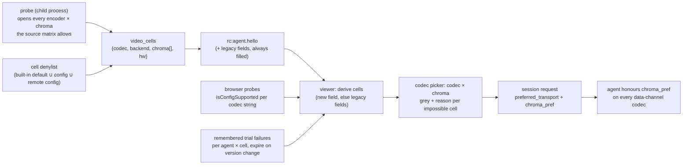

# FR-77 — Encoder × chroma matrix: every backend compiled in, one runtime-probed build, an honest codec picker

**Issue:** [#1470](https://github.com/gjovanov/roomler-ai/issues/1470) · **Status:** proposed 2026-09-07, design settled in a grill session, P0 in flight · **Opened:** 2026-09-07 · **Glossary:** [`CONTEXT.md`](../../CONTEXT.md) · **ADR:** [0001](../adr/0001-encoder-backends-compiled-in-discovered-at-runtime.md) · **Related:** [#1468](https://github.com/gjovanov/roomler-ai/pull/1468) · [FR-16](FR-16-rc-quality-benchmark.md) · [FR-62](FR-62-encoder-rate-changes-without-an-idr.md) · [FR-74](FR-74-text-clarity-on-direct-paths.md)

## Goal

A remote-desktop session picks a **codec** and a **chroma format** independently; the
picker greys every impossible **cell** (codec × chroma format) with the reason; and
every hardware encoder backend FFmpeg offers for our platforms is compiled into **one
build per OS and architecture** and discovered by the runtime probe. No per-vendor
builds, no "smart" installer — that question was closed by a measurement, not a
preference (§Why, and ADR 0001).

The words in bold are the glossary's (`CONTEXT.md`): **codec** (H.264 / HEVC / AV1 /
VP9), **backend** (NVENC / QSV / AMF / VideoToolbox / VAAPI / Media Foundation /
openh264 / libvpx), **encoder** = codec × backend (`hevc_nvenc`), **chroma format**
(4:2:0 / 4:4:4), **cell** = codec × chroma format.

## Why — what the tree and the field say today

### Chroma is modelled three ways at once, and the picker folds it into the codec

- `AgentCaps` (`crates/remote_control/src/models.rs:40-186`) carries chroma as a
  transport name (`data-channel-vp9-444`, `:59` — used even when libvpx emits 4:2:0), a
  string `vp9_chroma` (`:165`) and a list `hevc_chroma` (`:177`). The session request
  carries `preferred_transport` + `chroma_pref` (`crates/remote_control/src/signaling.rs:655,665`).
- The agent hard-wires `yuv420` for the VP9/AV1/H.264 data-channel codecs
  (`agents/roomlerd/src/peer.rs:4379-4386`); the ONLY hardware 4:4:4 path is
  `hevc_nvenc` with the RExt profile (`agents/roomlerd/src/encode/ffmpeg/encoder.rs:698-715`),
  advertised by `hevc_chroma` iff the name is `hevc_nvenc` (`agents/roomlerd/src/encode/caps.rs:502-505`).
- The picker (`ui/src/views/remote/RemoteControl.vue:2457-2523`) is a hard-coded list
  — `auto / av1 / hevc / hevc-444 / vp9-444 / vp9-420 / h264` — English literals, no
  i18n, chroma inside the value. Its per-agent override allow-list omitted `hevc-444`
  (fixed in #1468 by making the list the single source the type derives from).
- The FFmpeg dispatch tables (`encoder.rs:95,107,133,148`) try
  `h264/hevc/av1 × nvenc/qsv/amf/videotoolbox` + `vp9_qsv` (profile 0 only, `:655-659`).
  VAAPI was never wired (`agents/roomlerd/Cargo.toml:198-199` still promises it for
  "rc.74"); no `*_mf` name exists anywhere. macOS ships FFmpeg again since 2026-08-25
  (`release-agent.yml:2043-2066`) — several docs still say it does not.
- There is **no video decoder anywhere on the agent side** (grep-confirmed). The
  browser decodes, through WebCodecs, and probes per codec string
  (`ui/src/composables/useRemoteControl.ts:1760-1833`).

### The size question, measured

Per-object linkable bytes (`.text + .rdata + .data + .pdata + .xdata`) in the FULL
vendored FFmpeg 8.1.2 static library (`vendored-ffmpeg-8.1.2`, win64 static-md, MSVC
release), measured 2026-09-07:

| Backend family | Linkable KB | Shipped today |
|---|---|---|
| NVENC h264/hevc/av1 (`nvenc.o` + 3) | 86 | Win, Linux |
| QSV h264/hevc/av1/vp9 (`qsvenc.o`, `qsv.o` + 4) | 76 | Win, Linux |
| AMF h264/hevc/av1 | 70 | Win, Linux |
| Media Foundation via FFmpeg (`mfenc.o` + `mf_utils.o`) | 51 | no |
| D3D12 video encode h264/hevc/av1 (FFmpeg 8.1+) | 83 | no |
| CBS bitstream writers the D3D12/VAAPI/Vulkan wrappers share | 349 | no |
| VAAPI h264/hevc/av1/vp9 (Linux only; estimated from 223 KB of source) | ~100 | no |
| VideoToolbox (macOS only; estimated) | ~40 | mac |

Every wrapper on every platform is **under 1 MB** against a 35 MiB `roomlerd.exe`, a
13.13 MB MSI and a 10.44 MiB `.deb`. The whole full library is 21.7 MB linkable, which
reproduces the P3e finding ("23 MiB linked where the ten encoders' closure is 0.29").
The real per-backend costs are elsewhere: a hard runtime dependency (VAAPI → `libva`),
probe fault surface, rate-control behaviour (FR-62: AMF and VideoToolbox rebuild on
every bitrate change), and test hardware.

### FFmpeg 9

FFmpeg 9.0.1 "Lei" shipped 2026-08-12. The 9.0 changelog carries nothing on chroma or
new hardware encoders; it removes support for NVENC SDKs older than 11.1 (we build with
`n13.1.15.0`) and **requires AMF headers ≥ 1.5.2** (`configure`: `AMF_VERSION … >=
0x1000500020000`; the Linux vendor job pinned `v1.4.36`). 8.1 had added D3D12 H.264/AV1
encoding. `ffmpeg-next` 9.0.0 exists (2026-08-05); libavcodec's major moves 62 → 63,
which the macOS dylib install names in `release-agent.yml` reference. vcpkg's upstream
`ffmpeg` port is 9.0.1#1 at commit `2e6b9238` (2026-08-17), whose baseline also carries
`libvpl` 2024.2.0, `amd-amf` 1.5.2, `ffnvcodec` 13.0.19.0; the injection anchors our
overlay depends on (`set(CONFIGURE_OPTIONS …)`, the bare `PATCHES` line) exist unchanged
in that portfile. The FR-62 NVENC no-IDR patch applies to n9.0.1 with a −160-line
offset and an identical hunk body.

### What each backend can encode (FFmpeg n9.0 sources)

`RT` = listed and decided at runtime by the driver's capability query.

| Encoder | 4:2:0 | 4:4:4 | Notes |
|---|---|---|---|
| `h264_nvenc` | Y | RT | High 4:4:4 Predictive; 4:2:2 needs SDK 13 headers |
| `hevc_nvenc` | Y | RT | RExt (`hevc_chroma: yuv444` today) |
| `av1_nvenc` | Y | **N** | hard error: "AV1 High Profile not supported" |
| `h264_qsv` | Y | N | |
| `hevc_qsv` | Y | RT | `VUYX` / `XV30`; the code today calls it unreliable |
| `av1_qsv` | Y | N | |
| `vp9_qsv` | Y | RT | `VUYX` = profile 1; the code today pins profile 0 |
| `*_amf` | Y | N | no 4:4:4 surface exists |
| `h264/av1_videotoolbox` | Y | N | |
| `hevc_videotoolbox` | Y | N | only Main / Main10 / Main42210 (4:2:2 10-bit) |
| `h264_vaapi` | Y | N | refused: "non-4:2:0 profiles are not supported" |
| `hevc_vaapi` | Y | RT | `VAProfileHEVCMain444` (VA ≥ 1.2) |
| `av1_vaapi` | Y | N | |
| `vp9_vaapi` | Y | RT | profiles 1 / 3 |
| `*_mf` | Y | N | NV12 or D3D11 NV12 frames only |
| `*_d3d12va` | Y | N | |
| `hevc_vulkan`, `av1_vulkan` | Y | RT | vendor-neutral; a follow-up FR |

### What the browser can decode (Chromium / Firefox / WebKit sources, 2026-09-07)

| Cell | Chrome SW | Chrome HW Win | Chrome HW Linux | Chrome mac | Firefox | Safari |
|---|---|---|---|---|---|---|
| H.264 4:4:4 (`avc1.F4…`) | **Y** (ffmpeg) | N | N | N → SW | Win N · Linux Y | N |
| HEVC 4:4:4 (`hvc1.4.10…`) | N (no SW HEVC) | driver-dependent: Intel GUIDs, DXVA GUIDs since 2025-02 ⇒ NVIDIA on Chrome ≥ 137 | **N** | Y via VideoToolbox | Nightly only | VT-dependent |
| VP9 4:4:4 (`vp09.01…`) | **Y** (libvpx) | N | N | N → SW | Y (SW) | **N** |
| AV1 4:4:4 (`av01.1…`) | Y (dav1d) | driver-dependent | N | N → SW | Y (SW) | N |

Two structural facts shape the design: Chromium keeps **one** `HEVCPROFILE_REXT` for
every RExt chroma form, so `isConfigSupported` cannot tell 4:4:4 from 4:2:2 (the
mismatch surfaces at the first SPS); and no browser API says whether hardware or software
decoded. Only a real-bytes trial proves a cell, and the page-scoped transport ban
(`useRemoteControl.ts:3845`) already is that trial.

**The honest 4:4:4 cells** are therefore: HEVC 4:4:4 (hardware both ends on modern
NVIDIA and Intel; not on Linux Chrome), VP9 4:4:4 (software or Intel hardware encode,
software decode everywhere but Safari), H.264 4:4:4 (NVENC encode, Chrome software
decode — a new, untested cell). AV1 4:4:4 has no hardware encoder and is out.

## Key design

1. **One additive capability field.** `AgentCaps.video_cells: Vec<VideoCell { codec, backend, chroma: Vec<String>, hw: bool }>`,
   wire strings, typed on both sides through enums with a `wire()` mapping (the
   `RpcCap` pattern, `crates/remote_control/src/models.rs`), unknown values ignored, an
   entry only for a cell the probe actually opened. `hw_encoders`, `vp9_chroma`,
   `hevc_chroma` and the transport names keep being filled from the same data,
   **forever** — renaming `data-channel-vp9-444` would strand every deployed agent.
2. **`hw` is verified, never assumed.** NVENC, AMF, VideoToolbox and VAAPI are hardware
   by construction. QSV is not: oneVPL enumerates implementations in order and a host
   with Intel's CPU runtime opens `hevc_qsv` in software. QSV cells open through a
   hardware-only device, so a software implementation fails the open. (FR-16's
   "advertises hardware, runs software" case.)
3. **The probe is eager, in the child, bounded.** One timeout per open; the probe's
   duration reported in the hello. Today's probe (`caps.rs:51-254`) opens the first
   working backend per codec in ~2.6 s on the dev box; the matrix prunes to roughly
   16–18 opens on a Windows host. A cache keyed by GPU + driver version is added only if
   fleet p95 crosses ~3 s.
4. **A cell denylist is the kill switch.** Agent config key (`backend:chroma` entries)
   with a built-in default the field tests shrink — HEVC 4:4:4 on QSV and VAAPI start on
   it — and pushable through remote config, since it is not a security gate.
5. **The picker is two independent dropdowns; validity is a matrix.** Codec and chroma
   format, i18n keys, each impossible entry greyed with the reason as its subtitle.
   Auto chroma follows Priority (sharper ⇒ 4:4:4 when a cell exists; latency and
   balanced ⇒ 4:2:0). Auto codec under 4:4:4 ranks HEVC → VP9 → H.264 → libvpx; under
   4:2:0 it keeps today's rank (`useRemoteControl.ts:2176-2242`). Explicit chroma
   overrides Priority; Priority only ever fills an Auto. The backend is never in the
   picker: it is a host fact, shown in the pill (FR-26 format).
6. **Decode gating.** Pessimistic on the agent (probed cells only), optimistic on the
   browser (RExt accepted ⇒ offered), the real-bytes trial is the proof, and a failed
   trial is remembered per agent × cell until the browser or driver version string
   changes.
7. **One derivation, two consumers.** A pre-FR agent's legacy fields derive into cells
   for the picker and the admin codec chips (`ui/src/components/admin/agentCodecChips.ts`),
   unit-tested against a recorded 0.4.79 hello.
8. **Rate control gets a chroma column.** The per-codec ceiling factor table (FR-74 P1,
   `ffmpeg_maxrate_bps_scaled`) gains a chroma column, initialised to what the libvpx
   4:4:4 pump uses today, set by each cell's field test. No constant invented at the desk.
9. **VAAPI.** `--enable-vaapi` in the Linux vendor job; `libva2` + `libva-drm2` as
   package `Depends` (system, so it matches the host's drivers), driver packages as
   `Recommends`; render nodes iterated in order with a config key to pin one; arm64
   stays without FFmpeg. Names in the dispatch tables: `h264/hevc/av1/vp9_vaapi` after
   the vendor names.
10. **Backends deliberately not added.** FFmpeg's `*_mf`: the native Media Foundation
    module (`agents/roomlerd/src/encode/mf/`) is field-proven, takes NV12 straight from
    capture, and FFmpeg's wrapper is strictly weaker. D3D12 and Vulkan video encode:
    vendor-neutral and worth it, but each is a new hardware-frames path in the pump,
    not a name in a table — a follow-up FR.

## Phases

| # | Phase | Kill switch | Status |
|---|---|---|---|
| P0 | FFmpeg **9.0.1** on all three vendoring lanes (vcpkg baseline `2e6b9238`, AMF headers `v1.5.2`, `ffmpeg-next = "9.0"`, dylib names → 63, the NVENC patch re-based) + `scripts/dev-ffmpeg-windows.ps1`, the native Windows dev loop | flip the three asset patterns back to `vendored-ffmpeg-8.1.2` (kept one release) | in flight |
| P1 | `video_cells` + the matrix probe + verified `hw` + probe duration in the hello; server passthrough | legacy fields stay filled; a viewer ignoring the field sees today | — |
| P2 | Picker: codec × chroma dropdowns, i18n, Auto rules, remembered trial failures, the shared derivation | ships with P1 | — |
| P3 | New cells: VP9 4:4:4 hardware (QSV/VAAPI profile 1), H.264 4:4:4 (NVENC + software decode), HEVC 4:4:4 on QSV/VAAPI behind the denylist; the chroma column | the cell denylist | — |
| P4 | VAAPI on Linux x86_64 | `ROOMLERD_USE_FFMPEG=0` / the denylist | — |
| P5 | `docs/encoders.md` rewritten with diagrams (the cell resolution, the probe lifecycle); stale "macOS ships no FFmpeg" lines corrected in `CLAUDE.md`, `THIRD-PARTY-NOTICES.md`, `docs/lgpl-relink.md`; `docs/README.md` row | — | — |
| next | FR for D3D12 video encode (Windows) + Vulkan video encode (Linux/Windows) | — | — |

## Acceptance criteria

- [ ] **P0** — `roomlerd encoder-smoke` passes on the dev box against the 9.0.1 tree
      (native Windows build via the script) before any tag; after the roll, one session
      each on NVENC (dev box), QSV (CORPLAP-3) and VideoToolbox (the MacBook) with
      heartbeats unchanged from 0.4.80; the FR-62 drift gate green on the 9.0.1 assets.
- [ ] **P1** — the hello carries `video_cells` on the dev box and CORPLAP-3; the probe
      duration is reported; a viewer built before this FR sees no change.
- [ ] **P2** — the picker greys every impossible cell with its reason; a stored
      `hevc-444` override survives reconnect (#1468); the derivation reproduces today's
      picker for a recorded 0.4.79 hello.
- [ ] **P3** — the FR-74 Notepad++ scroll on each new cell, operator-judged, with the
      cell's ceiling factor recorded; HEVC 4:4:4 on QSV leaves the denylist only on a pass.
- [ ] **P4** — `roomlerd` starts on stock Ubuntu 24.04 with only the declared
      dependencies; a VAAPI cell opens on the dev box's WSL (Mesa D3D12 driver);
      bare-metal Intel and AMD recorded honestly as pending.
- [ ] **Docs** updated/created with diagrams, linked from `docs/README.md`.

## Open decisions

- Probe cache keyed by GPU + driver version: only if the measured fleet p95 exceeds ~3 s.
- The chroma column's initial values, and whether the relay clamp needs a chroma term:
  decided by P3's field tests.

## Out of scope

Native decoders (the browser decodes) · 4:2:2 and 10-bit · per-vendor builds · FFmpeg's
`*_mf` · D3D12 and Vulkan (follow-up FR) · arm64 FFmpeg · AV1 4:4:4 (no hardware
encoder exists) · a backend override in the picker (FR-16's diagnostics knob) ·
multi-GPU adapter selection for Windows backends (unchanged).

## Field-verification log

| Date | Host | Phase | Result |
|---|---|---|---|
| 2026-09-07 | dev box (RTX 5090 Laptop + Radeon 610M) | baseline | shipped 0.4.79 probe: `mf-h264-hw`, `ffmpeg-{hevc,av1,h264}_nvenc`, `libvpx-vp9-444-sw`, `hevc_chroma: [yuv420, yuv444]`, 2.6 s; no AMF cell (the probe stops at the first opener per codec) |
| 2026-09-07 | vendor lanes | P0 | `vendored-ffmpeg-9.0.1` published from the P0 branch: win64 static-md minimal 11.95 MB (`avcodec.lib` 12.1 MB — unchanged from 8.1.2; 10 encoders present, registry payload gone), linux minimal 1.1 MB, macos 790 KB, corresponding source 17.2 MB; `ROOMLER-PATCHES.txt` = the re-based NVENC patch |
| 2026-09-07 | dev box, native Windows build via `scripts/dev-ffmpeg-windows.ps1` | P0 | roomlerd from the P0 branch against the 9.0.1 tree: build 3 m 05 s incremental; link check libavcodec **63**; `encoder-smoke --codec hevc` → `hevc_nvenc` **PASS**, `--codec h264` → `mf-h264` PASS, `--codec av1` fails on the Media Foundation AV1 MFT (ActivateObject — the known NVENC-MFT issue, no FFmpeg involved); caps probe advertises the **same set as 0.4.79** (`openh264-sw`, `mf-h264-hw`, `ffmpeg-{hevc,av1,h264}_nvenc`, `libvpx-vp9-444-sw`, `hevc_chroma` yuv420+yuv444) in 2.2 s. Three recipe traps found and fixed: pkgconf's DLL, `CMAKE_POLICY_VERSION_MINIMUM`, `FFMPEG_DIR` bypassing pkg-config |
