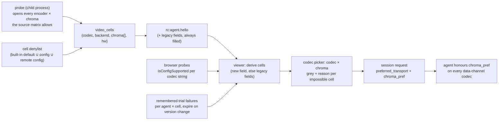

# FR-77 — Encoder × chroma matrix: every backend compiled in, one runtime-probed build, an honest codec picker

**Issue:** [#1470](https://github.com/gjovanov/roomler-ai/issues/1470) · **Status:** P0 released as `agent-v0.4.82` and field-verified 2026-09-07 on NVENC, QSV and VideoToolbox; P1 next · **Opened:** 2026-09-07 · **Glossary:** [`CONTEXT.md`](../../CONTEXT.md) · **ADR:** [0001](../adr/0001-encoder-backends-compiled-in-discovered-at-runtime.md) · **Related:** [#1468](https://github.com/gjovanov/roomler-ai/pull/1468) · [FR-16](FR-16-rc-quality-benchmark.md) · [FR-62](FR-62-encoder-rate-changes-without-an-idr.md) · [FR-74](FR-74-text-clarity-on-direct-paths.md)

## Goal

A remote-desktop session picks a **codec** and a **chroma format** independently; the
picker greys every impossible **cell** (codec × chroma format) with the reason; and
every hardware encoder backend FFmpeg offers for our platforms is compiled into **one
build per OS and architecture** and discovered by the runtime probe. No per-vendor
builds, no "smart" installer — that question was closed by a measurement, not a
preference (§Why, and ADR 0001).

The words in bold are the glossary's (`CONTEXT.md`): **codec** (H.264 / HEVC / AV1 /
VP9), **backend** (NVENC / QSV / AMF / VideoToolbox / VAAPI / Media Foundation /
openh264 / libvpx), **encoder** = codec × backend (`hevc_nvenc`), **chroma format**
(4:2:0 / 4:4:4), **cell** = codec × chroma format.

## Why — what the tree and the field say today

### Chroma is modelled three ways at once, and the picker folds it into the codec

- `AgentCaps` (`crates/remote_control/src/models.rs:40-186`) carries chroma as a
  transport name (`data-channel-vp9-444`, `:59` — used even when libvpx emits 4:2:0), a
  string `vp9_chroma` (`:165`) and a list `hevc_chroma` (`:177`). The session request
  carries `preferred_transport` + `chroma_pref` (`crates/remote_control/src/signaling.rs:655,665`).
- The agent hard-wires `yuv420` for the VP9/AV1/H.264 data-channel codecs
  (`agents/roomlerd/src/peer.rs:4379-4386`); the ONLY hardware 4:4:4 path is
  `hevc_nvenc` with the RExt profile (`agents/roomlerd/src/encode/ffmpeg/encoder.rs:698-715`),
  advertised by `hevc_chroma` iff the name is `hevc_nvenc` (`agents/roomlerd/src/encode/caps.rs:502-505`).
- The picker (`ui/src/views/remote/RemoteControl.vue:2457-2523`) is a hard-coded list
  — `auto / av1 / hevc / hevc-444 / vp9-444 / vp9-420 / h264` — English literals, no
  i18n, chroma inside the value. Its per-agent override allow-list omitted `hevc-444`
  (fixed in #1468 by making the list the single source the type derives from).
- The FFmpeg dispatch tables (`encoder.rs:95,107,133,148`) try
  `h264/hevc/av1 × nvenc/qsv/amf/videotoolbox` + `vp9_qsv` (profile 0 only, `:655-659`).
  VAAPI was never wired (`agents/roomlerd/Cargo.toml:198-199` still promises it for
  "rc.74"); no `*_mf` name exists anywhere. macOS ships FFmpeg again since 2026-08-25
  (`release-agent.yml:2043-2066`) — several docs still say it does not.
- There is **no video decoder anywhere on the agent side** (grep-confirmed). The
  browser decodes, through WebCodecs, and probes per codec string
  (`ui/src/composables/useRemoteControl.ts:1760-1833`).

### The size question, measured

Per-object linkable bytes (`.text + .rdata + .data + .pdata + .xdata`) in the FULL
vendored FFmpeg 8.1.2 static library (`vendored-ffmpeg-8.1.2`, win64 static-md, MSVC
release), measured 2026-09-07:

| Backend family | Linkable KB | Shipped today |
|---|---|---|
| NVENC h264/hevc/av1 (`nvenc.o` + 3) | 86 | Win, Linux |
| QSV h264/hevc/av1/vp9 (`qsvenc.o`, `qsv.o` + 4) | 76 | Win, Linux |
| AMF h264/hevc/av1 | 70 | Win, Linux |
| Media Foundation via FFmpeg (`mfenc.o` + `mf_utils.o`) | 51 | no |
| D3D12 video encode h264/hevc/av1 (FFmpeg 8.1+) | 83 | no |
| CBS bitstream writers the D3D12/VAAPI/Vulkan wrappers share | 349 | no |
| VAAPI h264/hevc/av1/vp9 (Linux only; estimated from 223 KB of source) | ~100 | no |
| VideoToolbox (macOS only; estimated) | ~40 | mac |

Every wrapper on every platform is **under 1 MB** against a 35 MiB `roomlerd.exe`, a
13.13 MB MSI and a 10.44 MiB `.deb`. The whole full library is 21.7 MB linkable, which
reproduces the P3e finding ("23 MiB linked where the ten encoders' closure is 0.29").
The real per-backend costs are elsewhere: a runtime dependency (VAAPI → `libva`, bundled since P4),
probe fault surface, rate-control behaviour (FR-62: AMF and VideoToolbox rebuild on
every bitrate change), and test hardware.

### FFmpeg 9

FFmpeg 9.0.1 "Lei" shipped 2026-08-12. The 9.0 changelog carries nothing on chroma or
new hardware encoders; it removes support for NVENC SDKs older than 11.1 (we build with
`n13.1.15.0`) and **requires AMF headers ≥ 1.5.2** (`configure`: `AMF_VERSION … >=
0x1000500020000`; the Linux vendor job pinned `v1.4.36`). 8.1 had added D3D12 H.264/AV1
encoding. `ffmpeg-next` 9.0.0 exists (2026-08-05); libavcodec's major moves 62 → 63,
which the macOS dylib install names in `release-agent.yml` reference. vcpkg's upstream
`ffmpeg` port is 9.0.1#1 at commit `2e6b9238` (2026-08-17), whose baseline also carries
`libvpl` 2024.2.0, `amd-amf` 1.5.2, `ffnvcodec` 13.0.19.0; the injection anchors our
overlay depends on (`set(CONFIGURE_OPTIONS …)`, the bare `PATCHES` line) exist unchanged
in that portfile. The FR-62 NVENC no-IDR patch applies to n9.0.1 with a −160-line
offset and an identical hunk body.

### What each backend can encode (FFmpeg n9.0 sources)

`RT` = listed and decided at runtime by the driver's capability query.

| Encoder | 4:2:0 | 4:4:4 | Notes |
|---|---|---|---|
| `h264_nvenc` | Y | RT | High 4:4:4 Predictive; 4:2:2 needs SDK 13 headers |
| `hevc_nvenc` | Y | RT | RExt (`hevc_chroma: yuv444` today) |
| `av1_nvenc` | Y | **N** | hard error: "AV1 High Profile not supported" |
| `h264_qsv` | Y | N | |
| `hevc_qsv` | Y | RT | `VUYX` / `XV30`; the code today calls it unreliable |
| `av1_qsv` | Y | N | |
| `vp9_qsv` | Y | RT | `VUYX` = profile 1; the code today pins profile 0 |
| `*_amf` | Y | N | no 4:4:4 surface exists |
| `h264/av1_videotoolbox` | Y | N | |
| `hevc_videotoolbox` | Y | N | only Main / Main10 / Main42210 (4:2:2 10-bit) |
| `h264_vaapi` | Y | N | refused: "non-4:2:0 profiles are not supported" |
| `hevc_vaapi` | Y | RT | `VAProfileHEVCMain444` (VA ≥ 1.2) |
| `av1_vaapi` | Y | N | |
| `vp9_vaapi` | Y | RT | profiles 1 / 3 |
| `*_mf` | Y | N | NV12 or D3D11 NV12 frames only |
| `*_d3d12va` | Y | N | |
| `hevc_vulkan`, `av1_vulkan` | Y | RT | vendor-neutral; a follow-up FR |

### What the browser can decode (Chromium / Firefox / WebKit sources, 2026-09-07)

| Cell | Chrome SW | Chrome HW Win | Chrome HW Linux | Chrome mac | Firefox | Safari |
|---|---|---|---|---|---|---|
| H.264 4:4:4 (`avc1.F4…`) | **Y** (ffmpeg) | N | N | N → SW | Win N · Linux Y | N |
| HEVC 4:4:4 (`hvc1.4.10…`) | N (no SW HEVC) | driver-dependent: Intel GUIDs, DXVA GUIDs since 2025-02 ⇒ NVIDIA on Chrome ≥ 137 | **N** | Y via VideoToolbox | Nightly only | VT-dependent |
| VP9 4:4:4 (`vp09.01…`) | **Y** (libvpx) | N | N | N → SW | Y (SW) | **N** |
| AV1 4:4:4 (`av01.1…`) | Y (dav1d) | driver-dependent | N | N → SW | Y (SW) | N |

Two structural facts shape the design: Chromium keeps **one** `HEVCPROFILE_REXT` for
every RExt chroma form, so `isConfigSupported` cannot tell 4:4:4 from 4:2:2 (the
mismatch surfaces at the first SPS); and no browser API says whether hardware or software
decoded. Only a real-bytes trial proves a cell, and the page-scoped transport ban
(`useRemoteControl.ts:3845`) already is that trial.

**The honest 4:4:4 cells** are therefore: HEVC 4:4:4 (hardware both ends on modern
NVIDIA and Intel; not on Linux Chrome), VP9 4:4:4 (software or Intel hardware encode,
software decode everywhere but Safari), H.264 4:4:4 (NVENC encode, Chrome software
decode — a new, untested cell). AV1 4:4:4 has no hardware encoder and is out.

## Key design

1. **One additive capability field.** `AgentCaps.video_cells: Vec<VideoCell { codec, backend, chroma: Vec<String>, hw: bool }>`,
   wire strings, typed on both sides through enums with a `wire()` mapping (the
   `RpcCap` pattern, `crates/remote_control/src/models.rs`), unknown values ignored, an
   entry only for a cell the probe actually opened. `hw_encoders`, `vp9_chroma`,
   `hevc_chroma` and the transport names keep being filled from the same data,
   **forever** — renaming `data-channel-vp9-444` would strand every deployed agent.
2. **`hw` is verified, never assumed.** NVENC, AMF, VideoToolbox and VAAPI are hardware
   by construction. QSV is not: oneVPL enumerates implementations in order and a host
   with Intel's CPU runtime opens `hevc_qsv` in software. QSV cells open through a
   hardware-only device, so a software implementation fails the open. (FR-16's
   "advertises hardware, runs software" case.)
3. **The probe is eager, in the child, bounded.** One timeout per open; the probe's
   duration reported in the hello. Today's probe (`caps.rs:51-254`) opens the first
   working backend per codec in ~2.6 s on the dev box; the matrix prunes to roughly
   16–18 opens on a Windows host. A cache keyed by GPU + driver version is added only if
   fleet p95 crosses ~3 s.
4. **A cell denylist is the kill switch.** Agent config key (`backend:chroma` entries)
   with a built-in default the field tests shrink — HEVC 4:4:4 on QSV and VAAPI start on
   it — and pushable through remote config, since it is not a security gate.
5. **The picker is two independent dropdowns; validity is a matrix.** Codec and chroma
   format, i18n keys, each impossible entry greyed with the reason as its subtitle.
   Auto chroma follows Priority (sharper ⇒ 4:4:4 when a cell exists; latency and
   balanced ⇒ 4:2:0). Auto codec under 4:4:4 ranks HEVC → VP9 → H.264 → libvpx; under
   4:2:0 it keeps today's rank (`useRemoteControl.ts:2176-2242`). Explicit chroma
   overrides Priority; Priority only ever fills an Auto. The backend is never in the
   picker: it is a host fact, shown in the pill (FR-26 format).
6. **Decode gating.** Pessimistic on the agent (probed cells only), optimistic on the
   browser (RExt accepted ⇒ offered), the real-bytes trial is the proof, and a failed
   trial is remembered per agent × cell until the browser or driver version string
   changes.
7. **One derivation, two consumers.** A pre-FR agent's legacy fields derive into cells
   for the picker and the admin codec chips (`ui/src/components/admin/agentCodecChips.ts`),
   unit-tested against a recorded 0.4.79 hello.
8. **Rate control gets a chroma column.** The per-codec ceiling factor table (FR-74 P1,
   `ffmpeg_maxrate_bps_scaled`) gains a chroma column, initialised to what the libvpx
   4:4:4 pump uses today, set by each cell's field test. No constant invented at the desk.
9. **VAAPI.** `--enable-vaapi` in the Linux vendor job; libva + libdrm BUILT INTO the
   vendor tree and bundled (the P4 build measured why: a `Depends: libva2` is a load-time
   need the updater's offline `dpkg --install` cannot satisfy, and the binary is replaced
   before the failure); the VA driver stays the host's, as `Suggests` (Mesa's drags LLVM
   onto headless servers); render nodes iterated in order with a config key to pin one; arm64
   stays without FFmpeg. Names in the dispatch tables: `h264/hevc/av1/vp9_vaapi` after
   the vendor names.
10. **Backends deliberately not added.** FFmpeg's `*_mf`: the native Media Foundation
    module (`agents/roomlerd/src/encode/mf/`) is field-proven, takes NV12 straight from
    capture, and FFmpeg's wrapper is strictly weaker. D3D12 and Vulkan video encode:
    vendor-neutral and worth it, but each is a new hardware-frames path in the pump,
    not a name in a table — a follow-up FR.

### P1 / P2 — as built (#1480)

- **QSV `hw` is verified by construction, not by FFI.** On the oneVPL build FFmpeg's
  internal MFX session filters `MFX_IMPL_TYPE_HARDWARE` (`libavcodec/qsv.c:518-522`),
  so the dispatcher never enumerates Intel's CPU runtime — an open either lands on
  silicon or fails. `av1_qsv` registers only under libvpl, so its presence is the
  flavour check (`FfmpegEncoder::qsv_is_hardware_by_construction`).
- **The 4:4:4 attempt list is the source matrix's** (`FFMPEG_444_CAPABLE`:
  `h264_nvenc`, `hevc_nvenc`, `hevc_qsv`, `vp9_qsv`, `hevc_vaapi`, `vp9_vaapi`), locked
  by a test that refuses AV1, AMF and VideoToolbox names. `h264_nvenc` needed
  `profile=high444p` — `rext` is HEVC's and h264_nvenc rejects it at open, which the old
  option builder would have read as "cannot do 4:4:4".
- **The denylist is an env key in P1** (`ROOMLERD_ENCODER_CELLS_DENY`, replaces the
  built-in `hevc_qsv:yuv444,hevc_vaapi:yuv444`; empty = deny nothing). The config key
  and the remote-config push land with P3, when the first denylisted cell is field-tested.
- **`probe_ms` is stamped by the parent** (spawn → parsed result), the cost the daemon
  actually paid; the driver-free fallback carries none.
- **Two viewer semantics moved**: a VP9 transport with chroma "auto" now reads as the
  dial-following `vp9` choice (it read as 4:2:0 while the agent, given no
  `chroma_pref`, ran profile 1), and chroma Auto on an explicit VP9/HEVC pick follows
  the Priority dial (balanced ⇒ 4:2:0). Stored choices gained `vp9`, `auto-444`,
  `auto-420`; the per-agent persistence is unchanged.
- **Decode failures are remembered per device × cell** under the browser build that
  failed (`roomler-rc-cell-failed.v1:<agent>`); a 4:4:4 failure bans only the 4:4:4
  cell. The page-scoped transport ban stays as the first-response mechanism.

### P3a — as built (#1488): the probe cache, the denylist key, the chroma column

- **The probe cache** (`agents/roomlerd/src/encode/caps_cache.rs`, decided by the
  operator on 2026-09-07 after the 0.4.83 read: 3986 ms on the dev box, 5432 ms on
  CORPLAP-3, both over the ~3 s line). The child probe's answer is kept in
  `caps-cache.json` next to the daemon's logs under a key of exactly what the
  answer depends on: the **build** (crate version + the executable's length and
  mtime — a dev build with the same version is a different build), the **hardware
  fingerprint** (`hwid.rs`: on Windows every display-class driver instance's
  `DriverDesc` / `DriverVersion` / `MatchingDeviceId` from the registry plus the OS
  build and UBR; on Linux the sysfs DRM ids and kernel driver per card, the NVIDIA
  module version, the kernel release and the size + mtime of the userspace driver
  libraries the backends dlopen; on macOS **no key ⇒ no cache** — its probe is
  ~120 ms and VideoToolbox is the OS), and a **SHA-256 of every `ROOMLERD_*` knob**
  (env + the S2 config fallbacks, so a denylist edit or `ROOMLERD_DC_H264=0` re-probes;
  hashed because an env block can carry a token). A mismatch on any part, a format
  bump, or an age over **7 days** re-probes. **Only a result that opened a hardware
  cell is cached**: a no-hardware answer is the cheap case, and it is what a
  boot-time driver race produces — a service that starts before the display driver —
  which must not be frozen for a week. A hit takes ONLY the driver-derived fields
  (`hw_encoders`, `codecs`, `transports`, `hevc_chroma`, `vp9_chroma`, `video_cells`);
  permissions, the GUI-session state, the file / clipboard / app / RPC verbs are
  recomputed on every start. The hello says `probe_cached: true` and `probe_ms` is
  then the cached probe's duration, so the fleet read of probe cost keeps meaning.
  Kill switch: config `caps_cache = false` / `ROOMLERD_CAPS_CACHE=0` (read AND write).
- **Found on the way: the vp9_qsv runtime-IDR verdict never left the child.** P4 of the
  QSV work probed whether `vp9_qsv` honours a forced IDR and cached the verdict in a
  `OnceLock` — which rc.433 (the out-of-process probe) left in the CHILD, where nothing
  read it again. Every vp9_qsv session since has run the GOP-60 containment the probe
  existed to lift, with nothing logged. The child now prints a **`ProbeReport`
  envelope** (`{caps, vp9_qsv_idr}`; a bare-caps line still parses), the parent installs
  the verdict (`FfmpegEncoder::set_vp9_qsv_idr_verdict`), and the cache keeps it.
- **The denylist is a config key** (`encoder_cells_deny`, validated `name:chroma`
  entries or `none`; blank clears to the built-in), bridged to the probe child through
  the S2 fallback map like every other knob, and **pushable through remote config with
  `MANAGE_AGENTS` alone** — it is the matrix's kill switch, not a security gate: it only
  ever removes cells. The device reports it as `needs_restart` (the probe runs once per
  process). `DesiredConfig.encoder_cells_deny` is the first non-security key on that
  surface; the `remote_config_enabled` opt-in still applies (it is about accepting
  pushed config at all).
- **The chroma column**: `chroma_rate_factor_pct(codec, chroma444)` — 100 for 4:2:0, a
  per-codec 4:4:4 factor on top of the codec factor, built-in **150** (what the libvpx
  4:4:4 pump used before the column existed) until a cell's field test sets its own
  through `rate_factor_{h264,hevc,vp9}_444` (`ROOMLERD_RATE_FACTOR_<CODEC>_444`,
  50–400). No AV1 key: no AV1 encoder does 4:4:4.
- **`cells.rs`** now holds the shared vocabulary (the 4:4:4 attempt list, the denylist,
  `names_444(codec)` = the cascade minus the denylist) so the probe's advertisement and
  the pump's 4:4:4 cascade (P3b) can never disagree.

### P3b — as built (#1489): the cells

- **VUYX is the 4:4:4 input for QSV and VAAPI** (`chroma444_pixel(name)`): FFmpeg n9's
  `vp9_qsv` / `hevc_qsv` list packed VUYX and XV30 and never planar 4:4:4 — the reason
  the P1 probe's 4:4:4 open of `vp9_qsv` failed on CORPLAP-3 while the name was on the
  attempt list. The pump keeps dcv's BT.601 I444 planes and interleaves them
  (`pack_vuyx`: V, U, Y, 0xFF per pixel — `AV_PIX_FMT_VUYX` byte order) into ONE packed
  plane the frame is built from, so the packed path renders identically to the planar
  one. NVENC keeps planar `yuv444p`. QSV's profile is set explicitly (`rext` for HEVC,
  `profile1` for VP9) in the `base` tier: a driver that rejects the key falls to the
  defaults tier, where the runtime derives the profile from the VUYX frames itself.
- **The 4:4:4 cascade is `cells::names_444(codec)`** — the source matrix minus the
  denylist, in cascade order — in every constructor: `new_hevc_adaptive` (hevc_nvenc,
  then hevc_qsv once the denylist lets it), `new_h264_adaptive` (h264_nvenc, High 4:4:4
  Predictive), `new_vp9_adaptive` (vp9_qsv profile 1). HEVC and H.264 fall back to the
  4:2:0 cascade on rejection and the pump reports the truth (`cell_444` from
  `enc.chroma444()`, `rc:video-info chroma`); **VP9 deliberately does not** — the
  viewer configured its decoder for profile 1 and a VP9 profile mismatch is a blank
  canvas, so a rejected `vp9_qsv` 4:4:4 returns `Err` and the session dispatch, which
  probes the exact cell first, runs libvpx (the software profile-1 path) instead.
- **The pump is chroma-generic**: `hevc_444` became `cell_444` (any codec but AV1), the
  shared-pipeline key is `FfmpegDcCodec::pipeline_label(chroma444)` (`HEVC-444`,
  `VP9-444`, `H264-444` — a 4:4:4 session never shares a pump with a 4:2:0 one of the
  same codec, the viewers configured different decoders), and the chroma column applies
  to every 4:4:4 cell through `rate_plan(…, cell_444, …)`.
- **The H.264 data-channel session honours `chroma_pref`** exactly as the HEVC one has
  since P7: sent only when both gates pass — the agent's `h264/nvenc yuv444` cell and the
  browser's `VideoDecoder.isConfigSupported` on the High 4:4:4 Predictive ladder
  (`avc1.F40034` / `F40033` / `F4002A`, profile_idc 244, the same Annex-B no-description
  contract). Chrome decodes High 4:4:4 in software only, which the rank prices in.
- **The viewer**: `SESSION_SUPPORTS_444.h264 = true`; `h264-444` is a stored choice
  (`choiceFromPicker('h264','yuv444')`, round-trips through the settings); the H.264
  4:4:4 cell's verdicts are `h264444` / `browserNoH264High444` / `agentNoH264_444`; a
  VP9 4:4:4 cell with a hardware backend reads `vp9444hw`. **The auto-rank** gains two
  rungs for an EXPLICIT 4:4:4 only, after the HEVC Rext pair and before the libvpx cell:
  H.264 High 4:4:4 (HW encode, SW decode), then VP9 profile 1 on `vp9_qsv` (HW encode,
  SW decode). Sharper-on-Auto does not take them: it trades hardware decode for chroma
  only at the libvpx rung, where nothing is lost. A remembered `h264:yuv444` decode
  failure bans the cell like the others.
- **HEVC 4:4:4 on QSV stays behind the denylist** — the code path exists (VUYX + `rext`),
  the cell opens only once `encoder_cells_deny` is pushed to a host without
  `hevc_qsv:yuv444`, which is P3's field test on CORPLAP-3.

### P3c — as built (#1491): the probe in two children, and what the 0.4.84 roll found

- **What the roll found (2026-09-08).** On CORPLAP-3 the first 0.4.84 probe child died
  with `0xc0000005` 3.5 s in, and the daemon advertised **no hardware at all** — the
  driver-free fallback is `h264/openh264` only. The one open P3b added on that host is
  `vp9_qsv` in 4:4:4 over VUYX; every other open was unchanged since 0.4.83. The process
  boundary did its job (the daemon never crashed), but a single child made the price of
  one faulting cell the WHOLE matrix: `av1_qsv`, `h264_qsv` and `vp9_qsv` 4:2:0 all gone
  for a cell no session needed. And on a service host the child's own log lines reach
  nothing — the error's "see the child's log lines above" was empty.
- **The probe runs in two children.** Phase `base` (`ROOMLERD_CAPS_PHASE=base`) is every
  4:2:0 open, the software cells and the vp9_qsv IDR verdict — no FFmpeg 4:4:4 attempt.
  Phase `444` opens only the 4:4:4 forms of the names the parent computes from the base
  matrix (`candidates_444`: hardware NVENC/QSV/VAAPI cells, not AV1, on the source
  matrix's list, minus the denylist), and answers with the names that opened
  (`ROOMLER_CAPS_444:[…]`); the parent folds them in (`merge_444`: the cells gain
  `yuv444`, and the legacy `hevc_chroma` says 4:4:4 exactly when `hevc_nvenc` won and
  opened). A dying or hanging 4:4:4 child now costs only the 4:4:4 forms: the 4:2:0
  matrix is advertised and the log names the cell. `probe_ms` is both children's cost.
- **The child announces every open on stdout** (`ROOMLER_CAPS_PROGRESS:<name>:yuv444`,
  line-buffered so it survives a crash), and the parent quotes the last one in its
  verdict — "which open died" is answered on service hosts too, and the line tells the
  operator what to add to `encoder_cells_deny`.
- **`vp9_qsv:yuv444` joins the built-in denylist** until a driver proves it; the cell is
  one push away on any host (`encoder_cells_deny` without it).
- **Field-verified on the same roll**: the cache (dev box: `cache hit — reusing the last
  probe's encoder matrix age_secs=708 probe_ms=3629 cells=8` 0.5 s after `agent
  starting`; the hello says `probe_cached: true` with `hevc_chroma` intact) and the
  denylist push (CORPLAP-3: opt-in over Fleet RPC → `PUT desired-config` with the key
  alone, 200 with `MANAGE_AGENTS` → restart → `applied` + `needs_restart:
  ["encoder_cells_deny"]` → restart → 6 cells back in 3032 ms, `applied` / `noop`).

### P4 — as built (#1494): VAAPI on Linux x86_64

- **The vendor build gains VAAPI**: the Linux job of `vendor-ffmpeg-windows.yml`
  configures `--enable-vaapi` with the four `*_vaapi` encoders on top of the ten vendor
  ones, verifies fourteen names in its runtime probe, and publishes the tree as
  **`ffmpeg-9.0.1-linux64-lgpl-shared-minimal-vaapi.tar.xz`** on the same
  `vendored-ffmpeg-9.0.1` release — a new asset name, because the tree's load-time needs
  changed. Rollback = drop the `-vaapi` suffix in `release-agent.yml`'s download pattern.
- **libva and libdrm are BUNDLED, the VA driver is the host's** — a correction to
  decision 9 as first written ("libva stays the system's, `Depends: libva2`"), made on the
  measurements of the build day. `--enable-vaapi` makes `libva.so.2` a DT_NEEDED of
  libavutil, i.e. a LOAD-time requirement of the daemon binary; a `Depends` satisfies it
  only where apt reaches a mirror, and the updater's offline fallback is `dpkg --install`
  (`updater.rs::linux_install_candidates`), which replaces the binary BEFORE the
  dependency failure — the host runs on the old inode until its next restart and then
  cannot start its daemon at all (the class the caps-probe and `/etc/roomler` entries in
  `CLAUDE.md` describe: a freeze, not an error; jupiter and zeus lacked `libva-drm2`,
  a stock 24.04 server lacks both). The reason decision 9 gave for the system's libva was
  a conflation: the thing that must match the host's kernel is the VA **driver**
  (`iHD` / `radeonsi` / `nouveau`), and libva is only the dispatcher that dlopens it; its
  one coupling to a driver is the `__vaDriverInit_1_<minor>` lookup, which walks DOWN
  from the loader's own minor — so the NEWEST libva loads every driver built against an
  older one, and a driver built against a newer libva than the bundle fails to load (no
  VAAPI cells, not a crash) until the next re-vendor. The vendor job therefore builds
  libdrm 2.4.134 + libva 2.24.1 (both MIT) into the FFmpeg prefix with
  `driverdir=/usr/lib/x86_64-linux-gnu/dri:/usr/lib64/dri:/usr/lib/dri` (the loader
  splits on `:`; the default would point INTO the prefix), asserts that libva /
  libva-drm / libdrm resolve from the tree and that the loader names the multiarch dri
  dir, and the `.deb`'s ldd-fixpoint bundler carries the three like any vendored lib —
  the stock-24.04 load check installs NO libva and asserts the three files are in the
  bundle. Driver packages are `Suggests`, not `Recommends`: apt installs recommends by
  default, and `mesa-va-drivers` drags `libgallium` + LLVM (~100 MB) onto every headless
  server on the next agent update.
- **The pump owns the hardware contexts** (`encode/ffmpeg/vaapi.rs`): ffmpeg-next 9 wraps
  none of `av_hwdevice_ctx_create` / `av_hwframe_ctx_*` / `av_hwframe_transfer_data`, so
  the raw `ffmpeg_sys_next` calls live in one file. The device opens ONCE per process
  (`vaapi::device()`, a `OnceLock`) on the first candidate libva accepts — the pinned
  `vaapi_device` config key, then `/dev/dri/renderD128`…`135` that exist. `/dev/dxg` was
  in that list as written and is NOT a candidate: WSL2 has no `/dev/dri` (kernel 6.6.87;
  FR-45 recorded the same on 2026-08-31, which this phase's reconnaissance should have
  read), `/dev/dxg` is a misc-major node (10:125), and libva's DRM display refuses it
  with nothing but an `fstat` — `vainfo --display drm --device /dev/dxg` prints "Failed
  to a DRM display for the given device" with `LIBVA_DRIVER_NAME=d3d12` and Mesa's
  `d3d12_drv_video.so` installed; the D3D12 VA driver is reachable only through a
  Wayland/X11 display, which a root daemon does not have. WSL is the negative cell. Every
  encoder gets its own frame pool (`vaapi::Frames`, `sw_format` NV12 or packed VUYX for
  4:4:4, pool 20) whose ref is handed to the codec context before `open`; each software
  frame the pump built is uploaded (`av_hwframe_get_buffer` + `av_hwframe_transfer_data`
  + `av_frame_copy_props`, so the pts and the forced-I type ride along) and the hardware
  frame is what `send_frame` gets. `build_encoder` returns the pool with the encoder;
  a rebuild carries it; a swap replaces it.
- **The names close every cascade** (`*_vaapi` after the vendor names, so an Intel box with
  both QSV and iHD keeps its vendor path first), VAAPI is hardware by construction
  (`hw: true`), and the cells stay probe-proven: `hevc_vaapi:yuv444` was on the denylist
  from P1, **`vp9_vaapi:yuv444` joins it** — the VUYX form on VAAPI is as unproven as it was
  on QSV, and CORPLAP-3 showed what an unproven packed-4:4:4 open can do to a runtime.
- **Options**: `rc_mode=VBR` anchored on `b:v` = the cap with the HRD window (no `qp` /
  `quality` on top — the driver's VBR owns quality, the governor the ceiling), `profile=rext`
  for HEVC 4:4:4, `async_depth=1` in the tier-protected group. Forced keyframes need no
  twin of `forced-idr`: `vaapi_encode` turns a forced I picture into an IDR.
- **arm64 stays without FFmpeg**, unchanged.

### P4b — as built (#1498): what the first roll found on jupiter

- **`FfmpegEncoder::drop` no longer flushes an encoder that never took a frame.** On
  0.4.86 the probe child opened `hevc_vaapi` on jupiter and died with SIGSEGV on every
  start (`probe_ms` absent on the server record, `hw_encoders=["openh264-sw"]`, the
  rc.433 fallback). gdb: `drop` → `send_eof` → `avcodec_send_frame(NULL)` → a NULL field
  load inside libavcodec's VAAPI encoder when no picture was ever issued; `encoder-smoke`,
  which encodes ten frames before its drop, passed on the same host and driver. The
  flush on drop is cosmetic (the drained packets go nowhere), so it runs only when
  `frame_count > 0` — reset on every rebuild, so it counts frames sent to THIS inner
  encoder. The same drop runs in the daemon during a session: a rebuild torn down before
  its first frame would have taken the whole agent down on VAAPI hosts. Validated on
  jupiter before the release by breaking on `send_eof` under gdb and returning without it:
  the child advertised `hevc/vaapi` + `h264/vaapi` and exited normally.
- **The denylist gates both chroma forms.** `encoder_cells_deny` gated only the 4:4:4
  open; `hevc_vaapi:yuv420` in it still opened the cell (measured while diagnosing the
  above). The base phase now skips a denied `name:yuv420` — logged, not advertised — so
  the kill switch means what its documentation says.

## Phases

| # | Phase | Kill switch | Status |
|---|---|---|---|
| P0 | FFmpeg **9.0.1** on all three vendoring lanes (vcpkg baseline `2e6b9238`, AMF headers `v1.5.2`, `ffmpeg-next = "9.0"`, dylib names → 63, the NVENC patch re-based) + `scripts/dev-ffmpeg-windows.ps1`, the native Windows dev loop | flip the three asset patterns back to `vendored-ffmpeg-8.1.2` (kept one release) | **shipped** #1472 → `agent-v0.4.82` (bump #1477), **field-verified 2026-09-07** — result on [#1470](https://github.com/gjovanov/roomler-ai/issues/1470) |
| P1 | `video_cells` + the matrix probe + verified `hw` + probe duration in the hello; server passthrough | legacy fields stay filled; a viewer ignoring the field sees today | **shipped** #1480 → `agent-v0.4.83`, **field-verified 2026-09-07** — result on [#1470](https://github.com/gjovanov/roomler-ai/issues/1470) |
| P2 | Picker: codec × chroma dropdowns, i18n, Auto rules, remembered trial failures, the shared derivation | ships with P1 | **shipped** with P1 (viewer `hosted-20260907-602396d`), **field-verified 2026-09-07** |
| P3 | **P3a** the probe cache · the `ProbeReport` envelope (the lost vp9_qsv IDR verdict) · `encoder_cells_deny` config key + remote-config push · the chroma column · `cells.rs`; **P3b** the cells: VP9 4:4:4 hardware (QSV/VAAPI profile 1, VUYX), H.264 4:4:4 (NVENC + software decode), HEVC 4:4:4 on QSV/VAAPI behind the denylist | the cell denylist; `caps_cache = false` | **P3a + P3b shipped** `agent-v0.4.84` #1488 #1489 — the cache and the push **field-verified 2026-09-08**; the roll found the one-child cost on CORPLAP-3 (a faulting `vp9_qsv` 4:4:4 open took the whole matrix) ⇒ **P3c** #1491: the two-child probe, `vp9_qsv:yuv444` default-denied; the cell field tests (H.264 4:4:4 on the dev box, VP9 and HEVC 4:4:4 on QSV) follow 0.4.85 |
| P4 | VAAPI on Linux x86_64 | `ROOMLERD_USE_FFMPEG=0` / the denylist / `vaapi_device` | **shipped** #1494 (+ #1495) → `agent-v0.4.86`, **P4b** #1498 → `agent-v0.4.87` (bump #1499), **field-verified 2026-09-08** — result on [#1470](https://github.com/gjovanov/roomler-ai/issues/1470): jupiter + zeus advertise `hevc/vaapi` + `h264/vaapi` (probe 100 ms), real bytes through the pump, WSL and mars the negative cells; 0.4.86's probe crash (a flush of an unfed encoder) closed by P4b; Intel (iHD) has no fleet host yet |
| P5 | `docs/encoders.md` rewritten with diagrams (the cell resolution, the probe lifecycle); stale "macOS ships no FFmpeg" lines corrected in `CLAUDE.md`, `THIRD-PARTY-NOTICES.md`, `docs/lgpl-relink.md`; `docs/README.md` row | — | — |
| next | FR for D3D12 video encode (Windows) + Vulkan video encode (Linux/Windows) | — | — |

## Acceptance criteria

- [x] **P0** — `roomlerd encoder-smoke` passes on the dev box against the 9.0.1 tree
      (native Windows build via the script) before any tag; after the roll, one session
      each on NVENC (dev box), QSV (CORPLAP-3) and VideoToolbox (the MacBook) with
      heartbeats unchanged from 0.4.80; the FR-62 drift gate green on the 9.0.1 assets.
      *Ticked 2026-09-07 on `agent-v0.4.82`: smoke `hevc_nvenc` PASS before the tag; three
      sessions with 0 skipped frames, 0 rebuilds, ages ≤ 49 ms; MSI size unchanged — the
      table is in the field log and on #1470.*
- [x] **P1** — the hello carries `video_cells` on the dev box and CORPLAP-3; the probe
      duration is reported; a viewer built before this FR sees no change.
- [x] **P2** — the picker greys every impossible cell with its reason; a stored
      `hevc-444` override survives reconnect (#1468); the derivation reproduces today's
      picker for a recorded 0.4.79 hello.
- [ ] **P3** — the FR-74 Notepad++ scroll on each new cell, operator-judged, with the
      cell's ceiling factor recorded; HEVC 4:4:4 on QSV leaves the denylist only on a pass.
- [x] **P4** — `roomlerd` starts on stock Ubuntu 24.04 with only the declared
      dependencies (the release lane's stock-24.04 check, with no libva installed; jupiter
      runs 0.4.87 with no `libva-drm2` on the host); VAAPI cells open on real silicon —
      jupiter and zeus advertise `hevc/vaapi` + `h264/vaapi` (AMD Raphael, `radeonsi`) and
      `encoder-smoke` puts real HEVC bytes through the pump; the dev box's WSL is recorded
      as what it measured to be, a NEGATIVE cell (no `/dev/dri`; libva refuses `/dev/dxg` —
      the criterion as first written assumed Mesa's D3D12 driver was reachable from a
      daemon, and it is not); bare-metal Intel (iHD) stays honestly pending — no fleet host.
- [ ] **Docs** updated/created with diagrams, linked from `docs/README.md`.

## Open decisions

- ~~Probe cache keyed by GPU + driver version: only if the measured fleet p95 exceeds ~3 s.~~ **Decided 2026-09-07 (operator)**: both Windows hosts read over the line on 0.4.83 (3986 / 5432 ms) — built as P3a's first step, keyed by build × hardware fingerprint × knobs, 7-day age bound.
- The chroma column's initial values, and whether the relay clamp needs a chroma term:
  decided by P3's field tests.

## Out of scope

Native decoders (the browser decodes) · 4:2:2 and 10-bit · per-vendor builds · FFmpeg's
`*_mf` · D3D12 and Vulkan (follow-up FR) · arm64 FFmpeg · AV1 4:4:4 (no hardware
encoder exists) · a backend override in the picker (FR-16's diagnostics knob) ·
multi-GPU adapter selection for Windows backends (unchanged).

## Field-verification log

| Date | Host | Phase | Result |
|---|---|---|---|
| 2026-09-07 | dev box (RTX 5090 Laptop + Radeon 610M) | baseline | shipped 0.4.79 probe: `mf-h264-hw`, `ffmpeg-{hevc,av1,h264}_nvenc`, `libvpx-vp9-444-sw`, `hevc_chroma: [yuv420, yuv444]`, 2.6 s; no AMF cell (the probe stops at the first opener per codec) |
| 2026-09-07 | vendor lanes | P0 | `vendored-ffmpeg-9.0.1` published from the P0 branch: win64 static-md minimal 11.95 MB (`avcodec.lib` 12.1 MB — unchanged from 8.1.2; 10 encoders present, registry payload gone), linux minimal 1.1 MB, macos 790 KB, corresponding source 17.2 MB; `ROOMLER-PATCHES.txt` = the re-based NVENC patch |
| 2026-09-07 | dev box, native Windows build via `scripts/dev-ffmpeg-windows.ps1` | P0 | roomlerd from the P0 branch against the 9.0.1 tree: build 3 m 05 s incremental; link check libavcodec **63**; `encoder-smoke --codec hevc` → `hevc_nvenc` **PASS**, `--codec h264` → `mf-h264` PASS, `--codec av1` fails on the Media Foundation AV1 MFT (ActivateObject — the known NVENC-MFT issue, no FFmpeg involved); caps probe advertises the **same set as 0.4.79** (`openh264-sw`, `mf-h264-hw`, `ffmpeg-{hevc,av1,h264}_nvenc`, `libvpx-vp9-444-sw`, `hevc_chroma` yuv420+yuv444) in 2.2 s. Three recipe traps found and fixed: pkgconf's DLL, `CMAKE_POLICY_VERSION_MINIMUM`, `FFMPEG_DIR` bypassing pkg-config |
| 2026-09-07 | release | P0 | `agent-v0.4.82` (bump #1477 → `95c1c717`; run 34147777709 green). Sizes vs 0.4.80: MSI **15.03 → 15.03 MB**, .deb 12.77 → 12.79, .pkg 20.58 → 20.62 |
| 2026-09-07 | dev box · `av1_nvenc` (direct, 1880×1176) | P0 | 39 heartbeats / 1871 frames: target 33.2–38.1 M, 0 skipped, send_wait max 46 ms, viewer age max 49 ms, 6 IDR, 0 rebuilds, encode avg 8.6 ms (0.4.78 before: 10.0 ms, age 37 ms). Pill `AV1 4:2:0 HW (av1_nvenc) · direct · dec HW · 31 fps · ~25 ms` |
| 2026-09-07 | CORPLAP-3 · `av1_qsv` (direct, 1920×1200) | P0 | 24 heartbeats / 487 frames: target 27.6–34.56 M (0.4.80: 34.56 M), 0 skipped, send_wait max 1.4 ms, age max 18 ms, 1 IDR, 0 rebuilds. Screen was black/locked (capture 74 ms, 6–13 fps) so encode avg 17.6 ms vs 13.4 and `iter_ms_max` 1.5 s vs 0.76 s (the open) are **to be re-read attended** |
| 2026-09-07 | MacBook (attended agent) · `hevc_videotoolbox` (direct, 3024×1964) | P0 | 20 heartbeats / 1239 frames: target 51–60 M, 0 skipped, send_wait max 31 ms, age max 27 ms, 1 IDR, 0 rebuilds, encode avg 5.7 ms (0.4.76 before: 5.3 ms). Pill `H.265 4:2:0 HW (hevc_videotoolbox) · direct · dec HW · 31.1 Mbps · 30 fps · ~12 ms` |
| 2026-09-07 | MacBook (`-daemon` agent) | note | Has never had screen capture on any version (`scrap capture unavailable — falling back to NoopCapture` on 0.4.42 / 0.4.48 / 0.4.82); a session against it reads `connected · video stalled`. The attended agent is the remote-desktop target. Not a regression |
| 2026-09-07 | dev box, the P1 branch built natively against the 9.0.1 tree | P1 | `roomlerd caps-probe`: **8 cells in 3.5 s** (`probe_ms` 3478; 2.2–2.6 s before the matrix) — `hevc/nvenc` 4:2:0+4:4:4 (299 ms), `h264/nvenc` 4:2:0+4:4:4 (309 ms; needed `profile=high444p`), `av1/nvenc` (158 ms), **`hevc/amf` (59 ms) + `h264/amf` (56 ms)** on the Radeon 610M — cells nobody had seen, the cascade always stopped at NVENC — `h264/mf` hw, `h264/openh264`, `vp9/libvpx` 4:2:0+4:4:4. Legacy fields byte-identical to the 0.4.82 hello |
| 2026-09-07 | release | P1/P2 | `agent-v0.4.83` (bump #1482 → `fe218499`; run 34158473705 green, 28 assets); viewer `hosted-20260907-602396d` promoted (the P1+P2 merge `602396d9`) |
| 2026-09-07 | dev box · CORPLAP-3 · MacBook, server record after the roll | P1 | `video_cells` + `probe_ms` on all three: dev box **8 cells / 3986 ms** (`hevc/nvenc` + `h264/nvenc` both 4:2:0+4:4:4, `av1/nvenc`, `hevc/amf`, `h264/amf`, `h264/mf` sw, `h264/openh264`, `vp9/libvpx`); CORPLAP-3 **6 cells / 5432 ms** (`vp9/qsv`, `av1/qsv`, `h264/qsv`, `h264/mf` sw, `h264/openh264`, `vp9/libvpx` — no HEVC cell, and none on any version since 0.4.71); MacBook **4 cells / 120 ms** (`hevc/videotoolbox`, `h264/videotoolbox`, `h264/openh264`, `vp9/libvpx`). Legacy fields byte-identical to the 0.4.82 hellos. ⚠️ Both Windows hosts sit above the ~3 s cache line — open decision, decided by a fleet-wide `probe_ms` read |
| 2026-09-07 | dev box ↔ Chrome on the dev box; CORPLAP-3 ↔ the same Chrome (live DOM) | P2 | dev box: every codec and both chroma entries selectable, 4:4:4 explained as the HEVC Rext cell; CORPLAP-3: **HEVC greyed** (no HEVC cell), 4:4:4 explained as software decode (VP9 profile 1). Two subtitles read wrong (a greyed HEVC quoted the 4:4:4 reason; 4:2:0 under codec Auto borrowed H.264's line) — fixed in the follow-up |
| 2026-09-07 | dev box → dev box, Sharper, chroma Auto | P2 | `[rc] auto transport — data-channel-hevc (HEVC 4:4:4: HW Rext encode on agent + HW Rext decode here)`; decoder `hev1.4.10.L153.B0`; `rc:video-info {encoder: hevc_nvenc, hardware: true, chroma: yuv444, transport: direct}`; first keyframe acquired, 1588×992 at ~18 ms — the chroma axis reaches the session end to end |
| 2026-09-08 | dev box, P3a branch built natively against the 9.0.1 tree | P3a | **The probe cache round trip.** Run 1 (no file): `cache miss — probing (no cache file)` → child reported 8 cells in **3229 ms** → `result cached for the next start`. Run 2: `cache hit — reusing the last probe's encoder matrix` (age 4 s, `probe_ms=3229`, 8 cells), no child spawned, the whole `caps` answer in under a second of process start. Run 3 (`ROOMLERD_CAPS_CACHE=0`): `cache disabled — probing`, 3329 ms. Stored key: build `0.4.83/<exe len>/<exe mtime>`; hardware `windows;os=26200.9278;hw=AMD Radeon(TM) 610M\|32.0.13034.7001\|PCI\VEN_1002&DEV_13C0…;NVIDIA GeForce RTX 5090 Laptop GPU\|32.0.16.1088\|pci\ven_10de&dev_2c18…` (both adapters with driver versions + the OS build and UBR — what a driver or Windows update rewrites); knobs = SHA-256 of the `ROOMLERD_*` set; `vp9_qsv_idr` absent on an NVIDIA host. 3 KB pretty JSON next to the logs |
| 2026-09-08 | code read while building the cache | P3a | **The vp9_qsv IDR verdict never left the probe child.** `probe_and_cache_vp9_qsv_idr` stores its verdict in a `OnceLock` that rc.433's out-of-process probe left in the CHILD; `vp9_qsv_runtime_config` in the parent always read `None` ⇒ `vp9_qsv_config(None, None)` = `(false, true)` = the GOP-60 containment, on every vp9_qsv session since. Nothing logged, nothing failed. Fixed by the `ProbeReport` envelope; CORPLAP-3's next session is the field check (expect `honors_low_power` / the long GOP in its log) |
| 2026-09-08 | release | P3a/P3b | `agent-v0.4.84` (bump #1490 → `f7352cb9`, release run 34168755016, 28 assets); viewer `hosted-20260907-ee34ca0` (the P3b merge) promoted, both pods rolled |
| 2026-09-08 | dev box, the 0.4.84 update + a restart | P3a | **The cache, in the field.** First 0.4.84 start: `cache miss — probing (roomlerd build changed)` → 8 cells in **3629 ms** → `result cached` (the WORKER's dir, `%LOCALAPPDATA%\roomler\roomler\data\logs\caps-cache.json` — the worker runs the probe, the SCM supervisor never does). A `Restart-Service` 12 min later: `cache hit — reusing the last probe's encoder matrix age_secs=708 probe_ms=3629 cells=8` **0.5 s** after `agent starting`; the hello then carries `probe_cached: true`, `probe_ms: 3629`, 8 cells, `hevc_chroma: [yuv420, yuv444]`. ⚠️ The MSI upgrade itself took **7.5 min** (service stopped 23:17:55 → running 23:25:27; RestartManager in "Shutting down application or service 'Roomler'"), vs 10 s for 0.4.83 — not this FR's, noted for the updater |
| 2026-09-08 | CORPLAP-3, the 0.4.84 update | P3b | **REGRESSION.** First 0.4.84 start: `cache miss` → **`the probe child DIED status=exit code: 0xc0000005 elapsed_ms=3490`** → the hello advertised `h264/openh264` only: `vp9_qsv`, `av1_qsv`, `h264_qsv` 4:2:0 all gone. The only new open on this host is `vp9_qsv` 4:4:4 over VUYX (P3b); the child's own log lines never reach a service host's log, so the log cannot name the open. One child = one faulting cell costs the whole matrix → P3c |
| 2026-09-08 | CORPLAP-3, restored through the push | P3a | **`encoder_cells_deny`, in the field.** `roomler config set remote_config_enabled true` over Fleet RPC ("in effect now — no restart needed"); `PUT …/desired-config {"encoder_cells_deny": "hevc_qsv:yuv444,hevc_vaapi:yuv444,vp9_qsv:yuv444"}` from the dashboard session → 200, revision 1, the only key on the row; `Restart-Service` → the device reported **`applied`, `needs_restart: ["encoder_cells_deny"]`** (state `needs_restart`); a second restart → the probe ran with the cell denied: **6 cells in 3032 ms** (`vp9/qsv` `av1/qsv` `h264/qsv` hw, `h264/mf`, `h264/openh264`, `vp9/libvpx` 4:2:0+4:4:4), report `noop`, state `applied`. ⚠️ `roomler exec` on a host that restarts its own service answers "no answer within 45s" — the command ran |
| 2026-09-08 | dev box ↔ Chrome on the dev box, explicit H.264 + "Crisp text (4:4:4)" (viewer `hosted-20260907-ee34ca0`, agent 0.4.84) | P3b | **H.264 4:4:4 session end to end.** The picker offered the cell under H.264 with "Sharpest text via H.264 High 4:4:4 — hardware encode, software decode" (this Chrome accepted the `avc1.F4…` string; the agent advertised `h264/nvenc yuv444`); the badge read **`H.264 4:4:4 HW (h264_nvenc) · direct · dec SW · FSR`**, 1880×1176 user-pick, ~6 ms; the agent opened `h264_nvenc` with `profile=high444p`, `chroma444=true`, `maxrate_bps=74617200` = the direct ceiling × 150 % (H.264) × 150 % (the chroma column). Operator-judged text clarity (the Notepad++ scroll) still to be read attended |
| 2026-09-08 | dev box, the P3c branch built natively | P3c | **The two-child probe.** Cache cleared: `cache miss` → base child → **`4:4:4 phase reported elapsed_ms=1313 tried=["hevc_nvenc","h264_nvenc"] opened=["hevc_nvenc","h264_nvenc"]`** → `child reported elapsed_ms=4541 … cells=8` (the same matrix as the one-child probe, both 4:4:4 cells merged in) → cached; the next start hit the cache in < 1 s. An Intel host with the default denylist has no 4:4:4 candidate and runs a single phase |
| 2026-09-08 | release | P3c | `agent-v0.4.85` (bump #1492 → `26c050cf`; release run 34172553308, 28 assets) — the two-child probe and `vp9_qsv:yuv444` default-denied reach the fleet |
| 2026-09-08 | dev box · CORPLAP-3 · MacBook, server record after the 0.4.85 roll | P3c | Dev box **8 cells / 5200 ms** (base + 4:4:4 phase; `hevc/nvenc` + `h264/nvenc` both 4:2:0+4:4:4, `hevc_chroma` yuv420+yuv444) — stored, `probe_cached: false` on the first start of the build. CORPLAP-3 **6 cells / 5710 ms, hardware back BY DEFAULT** (`vp9/qsv` `av1/qsv` `h264/qsv` hw + `h264/mf` `h264/openh264` `vp9/libvpx` 4:2:0+4:4:4): with `vp9_qsv:yuv444` on the built-in list there is no 4:4:4 candidate and the probe ran a single phase; the pushed denylist (revision 1) is now redundant and reports `noop`. MacBook **4 cells / 112 ms**, no cache by design. Still owed: the operator-judged Notepad++ scroll on the H.264 4:4:4 cell; the QSV 4:4:4 cells stay denied until a driver survives the VUYX open |
| 2026-09-08 | the dev box's WSL2 (Ubuntu 24.04, kernel 6.6.87, libva 2.20, Mesa 25.2.8 with `d3d12_drv_video.so`), the P4 branch built against the first `-vaapi` tree | P4 | **WSL2 is the NEGATIVE cell, and the first P4 design was wrong twice.** (1) The probe opened `/dev/dxg` as a DRM device and got `AVERROR_EXTERNAL` — libva's `vaGetDisplayDRM` returned NULL: `/dev/dxg` is misc-major (10:125), not DRM-major, and `vainfo --display drm --device /dev/dxg` refuses it with only an `fstat` (no ioctl), `LIBVA_DRIVER_NAME=d3d12` or not; `--display x11` has no auth from a service context and `--display wayland` dumps core. There is no `/dev/dri` in WSL2 (FR-45 recorded it 2026-08-31). `/dev/dxg` is out of the candidates; the opener logs `no render node on this host` once; the NVENC cells (`hevc/av1/h264_nvenc`) are unaffected. (2) The fleet survey for a positive cell found that jupiter and zeus (AMD Raphael iGPU, `renderD128`, `mesa-va-drivers` already installed) lack `libva-drm2`, and that the updater's offline fallback is `dpkg --install` — so the as-written `Depends: libva2, libva-drm2` would have left an offline host with a daemon that cannot load `libva.so.2` after its next restart. Corrected before any release: libva 2.24.1 + libdrm 2.4.134 are built into the vendor tree and bundled; drivers are `Suggests` (Mesa's drags LLVM). mars (no `/dev/dri`, an SM750) is a second negative cell. **Re-proven against the refreshed tree** (vendor run 34197700870): the daemon's transitive needs are `libavcodec.so.63`, `libavutil.so.61`, `libva.so.2`, `libva-drm.so.2`, `libdrm.so.2` — all from the tree; the bundled loader's driver dir is the distro list; `vaapi: no render node on this host` once; `hevc/av1/h264_nvenc` 4:2:0 + the 4:4:4 phase unchanged, `probe_ms` 2005 |
| 2026-09-08 | release + the Linux roll | P4 | `agent-v0.4.86` (bump #1496 → `961708178`; release run 34200504938, 28 assets; the x86_64 `.deb` 13,461,600 → 13,721,772 B for VAAPI + the bundled `libva`/`libva-drm`/`libdrm`, arm64 unchanged). The master rehearsal on the merge commit bundled `libavcodec.so.63 libavutil.so.61 libdrm.so.2 libva-drm.so.2 libva.so.2 libvpl.so.2 libvpx.so.7` (the vendor-specific `libdrm_amdgpu/nouveau/radeon` correctly left out) and the stock-24.04 load check passed with no libva installed. Rolled to jupiter, zeus, mars and the WSL sibling through the update route; all four back on 0.4.86 within 90 s; jupiter's `dpkg -s`: `Depends: libasound2, libc6, libxcb-randr0, libxcb-shm0, libxcb1`, `Suggests: mesa-va-drivers, intel-media-va-driver`, no `libva-drm2` on the host, the three loader libs in the agent's private lib dir with the FFmpeg bundle |
| 2026-09-08 | jupiter (AMD Raphael / VCN 3.1, `radeonsi` from `mesa-va-drivers` 25.2.8, Ubuntu 24.04.3), 0.4.86 | P4 | **The pump works, the probe did not.** `roomlerd encoder-smoke --codec hevc`: `vaapi: device opened /dev/dri/renderD128`, `hevc_vaapi` opened with `rc_mode=VBR maxrate=3000000 bufsize=3000000 async_depth=1`, **PASSED: keyframes=2 total_bytes=1401** — real HEVC bytes through upload + VAAPI encode on AMD silicon. `vp9_vaapi`: `No usable encoding entrypoint found for profile VAProfileVP9Profile0` (VCN 3.1 has no VP9 encode — the cascade falls to libvpx, correctly). But the server record read `hw_encoders=["openh264-sw"]`, no `probe_ms` — the rc.433 "child failed" fallback — and zeus identical. The child by hand: opens `hevc_vaapi` at 480×270 then **dumps core (139)**; gdb: `FfmpegEncoder::drop` → `Encoder::send_eof` → `avcodec_send_frame` → SIGSEGV at a NULL field load in libavcodec — a flush of an encoder that never took a frame. Also measured on the way: `ROOMLERD_ENCODER_CELLS_DENY=hevc_vaapi:yuv420` did NOT stop the base-phase open. Both fixed in P4b; the fix emulated on jupiter under gdb (`break send_eof` → `return` → continue): `hevc_vaapi` cell opened (4 ms), `h264_vaapi` cell opened (1 ms), child exited normally |
| 2026-09-08 | the WSL sibling + mars, 0.4.86 (server record) | P4 | WSL: `hevc/nvenc` 4:2:0+4:4:4, `av1/nvenc`, `h264/nvenc` 4:2:0+4:4:4, `probe_ms` 2256, no VAAPI cell — the negative cell as designed (exec is not enabled on that device, so the journal line is the earlier native read). mars: `child reported elapsed_ms=100`, `openh264-sw` + `libvpx-vp9-444-sw` only |
| 2026-09-08 | release + the roll | P4b | `agent-v0.4.87` (P4b #1498, bump #1499 → `17aabc211`; release run 34204447091, 28 assets). Rolled to jupiter, zeus, mars, the WSL sibling, the dev box, CORPLAP-3 and the MacBook through the update route; the Linux four back within 5 min (ssh to mars over the overlay times out for ~4 min while mars's own daemon restarts — not a fault) |
| 2026-09-08 | jupiter + zeus, 0.4.87 | P4 | **The positive cell.** Probe child `elapsed_ms=100`, server record **`hevc/vaapi` hw + `h264/vaapi` hw**, `codecs=["h264","h265"]`, `probe_ms=100` on both; `vp9_vaapi` / `av1_vaapi` refused by the driver (`No usable encoding entrypoint found for profile VAProfileVP9Profile0 (19)` / `VAProfileAV1Profile0 (32)` — VCN 3.1 has neither) and not advertised; no 4:4:4 phase (`hevc_vaapi:yuv444` denied, `h264_vaapi` not 4:4:4-capable). `encoder-smoke --codec hevc` PASSED again (keyframes=2, 1401 B). `dpkg -s`: `0.4.87-1`, the pre-P4 `Depends`, the two driver packages as `Suggests`, the three loader libs in the bundle, still no `libva-drm2` on the host |
| 2026-09-08 | mars · the WSL sibling · the dev box · CORPLAP-3, 0.4.87 (server record) | P4 | mars: `openh264-sw` + `libvpx-vp9-444-sw`, 100 ms. WSL: the three NVENC cells (HEVC/H.264 with 4:4:4), 2508 ms, no VAAPI. Dev box: NVENC + AMF cells, 4327 ms — unchanged from 0.4.85. CORPLAP-3: the QSV cells, 5660 ms — unchanged. The `_vaapi` cascade tails are inert off Linux |
