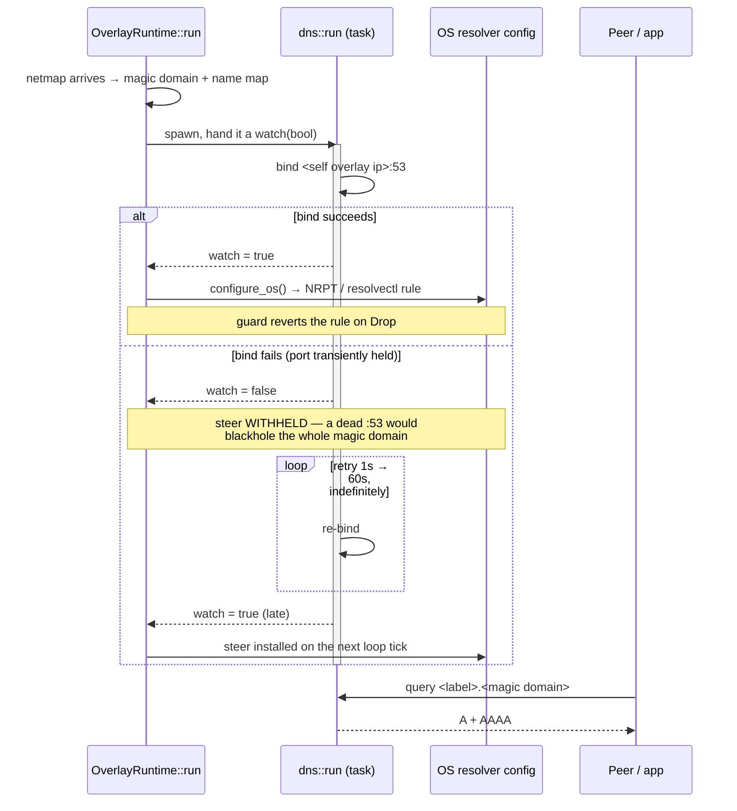
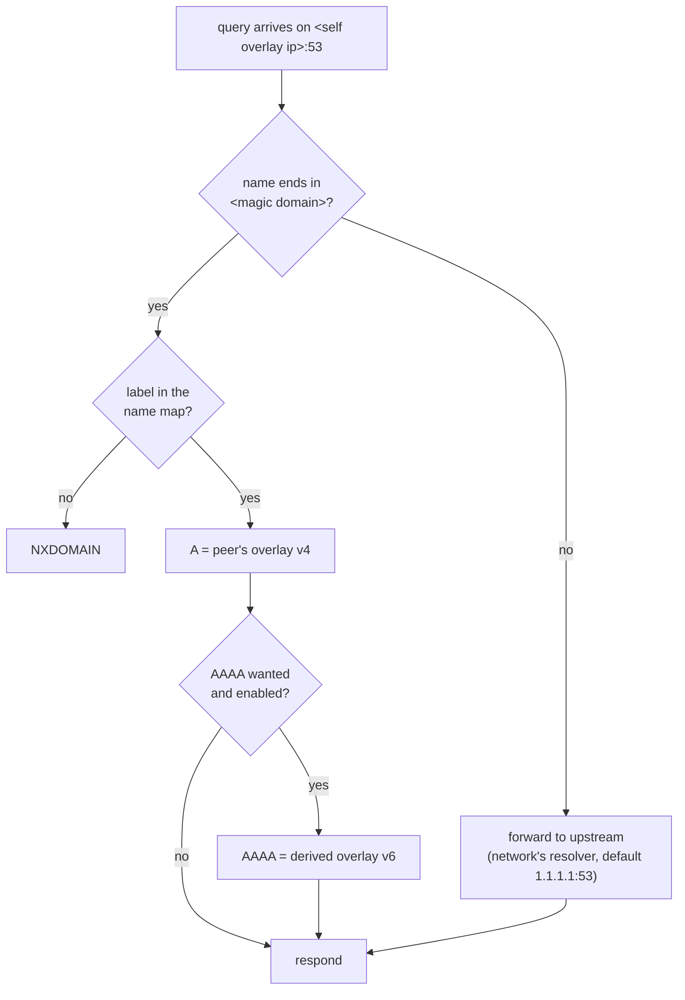

# MagicDNS — resolving peers by name

**`<label>.<tenant magic domain>` → a peer's overlay address, on every enrolled
host, with no DNS server to run and no `/etc/hosts` to maintain.**

This document covers the **resolver and the OS steer** — how a name becomes an
answer. Where the *label* comes from (fleet name vs overlay label, renames,
de-duplication) is [`device-naming.md`](device-naming.md).

## Two halves, and both must be live

| Half | What it is | Where |
|---|---|---|
| **The resolver** | a UDP server the daemon binds on `<self overlay ip>:53`, answering from a name map synced off the netmap | `crates/tunnel-core/src/overlay/dns.rs:84` (`run`) |
| **The OS steer** | a host rule sending *only* `<magic domain>` at that resolver | `dns.rs:336` (`configure_os`) |

🔑 **Either alone is useless, and the failure modes differ.** A resolver nobody
is steered at answers nothing anybody asks. A steer pointing at a resolver that
never bound is *worse than nothing*: on Windows the NRPT is registry-global, so
it blackholes the magic domain **host-wide**. That asymmetry is why the steer is
gated on the bind, never the reverse.

## Bring-up



⚠️ **The runtime is scoped to ONE WebSocket session.** Every reconnect tears the
whole thing down and rebuilds it — including this resolver. That single fact is
behind both bugs in [FR-72](fr/FR-72-magicdns-without-an-os-port.md).

## Answering a query



The name map is re-synced from the peer set whenever the netmap changes
(`sync_name_map`), so a renamed or newly-joined peer resolves without a restart.

⚠️ **AAAA is on by default and is a mixed-fleet hazard.** An old peer's OS does
not own its derived overlay v6, so v6 traffic to it blackholes; happy-eyeballs
clients fall back, strictly-sequential ones hang. `ROOMLERD_DNS_AAAA=0` reverts
to A-only without a rebuild.

## The OS steer, per platform

| Platform | Mechanism | Notes |
|---|---|---|
| **Windows** | `Add-DnsClientNrptRule -Namespace '.<domain>' -NameServers '<ip>'` (`dns.rs:356`) | ⚠️ The NRPT is **registry-global**, not per-interface — which is why a steer at a dead resolver breaks the domain for the whole host. ⚠️ NRPT nameservers carry **no port**: `-NameServers 'ip:port'` silently stores an *empty* list, so "just use another port" is not available here. ⚠️⚠️ **On a GPO-managed host the local store is ignored** — see below. |
| **Linux** | `resolvectl dns/domain <link>` (`dns.rs:382`) | ⚠️ `resolvectl` **replaces** a link's settings, so multi-org hosts must write all orgs' entries together rather than one at a time. |
| **macOS + everything else** | none — `setup_os` returns `false` (`dns.rs:405`) | Names still resolve through the SOCKS path (which does its own DOMAIN resolution); the OS itself is simply not steered, and `roomler status` reports `os_steer_active=false` honestly. |

The rule is owned by a `DnsOsGuard` (`dns.rs:315`) that reverts it on `Drop`, so
a teardown leaves no stale steer behind.

### ⚠️ Windows: a locally-written rule is inert on a GPO-managed host

A domain-joined, policy-managed Windows host **ignores the local NRPT store**.
Everything else looks perfect and no query ever reaches the resolver:

```
Get-NetUDPEndpoint 53               ->  <self overlay ip>  by roomlerd   ← bound
Get-DnsClientNrptRule   (local)     ->  .<magic domain> -> <self ip>     ← written
Get-DnsClientNrptPolicy -Effective  ->  0 rules                          ← honoured by nobody
```

`gpupdate /target:computer` does **not** rescue it. The fix is to write into the
Group-Policy store instead (Tailscale solves the same problem with
`detectWriteAsGP`); tracked as **P5** of
[FR-72](fr/FR-72-magicdns-without-an-os-port.md).

🔑 **Diagnostic rule of thumb**: `Get-DnsClientNrptRule` says *we wrote it*;
`Get-DnsClientNrptPolicy -Effective` says *the registry agrees*. **Neither
predicts whether a name resolves** — see the next section for a host where the
rule was effective and correct and nothing resolved anyway.

### ⚠️ Enforced corporate DNS — where MagicDNS cannot work at all

Some managed hosts run a DNS-enforcement layer that intercepts the machine's own
DNS egress: queries to public resolvers are dropped, and queries to any
non-approved address are refused — **including the host's own overlay address**.
On such a host every layer we control is healthy and no name resolves.

Measured, same resolver, same moment:

| query | result |
|---|---|
| from a **peer** → the host's `:53` | **ANSWERS**, correct A + AAAA |
| the **host itself** → its OWN `:53` | **REFUSED (rcode 5)** |
| the host → `1.1.1.1` / `8.8.8.8` | **timeout** (dropped) |

🔑 `roomlerd` holds that socket and this resolver **never returns REFUSED** — it
answers in-zone from the map and forwards out-of-zone. A REFUSED coming back
therefore proves the query never reached us.

This is a property of the host, not of the product. Names remain reachable over
the **SOCKS path**, which resolves DOMAIN itself and never consults the OS
resolver. Do not spend time on NRPT stores here — no choice of store changes it.

### 🔑 The raw-UDP probe — the only instrument that sees this

`Resolve-DnsName` cannot distinguish "our resolver said no" from "your query
never got there". A raw DNS packet can, and it is worth keeping:

```powershell
$n='<peer>.<magic domain>'; $b=New-Object System.Collections.Generic.List[byte]
$b.AddRange([byte[]](0x12,0x34,0x01,0x00,0,1,0,0,0,0,0,0))
foreach($l in $n.Split('.')){ $b.Add([byte]$l.Length); $b.AddRange([Text.Encoding]::ASCII.GetBytes($l)) }
$b.Add(0); $b.AddRange([byte[]](0,1,0,1))
$u=New-Object Net.Sockets.UdpClient; $u.Client.ReceiveTimeout=4000; $u.Connect('<resolver ip>',53)
[void]$u.Send($b.ToArray(),$b.Count)
$ep=New-Object Net.IPEndPoint ([Net.IPAddress]::Any),0; $r=$u.Receive([ref]$ep)
"rcode=$($r[3] -band 0x0F)  answers=$($r[7])"      # 0=ok 3=NXDOMAIN 5=REFUSED
```

Run it **from the host and from a peer**. The two answers disagreeing is the
whole diagnosis: a peer that gets answers while the host gets REFUSED means
something on the host is eating its own DNS.

## Failure modes worth recognising

| Symptom | Cause | Tell |
|---|---|---|
| `resolver DOWN`, names don't resolve | the bind failed | `magicdns: bind failed; retrying` |
| `active` on one read, `DOWN` on another, same host | **two runtimes' resolvers**, the dead one holding the port (fixed 0.4.71) | two `resolver up` for one address in one daemon lifetime |
| bound and healthy-looking, answers nothing | the survivor served the **dead session's** name map (fixed 0.4.71) | port owned by `roomlerd`, every name NXDOMAIN |
| dead for hours, port demonstrably free | a failed bind was **never retried** (fixed 0.4.73) | a `bind failed` with no later `resolver up` |

🔑 **The line that tells a reconnect from a process restart**: a healthy cycle
logs `OS split-DNS reverted` ≈25 s *before* the next `resolver up`. A failure
with **no** revert line before it is a process restart — a different bug with a
different fix.

## Diagnosing it — and the probes that lie

⚠️ Three instruments give confident wrong answers here. Each cost real debugging
time, one of them a whole session spent suspecting the firewall layer.

| ❌ Don't | Why it lies | ✅ Do |
|---|---|---|
| `nslookup <name>` | it is a raw DNS client and **bypasses the NRPT entirely** → NXDOMAIN on hosts where resolution works | `Resolve-DnsName <name>` / `ping <name>` |
| `Resolve-DnsName … -Server <own overlay ip>` | returns **NO ANSWER even on known-good hosts** | query by name (through the steer), or from **another** host |
| reading `AddressAlreadyInUse` as "someone else has the port" | *"another process owns it"* and *"we own it twice"* are the identical error | `Get-NetUDPEndpoint -LocalPort 53 \| … OwningProcess`, then map PID → process |

Useful checks:

```powershell
roomler status                              # magic domain, resolver_bound, os_steer_active, upstream
Get-NetUDPEndpoint -LocalPort 53            # who holds the port, on which address
Get-DnsClientNrptPolicy -Effective          # which rule actually wins
Resolve-DnsName <peer>.<magic domain>       # the real path an application takes
```

⚠️ A wildcard `0.0.0.0:53` holder (Internet Connection Sharing, a local DNS
proxy) does **not** block our specific-address bind — measured both plain and
with `SO_REUSEADDR`. Do not design around it.

⚠️ **`roomler status` reporting `active` is not proof the resolver answers** —
that gap is [#1363](https://github.com/gjovanov/roomler-ai/issues/1363), still
open. The authoritative check is a query.

## Related

- [`device-naming.md`](device-naming.md) — where the label comes from
- [`overlay-communication.md`](overlay-communication.md) — the carrier the answer travels over
- [`fr/FR-72-magicdns-without-an-os-port.md`](fr/FR-72-magicdns-without-an-os-port.md) — the resolver-lifecycle bugs, with the measurements that refuted three wrong causes
