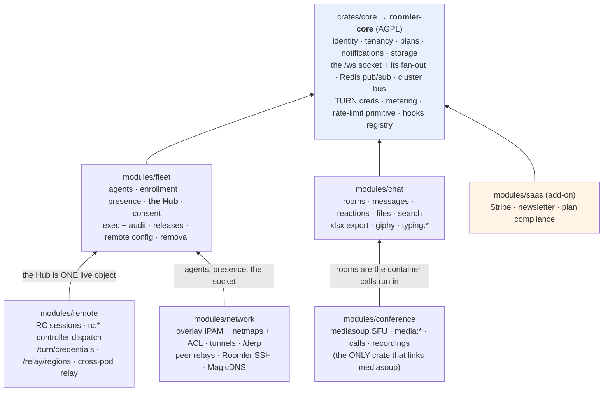
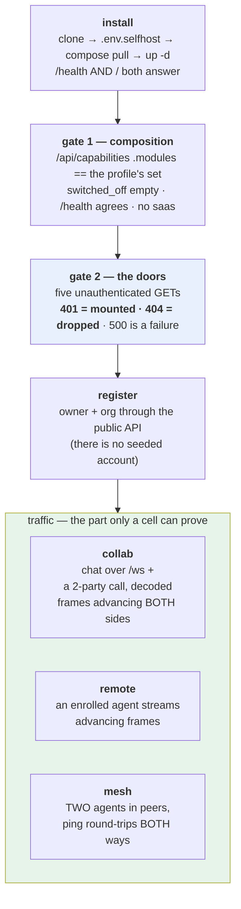
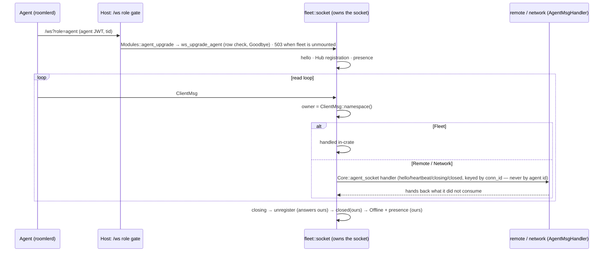
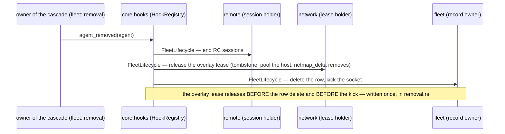
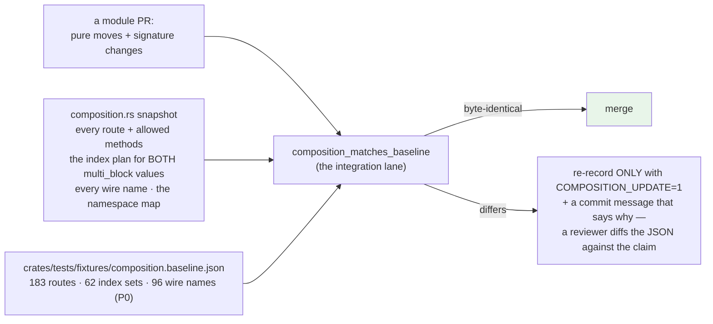

# The modular monolith — how the server is composed

The server is **one process, one container, one wire**, composed from a small core and six
module crates behind a single `Module` contract, selected at build time by Cargo features into
named **profiles**, and discovered at run time through `GET /api/capabilities`. This is the shape
[FR-69](fr/FR-69-modular-monolith.md) built (P0–P9, closed 2026-09-05, #1307); that spec is the
record of every decision with its alternatives and field evidence — this page is how the system
works now, for whoever has to change it.

Not services, not plugins: nothing is loaded dynamically, nothing talks over a network that used
to be a function call, and no document or wire message changed shape. What changed is **who owns
what**, and that the ownership is enforced by the compiler and by a composition baseline in CI.

> Start with [architecture.md](architecture.md) for the whole system; this page is the server's
> internal composition only. The daemon (`roomlerd`) is untouched by it.

---

## 1. The shape



Three rules keep it a monolith rather than a pile of crates:

| Rule | What it means in code |
|---|---|
| **The DAG is data** | `crates/core/src/graph.rs` lists the modules and the three edges (`conference → chat`, `remote → fleet`, `network → fleet`). Any module may call core; core **never** calls a module. |
| **Core membership is narrow** | Something is in `roomler-core` only if at least two modules need it **and** it is identity, tenancy or infrastructure. Everything else belongs to exactly one module. |
| **Inverse flows are hooks** | When core must reach "up" (a tenant is archived, an agent is removed), it invokes a registry of hooks in a fixed order — see §6. |

The licence split follows the crate boundary: `roomler-core` and every module are AGPL-3.0
(server side); the daemon's shared crate is `roomler-node-core` (`crates/agent-core`, MPL-2.0)
and a CI assertion inverts `cargo tree` from every agent binary to prove `roomler-core` is never
inside one (FR-24, FR-69 AC10).

---

## 2. Who owns what

| Concern | Owner | Notes |
|---|---|---|
| users, tenants, members, roles, invites, notifications, push, email, storage, analytics | **core** | the twelve core-only route files take `State<Core>` |
| the `/ws` upgrade, the socket registry, the dispatcher, Redis fan-out, the cluster identity/directory/bus | **core** | the host keeps only the `/ws` **role gate** and the user socket |
| agents, enrollment tokens/keys, presence, **the agent Hub**, the agent socket (hello, registration, read loop, teardown order), consent, exec + `exec_audit`, releases + installer proxies, remote config, device removal | **fleet** | `remote` and `network` are built ON fleet: `Module::Deps = FleetState` |
| rooms, messages, reactions, files (+ media-type sniffing), search, export, giphy, `typing:*` | **chat** | `conference` depends on it: room guards have `_with(tenants, rooms, …)` forms so both modules run ONE visibility rule |
| the mediasoup workers, `media:*`, calls, recordings | **conference** | first user of the stateful surfaces: `WsHandler::closed`, `Module::jobs`, `Module::shutdown` |
| RC session routes, `rc:*` controller dispatch + authz + consent-mode gate, the cross-pod RC relay, `/turn/credentials`, `/relay/regions` | **remote** | the session state machine stays in fleet's Hub; the controller path is a host → module **call**, not a `ws` namespace |
| overlay engine (IPAM, netmaps, leases, L3 ACL, relay grants), the org relay mint, the DERP ACL cache + `/derp` upgrade + cluster convergence, tunnel clients + policies, peer relays, Roomler SSH, the ephemeral reaper | **network** | `Module::indexes_for(multi_block)` is born here — `overlay_blocks` has two schemas |
| Stripe, the public updates list + newsletter, plan compliance | **saas** | an add-on feature on the api crate; no self-host image carries it |
| the device listing (`/tenant/{tid}/device`) | **the host** | a view over fleet (required) and network (optional) — see §4's lesson |

---

## 3. The `Module` contract, and how the host composes it

Every module is a crate behind a Cargo feature, mounted by `crates/api/src/compose.rs`. Its state
is `Core` + the DAOs it owns, derefs to `Core`, and implements `FromRef<ModuleState> for Core` so
core's extractors work unchanged inside it.

```mermaid
flowchart LR
    subgraph contract["roomler_core::Module — the surfaces"]
        R["routes() → Router<()><br/>unlimited_routes() (outside the governor)"]
        W["ws() → WsRegistration<br/>handlers (typing:*, media:*) · upgrades (/derp)"]
        I["indexes_for(multi_block)<br/>the module's index sets"]
        J["jobs() · shutdown()<br/>hooks() → FleetLifecycle · TenantLifecycle"]
        D["type Deps<br/>() or another module's STATE"]
    end
    subgraph host["crates/api/src/compose.rs — Modules"]
        INIT["init(core, settings, deps)<br/>in graph::MODULES order"]
        MOUNT["mount / mount_unlimited<br/>Router<()>.with_state(())"]
        UP["mount_upgrades<br/>(before the host's /ws)"]
        HOOKS["register_hooks(&core)"]
        JOBS["run_startup_jobs(leader)"]
        DOWN["shutdown() in REVERSE order"]
    end
    contract --> INIT --> MOUNT --> UP --> HOOKS --> JOBS
    JOBS -.->|"at exit"| DOWN
```



What the host drives, and in which order — each of these is a rule paid for in the field:

- **Composition order is the DAG order.** `init` runs in `graph::MODULES` order, so a dependency
  is initialised before its dependant by construction, and a module that needs a *live object*
  of another (remote needs fleet's Hub — one registry, or it would dispatch into an empty one)
  receives that module's state as `Deps`. A stateless dependency (a DAO over `core.db`, a pure
  guard) is **not** a `Deps`: re-create it, as conference does with chat's room guards.
- **`WsHandler::closed(ctx)`** is called by the host for every handler of the socket's role after
  its own cleanup and before it logs the disconnect; a module holding per-connection state
  (conference: transports + the call session) releases it there — never by watching the registry.
- **`Module::jobs`** are declared; the host runs the `AtStartup` ones under the SAME Mongo lease
  that gates its own maintenance, logs a failure instead of refusing to boot, and warns on an
  `Every` cadence because nothing schedules those yet.
- **`Module::shutdown`** runs in reverse composition order at the top of `shutdown_cleanup`.
- **A module that is not mounted answers 503, never a boot refusal**: the agent socket and the
  tunnel-client socket go through `Modules::agent_upgrade` / `tunnel_client_upgrade`; the gauges
  read zero (`fleet_gauges` / `network_gauges`).

---

## 4. Profiles — what a build leaves out is the claim

```mermaid
flowchart LR
    subgraph feats["Cargo features on crates/api"]
        F1["profile-full = chat + conference + fleet + remote + network"]
        F2["profile-collab = chat + conference"]
        F3["profile-remote = fleet + remote"]
        F4["profile-mesh = fleet + network"]
        F5["profile-access = fleet + remote + network"]
        S["saas — an ADD-ON, never in a published self-host image"]
    end
    DF["Dockerfile<br/>ARG PROFILE=full · ARG SAAS=1<br/>--no-default-features --features roomler-ai-api/profile-$PROFILE[,saas]"]
    subgraph images["images on ghcr.io/gjovanov/roomler-ai"]
        H["hosted-&lt;date&gt;-&lt;sha7&gt; · <b>hosted</b><br/>full + saas — what roomler.ai runs (FR-73)"]
        V["&lt;tag&gt; = full · <b>latest</b><br/>&lt;tag&gt;-collab · -remote · -mesh · -access<br/>SAAS=0, asserted by the publish smoke"]
    end
    HEALTH["/health · /api/capabilities<br/>modules = the MOUNTED set<br/>compiled = compose::EXTRACTED"]
    feats --> DF --> images --> HEALTH
    style S fill:#fff4e5
    style H fill:#e8f0fe
```



| Profile | Carries | Needs beside it | Leaves out (and CI asserts it) |
|---|---|---|---|
| `full` | everything | MongoDB, Redis, MinIO, coturn, the media port range | — |
| `collab` | chat, conference | MongoDB, Redis, MinIO, coturn | the fleet, the overlay, remote desktop; **no `roomler-ai-tunnel-core`** |
| `remote` | fleet, remote | MongoDB, Redis, coturn | the SFU worker build, MinIO, the overlay; **no `mediasoup`** |
| `mesh` | fleet, network | MongoDB, Redis, coturn (+ DERP relays if run) | the SFU worker build, MinIO; **no `mediasoup`** |
| `access` | fleet, remote, network | MongoDB, Redis, coturn | chat, calls; **no `mediasoup`** |

Three facts about profiles that are easy to get wrong:

- `default = ["profile-full", "saas"]` is the **hosted** build on purpose: the prod image is
  built with no feature argument, so a default without `saas` would drop billing from the next
  deploy silently. The self-host publish passes `SAAS=0` and its smoke asserts the module is absent.
- `/health` and `/api/capabilities` report the **mounted** set, never the DAG — a `mesh` image
  must answer `["fleet","network"]`, not all six.
- `cargo clippy --workspace` compiles the feature **union** and can never see a profile. The
  `profiles` CI job checks each reduced profile with `--no-default-features` and asserts the
  absences against a `cargo tree` that must list ≥100 crates **and** a positive control on the
  full graph — an absence assertion that cannot fail proves nothing.

**The lesson the `remote` profile taught (P7b → #1352).** The device listing reads fleet (required)
and network (optional). P7b put it in `network` on the strength of the graph edge, and every
`remote` image 404'd its own devices page — invisible to a `/health`-only smoke. A view that reads
two modules where **both** are required belongs to the one that depends on the other; a view where
one is **optional** belongs to the host. The publish smoke now asserts the route answers 401
wherever fleet is mounted.

---

## 4b. Proving a profile *works* — FR-75

Everything above establishes what a profile **links** and what string it **advertises**. Neither
says it can carry traffic, and that gap has a precedent worth stating plainly: the 2026-08-26
mediasoup RTC-range incident had *flawless signalling* — join, transports, producers and consumers
all green — and **zero media**, for weeks, on a subset of tenants, with nothing logged. A
`/health` line saying `conference` would have been true and useless.

So [FR-75](fr/FR-75-selfhost-profile-matrix.md) adds a cell per profile that installs the published
image the documented self-host way and then makes the pillar **do its job**. The ladder is
cheapest-first, so a build that cannot pass a gate never boots a browser:



| profile | must WORK | must be ABSENT | VMs in the cell |
|---|---|---|---|
| `full` | all three | — (**the 401 control** for every absence probe) | server + 2 agents |
| `collab` | chat + a real call | fleet · remote · network | server only |
| `remote` | remote-desktop frames | chat · conference · network | server + 1 agent |
| `mesh` | `peers` + `ping` both ways | chat · conference · remote | server + 2 agents |
| `access` | remote desktop **and** mesh | chat · conference | server + 2 agents |

The five probes, each verified against `crates/tests/fixtures/composition.baseline.json`:
`chat` → `/api/tenant/{tid}/room` · `conference` → `…/room/{rid}/call/participant` ·
`fleet` → `…/agent` · `remote` → `/api/turn/credentials` · `network` → `…/tunnel-client`.

Three properties of the design are load-bearing:

- **Absence is asserted positively, with a control.** A 404 is the claim; the *same probe on
  `full` answering 401* is what makes the 404 mean something. A grep that matches nothing is not
  evidence — the FR-46 lesson, where an audit died silently at the moment it succeeded.
- **A dropped module answers 404, never 500.** 500 would mean a route mounted onto absent state.
- **The browser runs inside the server VM**, against loopback. RTP does not survive a
  port-forward; a LAN URL is not a secure context, so `navigator.mediaDevices` is `undefined`; and
  `ROOMLER__APP__FRONTEND_URL` must **equal** the browser's Origin or the cookie-authenticated
  `/ws` upgrade is 403'd. The prod e2e lane uses an in-pod sidecar for the same three reasons.

⚠️ **A second machine needs TLS.** `roomlerd enroll` rewrites `http://` to `https://` for any
non-loopback host — enrollment tokens must travel over TLS — so a plain-HTTP self-host can only
enrol devices from its own box. ⚠️ And the daemon's two TLS stacks disagree about a self-signed
certificate that is its own CA: enrollment (OpenSSL) accepts it, the signalling WebSocket (rustls)
refuses it as `CaUsedAsEndEntity`. The visible symptom is an agent that enrols perfectly and never
comes online.

**Verified 2026-09-07** on `v0.4.76-{collab,remote,mesh,access}` and a current-code `full`: all
five cells green, 79 checks. The harness is `roomler-ai-deploy/profiletest/` plus the
`profiletest` skill.

---

## 5. Runtime gating — one predicate for navigation and routes

```mermaid
sequenceDiagram
    participant B as Browser (SPA)
    participant S as Server
    B->>S: GET /api/capabilities (once per page load, kicked off in main.ts)
    S-->>B: { modules: [mounted…], compiled: [EXTRACTED…], switched_off: […] }
    Note over B: capabilities store: has(m) = bundle carries m (VITE_MODULES) AND server mounts m<br/>FAIL-OPEN until the answer arrives
    B->>B: router.beforeEach awaits caps.ready()
    alt route.meta.module is mounted
        B->>B: navigate; AppLayout / TenantDashboard show the pillar's nav + tiles
    else refused
        B->>B: land on the org dashboard
    end
    Note over B,S: unknown module names from a NEWER server are IGNORED, never an error
```

Why fail-open: the server enforces every action anyway, so the worst case of failing open is a
link whose page 404s, while failing closed would blank the product behind one round-trip — the
same rule `canSeeFleetNav` follows for permissions. A bundle built with `VITE_MODULES` is an
optimisation, not the gate: the published image ships one bundle for every profile and the
runtime answer is what hides a pillar. The e2e spec `ui/e2e/mesh-profile.spec.ts` asserts a
`mesh` server shows no chat or conference surfaces, refuses the chat deep-link, and produces zero
console errors and zero failed `/api/` calls — and skips itself where `chat` is mounted.

---

## 6. The wire does not move — ownership is a map, not a prefix

`ClientMsg` / `ServerMsg` stay in `remote_control/src/signaling.rs`. Every client variant has an
owner: `ClientMsg::namespace() -> Owner { Fleet, Remote, Network }` is an **exhaustive** match (a
new variant does not compile until it names one), `CLIENT_MSG_OWNERS` is the same map as a table,
locked against the enum's own renames by a test that reads the source, and snapshotted by the
composition baseline.



⚠️ The prefix is **not** the owner: `rc:consent*` is fleet's, `rc:relay.*` and
`rc:agent.key_rotated` are network's. Per-connection state a module needs (the tunnel originator,
the probe throttle) lives behind its `AgentSocketLifecycle`, keyed by `conn_id` — a displacing
connection must not tear down its successor. The teardown order above is the rc.53 / rc.307 B /
Phase A-1 invariants written once; do not reorder.

---

## 7. Inverse edges — hooks in a core registry

Core never calls a module, so the cascades that cross modules are **hooks** core invokes in
`hooks::HOOK_ORDER`: session holders → lease holders → the record owner. A failing holder stops
the cascade.



Two more shapes the registry carries:

- **A query hook with a reason.** fleet's `rc.agent_nudge` asks `core.hooks.agent_busy(id)`; network
  answers with `Option<&'static str>` (`origin_busy` / `tunnel_busy`) — a bool would lose the
  reason the outcome names.
- **A tenant archive** is a `TenantLifecycle` run: `core.hooks.tenant_archived` sums the results
  in `HOOK_ORDER` (fleet revokes every device; network releases every node and quarantines the
  block).

---

## 8. The gate — a composition baseline, asserted on every move



The baseline is why a move is safe to review: a PR that only moves code cannot change what the
server mounts, indexes or speaks without the JSON diff saying so. `ensure_indexes` is
`index_plan(multi_block)` applied — a new collection's indexes go into a module's `indexes_for`,
never as a side call, because a spec outside the plan is invisible to the gate.

---

## 9. What a module PR looks like

1. **Pure moves + signature changes.** `git mv` the files; the api crate re-exports moved items
   under their old `crate::` paths while callers migrate.
2. **One accessor per moved engine, every chain gets it** — and grep the `state\n.x` chains
   rustfmt produces (`^\s*\.<field>\s*$`), including fields whose name is a prefix of another.
3. **A moved crate's external deps come from its bodies, not its `use` lines**: census the
   `\b[a-z][a-z0-9_]*::` tokens and diff against `Cargo.toml`.
4. **A `#[cfg(test)]` helper another crate's tests call is invisible there** — make it
   `#[doc(hidden)] pub` or a `test-fixtures` feature.
5. **Cutting a block off the end of a file drags its `mod tests` along** — check whose functions
   those tests call; and `rustfmt --edition 2024 --check <file>` before the push.
6. **A new workspace member needs `cargo update -w`** before the lane builds it.
7. **Re-record the baseline only when the diff is the claim.**

A stacked branch compiles on CI in ~4 min via
`gh workflow run integration-tests.yml --ref <branch> -f filter=composition_matches_baseline` —
cheaper than a local server build on a Windows box, which cannot build the server natively.

---

## 10. What is deliberately not done

| Deferred | Why |
|---|---|
| **D11** — folding `ui/src/views` / `stores` by module and generalising the `ws.ts` registry | the SPA gates correctly at runtime already; the fold is hygiene, not behaviour |
| **D14** — a daemon-side `Subsystem` split mirroring the modules | the daemon's feature set was out of scope; its `peer.rs` and capture/encode pipeline are FR-70's arc |
| moving any pillar to a different licence, splitting the repo, processes or version | the whole point was one process, one container, one wire |

---

## Where to go deeper

- [fr/FR-69-modular-monolith.md](fr/FR-69-modular-monolith.md) — every decision with its
  alternatives, the phase table, the field-verification log (the prod roll, the `mesh` cells).
- [architecture.md](architecture.md) — the system around this: control plane vs data planes,
  the workspace map, deployment shape.
- [deployment.md](deployment.md) — how the profiles become images, and how the hosted image is
  built and promoted (FR-73).
- [self-hosting.md](self-hosting.md) — choosing a profile as a self-hoster.
- `CLAUDE.md` § "Modular monolith — the FR-69 program" — the fifteen rules in force while the
  program was in flight, kept as the engineering record.
