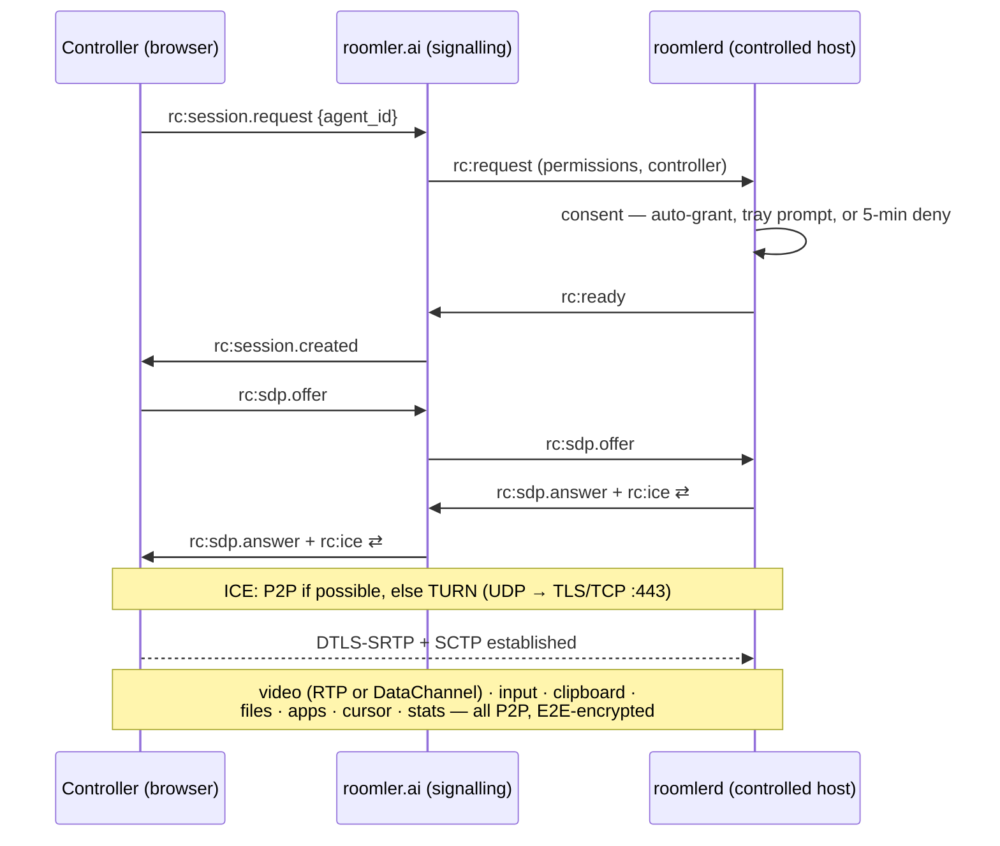
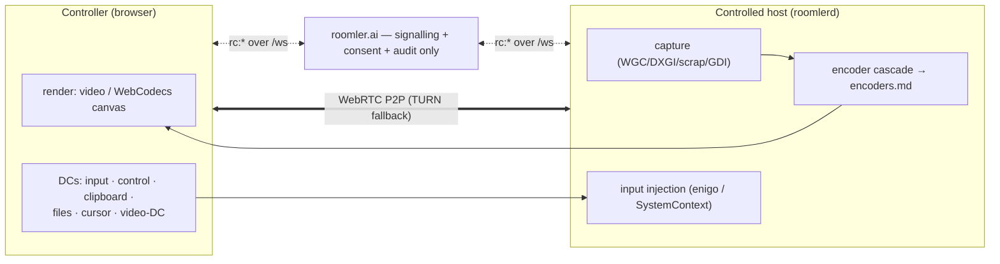
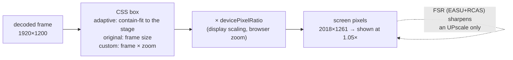

# Remote Control — Architecture & Design

> Adds TeamViewer / RustDesk-style unattended remote desktop access to roomler-ai, reusing the existing mediasoup SFU, WebSocket signaling, and COTURN cluster. Targets sub-150 ms input-to-glass latency on LAN, sub-300 ms over WAN.

> **One device in N orgs, N users on one host, events from every org:** see
> [`multi-org.md`](./multi-org.md) — the `[[orgs]]` config, per-org supervisors,
> tenant address blocks + the renumber runbook, concurrent sessions and the
> InputArbiter, and cross-org `device:presence`.

## 1. Goals & Non-Goals

**Goals**

- View and fully control a registered remote machine (Windows / macOS / Linux) from any modern browser, no client install on the controller side.
- One unified room model: a "remote control session" is just a special room kind, so it inherits auth, multi-tenancy, RBAC, presence, chat, recording, and notifications for free.
- Prefer P2P via WebRTC when ICE allows; fall back to TURN over the existing COTURN cluster; never proxy raw input through the application server.
- Multi-monitor, clipboard, file transfer, and a "view-only" guest mode out of the box.
- Audit everything (session start/stop, input events optional, file transfers, clipboard direction).

**Non-goals (v1)** — *historical; most of these have since shipped.* SYSTEM-context
control (lock screen, UAC, pre-logon) landed as the Windows SystemContext service
(§19, [operator-systemcontext-smoke.md](operator-systemcontext-smoke.md)); boot-time
access follows from the service modes; headless Linux hosts get a **virtual
desktop** created by the agent. Still true today:

- Mobile agents (iOS/Android as the controlled device). Mobile as controller is fine — it's just a browser.
- Rendering an X11 login greeter on Linux (the virtual-desktop path sidesteps it).

## 2. Where this fits in the existing stack

The current stack already gives us 80% of what's needed:

| Existing piece | What we reuse |
|---|---|
| Rust + Axum 0.8 backend | New `crates/remote_control` for session/agent state, plus routes module |
| MongoDB + 18 collections | New collections: `agents`, `remote_sessions`, `remote_audit` |
| WebSocket handler (presence, signaling) | New message namespace `rc:*` for agent registration and control signaling |
| mediasoup 0.20 SFU + WorkerPool | New router kind `RemoteControlRouter` with one video producer (screen) + bidirectional `SCTP` data channels |
| COTURN cluster (`coturn.roomler.live`) | Same TURN credentials path; agent fetches short-lived creds from the API |
| JWT + httpOnly cookies | Agent uses a long-lived **agent token** (separate audience claim); controllers use the existing user JWT |
| Vue 3 + Pinia + mediasoup-client | New view `RemoteControl.vue`, new store `remoteControl.ts`, new composable `useRemoteControl.ts` |
| Notifications | "X requested control of your machine" goes through the existing notification bell |

The only genuinely new component is the **native agent** (a separate Rust binary that ships per-OS) and a thin signaling extension on the server.

> **See also — the `roomler` subsystem.** A sibling of remote-control that reuses the same agent binary, `rc:*` signaling, and coturn cluster, but for **TCP port-forwarding** (operator's `127.0.0.1:<port>` → agent → an internal service) rather than screen capture + input. Its data plane defaults to **QUIC** (`quic-v1`, quinn) with a WebRTC-data-channel fallback, and crosses corporate NAT / firewalls via the same direct → TURN(UDP) → TURNS/TCP tier walk. The server negotiates `quic-v1` only for agents new enough to speak it (≥ rc.104). Operator guide: [`docs/tunnel-install.md`](./tunnel-install.md).

> **See also — the L3 overlay & its Windows firewall override.** The `overlay-l3` feature evolves the tunnel into a Tailscale-style per-tenant WireGuard+DERP mesh (Wintun NIC `roomler`, overlay IPs `100.64.0.0/10`). On a GPO-locked Windows host the corporate Defender Firewall drops unsolicited inbound on the overlay adapter; the agent overrides this by programming the Windows Filtering Platform directly (a LUID-scoped, high-weight hard-permit sublayer) from its LocalSystem service. Design, limits (callout/IPsec), and the `ROOMLERD_WFP_PERMIT` disable: [`docs/overlay-wfp.md`](./overlay-wfp.md).

## 3. High-level topology

At a glance — session establishment and where the data actually flows:





The original wire-level view:

```
  ┌──────────────────────────┐                                     ┌────────────────────────────┐
  │  Controller (browser)    │                                     │  Controlled host (agent)   │
  │  Vue 3 + mediasoup-client│                                     │  Rust binary (Tauri tray)  │
  │                          │                                     │  scrap | wgpu | enigo      │
  │  ┌─────────────────────┐ │                                     │  ┌─────────────────────┐   │
  │  │ <video> screen      │◄┼──── RTP H.264 / AV1 (recv) ────────►│  │ capture+encode loop │   │
  │  │ DC: input  (ULR)    │─┼──── SCTP ord/unord ────────────────►│  │ enigo input service │   │
  │  │ DC: control (rel)   │◄┼──── SCTP reliable ─────────────────►│  │ control state       │   │
  │  │ DC: clipboard (rel) │◄┼──── SCTP reliable ─────────────────►│  │ clipboard sync      │   │
  │  │ DC: filexfer (rel)  │◄┼──── SCTP reliable ─────────────────►│  │ chunked file xfer   │   │
  │  └─────────────────────┘ │         (P2P or via TURN)           │  └─────────────────────┘   │
  └────────────┬─────────────┘                                     └────────────┬───────────────┘
               │                                                                │
               │ WSS  (signaling: SDP-equivalent, ICE, session control)         │ WSS
               │                                                                │
               └─────────────────────► Roomler API (Axum) ◄─────────────────────┘
                                       ├─ rc_signaling::Hub
                                       ├─ mediasoup RemoteControlRouter
                                       └─ MongoDB (sessions, agents, audit)

                                              ▲
                                              │ TURN credentials (REST API)
                                              │
                                       coturn.roomler.live
```

The application server **never sees raw input or pixels** — those flow over the WebRTC PeerConnection between agent and controller, either P2P or relayed by TURN. The server only does signaling, authorization, mediasoup routing setup, and audit logging.

## 4. The agent

A standalone Rust binary, distributed as `roomlerd` per OS. Two operating modes:

1. **Attended** — user runs `roomlerd --pair` from the tray, gets a one-time PIN, types it in the controller UI. PIN is good for 10 minutes, single use.
2. **Unattended** — agent registers once with an `enrollment_token` (issued by an org Admin via the existing org settings UI), persists a per-machine `agent_token`, and stays connected to the API via WebSocket whenever the user is logged in.

### 4.1 Why a native binary (and not just `getDisplayMedia` + browser)

`getDisplayMedia` works for *attended screen sharing* (which roomler already has via `produce`). It cannot:

- run when no browser tab is open,
- inject mouse/keyboard into other apps,
- read/write the system clipboard,
- access multiple displays distinctly,
- enumerate windows for window-only sharing,
- bypass DRM-protected surfaces with hardware capture paths,
- survive browser tab crashes.

So: native agent for the *host*, browser for the *controller*. This is the same split RustDesk uses, and Chrome Remote Desktop, and Parsec.

### 4.2 Agent crate layout

```
agents/roomlerd/
├── Cargo.toml                 # workspace member of the main repo
├── src/
│   ├── main.rs                # tray/CLI entry
│   ├── config.rs              # ~/.config/roomler/config.toml
│   ├── enrollment.rs          # one-shot enrollment → agent_token
│   ├── signaling.rs           # WSS to roomler API, rc:* protocol
│   ├── peer.rs                # webrtc-rs PeerConnection wrapper
│   ├── capture/
│   │   ├── mod.rs             # trait ScreenCapture
│   │   ├── windows.rs         # WGC (Windows.Graphics.Capture)
│   │   ├── macos.rs           # ScreenCaptureKit
│   │   ├── linux_wayland.rs   # PipeWire via xdg-desktop-portal
│   │   └── linux_x11.rs       # XShm fallback
│   ├── encode/
│   │   ├── mod.rs             # trait VideoEncoder
│   │   ├── nvenc.rs           # NVIDIA HW
│   │   ├── amf.rs             # AMD HW
│   │   ├── qsv.rs             # Intel HW
│   │   ├── vt.rs              # macOS VideoToolbox
│   │   ├── mediafoundation.rs # Windows MF
│   │   ├── vaapi.rs           # Linux VA-API
│   │   └── openh264.rs        # SW fallback
│   ├── input/
│   │   ├── mod.rs             # trait InputInjector
│   │   ├── enigo_backend.rs   # default (uxn-cross-platform)
│   │   ├── windows.rs         # SendInput (handles UIPI / DPI)
│   │   ├── macos.rs           # CGEventPost (needs Accessibility)
│   │   └── linux.rs           # uinput (Wayland) / XTest (X11)
│   ├── clipboard.rs           # arboard + change watcher
│   ├── filexfer.rs            # chunked, resumable
│   ├── permissions.rs         # OS-specific consent dance
│   └── audit.rs               # local log + push events to server
└── installer/
    ├── windows.wxs            # MSI; auto-start at user login
    ├── macos.plist            # LaunchAgent (user, not Daemon, in v1)
    └── linux/
        ├── roomler.service         # systemd --user
        └── flatpak/...
```

`webrtc-rs` is the right peer-connection lib here — it's pure Rust, has matured a lot, and integrates cleanly with `tokio`. Using it on the agent side means a controller browser sees a regular WebRTC peer; the agent does not need to attach to mediasoup, it just dials the controller's `mediasoup-client` peer.

### 4.3 Why P2P, not always SFU

For 1↔1 remote control, mediasoup as a relay buys you *nothing* and adds a hop. So the agent and controller form a **direct PeerConnection** (P2P with ICE → TURN fallback). The mediasoup SFU only enters the picture when **multiple controllers** observe the same session (e.g., a support session shadowed by a senior engineer, or screen-sharing a remote-control session into a roomler call). In that case, the agent's stream is republished to a mediasoup `RemoteControlRouter` and other controllers consume from the SFU as view-only.

```
1 controller : 1 agent           → direct PeerConnection (best path)
N controllers : 1 agent          → agent → mediasoup → N consumers (view-only)
1 active controller + N watchers → split: 1 PC for input controller, SFU for watchers
```

This hybrid is exactly the `WorkerPool + RoomManager` pattern already in roomler — we just add a transport kind for "remote screen capture" and a one-producer router shape.

## 5. Capture & encode pipeline

### 5.1 Capture targets per OS

| OS | Primary API | Why | Fallback |
|---|---|---|---|
| Windows 10+ | `Windows.Graphics.Capture` (WGC) via `windows` crate | DXGI surface, no permission prompt for own session, handles DPI, supports per-window | DXGI Desktop Duplication |
| macOS 12.3+ | `ScreenCaptureKit` | Apple's blessed path; handles privacy indicators, multi-display | `CGDisplayStream` (deprecated but works) |
| Linux Wayland | `xdg-desktop-portal` ScreenCast → PipeWire | The only sanctioned route on Wayland; works on GNOME, KDE, Sway | None — Wayland refuses raw access |
| Linux X11 | `XShm` + `XCompositeNameWindowPixmap` | Zero-copy via shared memory | Generic XGetImage |

The portal/SCK paths produce a system permission prompt the *first* time. That's a feature, not a bug — it's the user consent layer.

### 5.2 Encoder selection

Picked at agent startup, redetected on GPU change:

```
priority order:
  1. HW: nvenc | qsv | amf | vaapi | videotoolbox | mediafoundation
  2. SW: openh264 (always available)
codec preference:  AV1  > H.265  > H.264
```

H.264 is the safe default — every browser decodes it. AV1 only if the controller's `RTCRtpReceiver.getCapabilities('video')` advertises it. We negotiate this in the SDP exchange.

### 5.3 Adaptive streaming

- Two-layer simulcast in SW (one full-res, one half-res) so the controller can switch instantly on bandwidth dips.
- `goog-remb` / TWCC feedback drives target bitrate; reasonable bounds: 600 kbps (idle) → 25 Mbps (4K motion).
- **Variable framerate, idle skip**: when nothing on screen changes (hashed via dirty-rect tracking from WGC/SCK), the encoder emits a 1 fps keepalive instead of a full 60 fps stream. This is the single biggest battery and bandwidth win.
- IDR on demand: the controller sends `{"t":"keyframe"}` over the control DC if it detects decode errors after a packet loss spike; agent issues an immediate keyframe.

## 6. Input injection

Three input planes, all over a single SCTP-unreliable data channel labeled `input`:

```rust
// shared schema, serialized as msgpack (smaller + faster than JSON)
#[derive(Serialize, Deserialize)]
#[serde(tag = "t")]
enum InputMsg {
    MouseMove   { x: f32, y: f32, mon: u8 },        // normalized 0..1 per monitor
    MouseButton { btn: Button, down: bool, x: f32, y: f32, mon: u8 },
    MouseWheel  { dx: f32, dy: f32, mode: WheelMode },
    Key         { code: u32, down: bool, mods: u8 }, // USB HID usage code
    KeyText     { text: String },                    // for IME / unicode
    Touch       { id: u32, phase: TouchPhase, x: f32, y: f32 },
    Heartbeat   { seq: u64, ts_ms: u64 },
}
```

Key design choices:

- **Normalized coordinates** (0..1 per monitor index), not pixels. The browser doesn't know the agent's resolution, and the agent's resolution can change mid-session (laptop docking, etc.). The agent maps to absolute pixels using its current monitor geometry.
- **HID usage codes**, not browser key codes or X11 keysyms. Browser keyboard events expose `KeyboardEvent.code` which maps cleanly to HID; the agent maps HID → OS-native scan codes. This is the only way to get layout-independent behavior (a German controller pressing the physical "Z" key sends "Y" on a US-layout host *correctly*, because the host's layout interprets the scan code).
- **Unreliable DC, ordered=false, maxRetransmits=0** — input is real-time; a dropped move event is replaced by the next one a few ms later. Latency >> reliability.
- **Mouse coalescing on the controller**, not the agent. The browser fires `pointermove` at up to display refresh rate; we coalesce to one msg per RAF (~16 ms), preserving the *last* position but dropping intermediate samples. Click/key events are never coalesced.
- **`enigo` is the default**, with OS-specific direct backends behind a feature flag for performance and edge cases (UIPI on Windows, IME composition on macOS, `uinput` on Wayland because XTest doesn't exist there).

### 6.1 The Wayland problem

Wayland has no equivalent of XTest. The supported path is `/dev/uinput`, which requires the agent to be in the `input` group (or have `CAP_SYS_ADMIN`). Installer adds the user to `input` group + udev rule. If permission isn't granted, the agent runs in **view-only** mode and the UI clearly says so.

### 6.2 Remote cursor

The agent does **not** render the cursor into the captured frame (it tells the OS "I'm capturing, hide the cursor"). Instead, it sends cursor shape + position over the `control` DC. The controller renders the cursor as a CSS overlay on top of the video. This eliminates the "delayed mouse" feeling that plagues lower-end remote desktop tools — the local cursor moves at native refresh, the video catches up.

## 7. Signaling protocol (`rc:*` namespace)

Extension to the existing WebSocket. All messages are JSON envelopes; the existing `WS Handler` routes by prefix.

### 7.1 Agent → server

```jsonc
// on connect, after WSS auth via agent_token
{"t":"rc:agent.hello", "machine":"linuxbox-9950x3d", "os":"linux", "displays":[...], "caps":{...}}

// answer to a controller's offer
{"t":"rc:sdp.answer",  "session":"sess_abc", "sdp":"..."}
{"t":"rc:ice",         "session":"sess_abc", "candidate":"..."}

// session-control replies
{"t":"rc:consent",     "session":"sess_abc", "granted":true}

// passive
{"t":"rc:agent.heartbeat", "rss_mb":124, "fps":58, "encoder":"nvenc-h264"}
```

### 7.2 Server → agent

```jsonc
{"t":"rc:request",   "session":"sess_abc", "controller":{"user_id":"u_1","name":"Goran"}, "permissions":["input","clipboard","files"]}
{"t":"rc:offer",     "session":"sess_abc", "sdp":"...", "ice_servers":[{"urls":"turn:..."}]}
{"t":"rc:ice",       "session":"sess_abc", "candidate":"..."}
{"t":"rc:terminate", "session":"sess_abc", "reason":"user_disconnect"}
```

### 7.3 Controller browser ↔ server

Same `rc:*` shapes; the controller is just the other peer. The server is a relay only for SDP/ICE, never for media.

### 7.4 Why not piggyback on mediasoup signaling

mediasoup-client speaks its own RPC for `transport.connect/produce/consume`. That's the right protocol when mediasoup is in the path, but for direct P2P agent↔controller it's overkill. We'd be paying for a router roundtrip just to swap SDP. So: a thin custom signaling layer for the 1:1 case, mediasoup signaling for the N-watcher case.

## 8. Data model additions

```rust
// crates/data/src/models/agent.rs
pub struct Agent {
    pub id: ObjectId,
    pub org_id: ObjectId,
    pub owner_user_id: ObjectId,
    pub name: String,                  // user-friendly: "Goran's Laptop"
    pub machine_id: String,            // stable hardware fingerprint (HMAC of dmi+mac)
    pub os: OsKind,
    pub agent_version: String,
    pub agent_token_hash: String,      // argon2 of the long-lived token
    pub status: AgentStatus,           // Online | Offline | Unenrolled
    pub last_seen_at: DateTime,
    pub displays: Vec<DisplayInfo>,    // refreshed on every connect
    pub capabilities: AgentCaps,       // hw encoders, has_input_perm, etc.
    pub access_policy: AccessPolicy,   // who from this org can request control
    pub created_at: DateTime,
}

pub enum AgentStatus { Online, Offline, Unenrolled, Quarantined }

pub struct AccessPolicy {
    pub require_consent: bool,         // user must click "Allow" each time
    pub allowed_role_ids: Vec<ObjectId>,
    pub allowed_user_ids: Vec<ObjectId>,
    pub auto_terminate_on_idle_min: Option<u32>,
}

// crates/data/src/models/remote_session.rs
pub struct RemoteSession {
    pub id: ObjectId,
    pub agent_id: ObjectId,
    pub org_id: ObjectId,
    pub controller_user_id: ObjectId,
    pub watchers: Vec<ObjectId>,       // view-only participants
    pub permissions: Permissions,      // input, clipboard, files, audio
    pub started_at: DateTime,
    pub ended_at: Option<DateTime>,
    pub end_reason: Option<EndReason>,
    pub recording_url: Option<String>, // optional; recorded as standard mediasoup recording
    pub stats: SessionStats,           // bytes, peak fps, avg rtt
}

// crates/data/src/models/remote_audit.rs
pub struct RemoteAuditEvent {
    pub session_id: ObjectId,
    pub at: DateTime,
    pub kind: AuditKind,               // Started, ConsentGranted, ClipboardWrite, FileSent, ...
    pub detail: Bson,
}
```

Indexes (typical):
- `agents`: `{org_id:1, status:1}`, `{owner_user_id:1}`, `{machine_id:1}` unique per org
- `remote_sessions`: `{agent_id:1, started_at:-1}`, `{controller_user_id:1, started_at:-1}`
- `remote_audit`: `{session_id:1, at:1}` + TTL on `at` for org retention policy

## 9. New backend crates / modules

```
crates/
├── remote_control/
│   ├── src/
│   │   ├── lib.rs
│   │   ├── hub.rs            # registry: agent_id → WS, session_id → state
│   │   ├── session.rs        # state machine: Pending → AwaitingConsent → Active → Closed
│   │   ├── signaling.rs      # rc:* message routing
│   │   ├── consent.rs        # consent prompt + timeout
│   │   ├── permissions.rs    # what a controller is allowed to do this session
│   │   ├── sfu_bridge.rs     # publishes agent stream into mediasoup for N-watcher case
│   │   ├── turn_creds.rs     # REST API short-lived TURN creds (HMAC over coturn shared secret)
│   │   ├── worker_pick.rs    # THE shared FNV-1a coturn worker pick (invariant I6)
│   │   └── audit.rs
│   └── Cargo.toml
├── routes/
│   └── src/
│       └── remote_control.rs # /api/agents, /api/agents/:id/sessions, /api/agents/enroll
└── server/
    └── src/
        └── ws/
            └── rc.rs         # rc:* dispatcher → remote_control::hub
```

> **Same-worker TURN affinity (invariant I6).** With ≥2 coturn workers
> configured (`ROOMLER__TURN__WORKER_URLS`), `turn_creds::issue_for_session`
> puts one session-picked worker's URLs first in the creds issued
> independently to controller and agent, so both ICE stacks converge on the
> same worker — cross-worker relay↔relay drops under the dual-public-IP
> worker's SNAT asymmetry. The pick is the ONE shared `worker_pick`
> implementation (FNV-1a over the session key), also used by the overlay
> broker and overlay client; rationale + golden-vector locks:
> [`docs/overlay-nat-traversal.md`](./overlay-nat-traversal.md), "Worker
> co-location".

### 9.1 REST surface

| Method | Path | Purpose |
|---|---|---|
| `POST` | `/api/agents/enroll-token` | Admin creates a one-shot enrollment token (returns QR + CLI command) |
| `POST` | `/api/agents/enroll` | Agent exchanges enrollment token for `agent_token` |
| `GET` | `/api/agents` | List agents in current org (filtered by RBAC) |
| `GET` | `/api/agents/:id` | Agent detail incl. live status, displays |
| `PATCH` | `/api/agents/:id` | Rename, update access policy |
| `DELETE` | `/api/agents/:id` | Revoke (server-side token blacklist) |
| `POST` | `/api/agents/:id/sessions` | Request a new session (returns `session_id`; SDP exchange happens over WS) |
| `GET` | `/api/sessions/:id` | Session detail + live stats |
| `POST` | `/api/sessions/:id/terminate` | Force-end (controller, agent owner, or org admin) |
| `GET` | `/api/sessions/:id/audit` | Audit trail |
| `GET` | `/api/turn/credentials` | Short-lived TURN creds for browser & agent |

### 9.2 Hub state machine

```
                      consent.timeout (5 min)
        ┌─────────────────────────────────────┐
        ▼                                     │
  ┌──────────┐  request   ┌────────────────┐  │  granted   ┌─────────┐
  │ Pending  │──────────► │AwaitingConsent │──┴──────────► │ Active  │
  └──────────┘            └────────────────┘  denied        └────┬────┘
                                              ─────────►        │ ws_drop / terminate
                                              Rejected           ▼
                                                            ┌─────────┐
                                                            │ Closed  │
                                                            └─────────┘
```

A session is the only thing that can hold a mediasoup transport open in this subsystem; closing it tears down the routers and frees worker slots.

## 10. Frontend additions

```
ui/src/
├── views/
│   ├── Agents.vue                 # list + status per agent
│   └── RemoteControl.vue          # the actual session view
├── stores/
│   └── remoteControl.ts           # Pinia store
├── composables/
│   └── useRemoteControl.ts        # PeerConnection lifecycle, DC handlers
└── components/
    └── remote/
        ├── ScreenCanvas.vue       # <video> + cursor overlay + input handlers
        ├── MonitorPicker.vue
        ├── ToolBar.vue            # Ctrl-Alt-Del send, file, clipboard, quality
        ├── FileTransferPanel.vue
        └── ParticipantsBar.vue    # for multi-watcher sessions
```

`RemoteControl.vue` does the gnarly browser-side work:

- Captures `pointermove` / `pointerdown` / `wheel` / `keydown` / `keyup` on a focused, cursor-hidden surface.
- For mouse: requests pointer lock when entering "fullscreen control" mode so movement is unbounded.
- For keyboard: uses `KeyboardEvent.code` (HID-aligned), traps the browser's reserved combos with `navigator.keyboard.lock(['Tab','Escape',...])`. This is a real API and is how Discord/Parsec keep Tab/Esc from leaving the page.
- Coalesces mouse events to RAF cadence, sends keys immediately.
- Renders cursor shape + position from the `control` DC as an SVG overlay.

```ts
// useRemoteControl.ts (sketch)
export function useRemoteControl(sessionId: string) {
    const pc = new RTCPeerConnection({ iceServers: await fetchTurnCreds() });
    const inputDc    = pc.createDataChannel('input',     { ordered: false, maxRetransmits: 0 });
    const controlDc  = pc.createDataChannel('control',   { ordered: true });
    const clipDc     = pc.createDataChannel('clipboard', { ordered: true });
    const fileDc     = pc.createDataChannel('files',     { ordered: true });

    pc.ontrack = e => videoEl.srcObject = e.streams[0];

    // Signaling via existing WS
    ws.on('rc:offer',   ({ sdp }) => pc.setRemoteDescription({type:'offer',sdp})
                                       .then(() => pc.createAnswer())
                                       .then(a => { pc.setLocalDescription(a); ws.send({t:'rc:sdp.answer', sdp:a.sdp})}));
    pc.onicecandidate = e => e.candidate && ws.send({t:'rc:ice', candidate:e.candidate.toJSON()});

    return { pc, inputDc, controlDc, clipDc, fileDc };
}
```

## 11. Auth, consent, security

### 11.1 Tokens

| Token | Audience | Lifetime | Storage |
|---|---|---|---|
| User JWT | `aud=user` | 30 min, refresh 30 d | httpOnly cookie (existing) |
| Enrollment token | `aud=enroll`, `org_id`, `single_use=true` | 10 min | shown once in UI, copied to agent CLI |
| Agent token | `aud=agent`, `agent_id`, `org_id` | 1 year, rotates on use | argon2-hashed in `agents`, raw in agent's OS keychain |
| Session token | `aud=session`, `session_id`, perms[] | session duration | in-memory both sides |
| TURN creds | HMAC-SHA1 over coturn shared secret | 10 min | not stored |

### 11.2 Consent

Five modes, set per device (`AccessPolicy.consent_mode`, admin-set, default
`prompt`). The server resolves one per session and sends it to the agent as a
directive on `ServerMsg::Request`:

| mode | who is asked | window | agent behaviour |
|---|---|---|---|
| `auto` | nobody | — | grants immediately |
| `prompt` | whoever is at the device | **5 min** | raises an on-host prompt |
| `email` | the device OWNER, by approve-link | 5 min | waits; the SERVER resolves |
| `push` | the device owner, by web-push card | 5 min | waits; the SERVER resolves |
| `prompt_then_email` | **both, in parallel** | host 30 s / owner 5 min | prompts AND the server emails |

Plain `prompt` waits **5 minutes** (FR-34, field CORPLAP-1): a device set to it may
be LOCKED when a session starts, and the operator has to walk to the machine,
unlock, and only then can they see and approve — 30 s was not enough to arrive.
`prompt_then_email` keeps a SHORT (30 s) host half precisely because its emailed
link is the fallback; plain `prompt` has none, so its one window must be
generous. The on-host panel shows the remaining time as `m:ss`.

**A locked host (FR-34).** When a device set to `prompt` is LOCKED, the on-host
panel is on the (currently invisible) secure `Winlogon` desktop, so nobody can
see it until someone unlocks the machine. That is the intended flow — unlocking
proves physical presence, then you approve — not a bug, and the 5-min window
gives the operator time to reach the machine. So the controller does not sit in
a silent wait: the agent probes lock state at prompt time (`lock_state`) and, if
locked, sends `rc:consent.pending{host_locked}` over the signalling WS; the hub
relays it to the controller, whose "awaiting consent" screen becomes *"that
device is locked — unlock it on the machine, then approve."* Advisory only; it
never gates the outcome. (Rendering the panel on the secure desktop was
considered and rejected — modern Win11 restricts windows there, it is
`WDA_EXCLUDEFROMCAPTURE` so unobservable, and unlock-then-approve is the sounder
flow anyway.)

`prompt_then_email` is "and", not "then" — the mail goes out at once. What is
sequential is the two windows: the host modal closes after the attended window
while the emailed link keeps the full async one, so a host nobody answers hands
over to the owner rather than ending the session. An explicit host **Deny** does
end it — the person at the machine said no.

**The owner shortcut.** Controlling a device you OWN resolves to `auto` before
the policy is read (`resolve_session_authz`), because unattended access to your
own headless boxes is the common case. ⚠️ That made the picker look broken on
any fleet where one person owns every device: the setting had no observable
effect and nothing on screen said so. `AccessPolicy.prompt_owner` (FR-27,
default off) opts the owner back in, and the Devices grid now labels the state
either way.

**The device has the last word.** The directive is a CEILING. A device with
`auto_grant_session = false` prompts even under an `auto` directive — the agent
resolves the two through `consent::strictest_of`. Same gate-4 principle as exec
and SSH: the device's own refusal survives a server that has been talked into
something. The floor defeats `auto` only; `email`/`push` do not auto-grant, so a
device that merely refuses to auto-grant has no standing to force a second
prompt onto the host.

⚠️ **This surprises operators** (field, 2026-08-30): a device whose *server*
policy reads `consent_mode = auto` — including one you own — can still prompt on
every session, and nothing server-side fixes it. The reason is that
`auto_grant_session` lives in the device's own `config.toml`, and as a gate-4
floor it is **deliberately not remotely configurable** — a control plane that
could flip it would not be a floor. It **defaults to `true`** (auto-grant), so a
device that prompts has it explicitly set to `false`; that `false` overrides both
the `auto` directive *and* the owner shortcut. To change it, do so **on the
host** — `roomler config set auto_grant_session <true|false>` — then restart the
daemon (the config surface notes changes apply on the next start). Making a
device auto-grant is a device-owner decision the server cannot make for it.

**Prompt surfaces.** A chain, probed per prompt and logged per prompt
(`native` + `have_surface` on one line):

1. **native** — the daemon draws the panel itself. Windows
   (`viewer-indicator`, and `WDA_EXCLUDEFROMCAPTURE` so the requester cannot
   see the Approve button), X11 (`viewer-indicator-x11`, an override-redirect
   window, no capture exclusion — X has no equivalent), macOS
   (`viewer-indicator-macos`, AppKit).
2. **companion** — `roomler-desktop`'s always-on-top consent window. The daemon
   starts it if it is not running (`companion::ensure_running`).
3. **CLI** — `roomlerd consent --list` / `--approve`, which works everywhere.
4. **none** — reported as `no_prompt_surface`, not as a deny.

⚠️ The `.pending` marker is written in ALL cases, because it is also what
`roomlerd consent --list` reads. `ConsentRequest.surface` is what stops the
companion from popping a second panel over a native one.

⚠️ **A virtual-desktop host declines the native surface, even though its X
display connects.**
<!-- RETIRED-NAME-ANCHOR: the LEGACY env spelling FR-21 P3 kept working, and
     the one every affected host actually carries in its systemd drop-in. -->
`ROOMLER_AGENT_VIRTUAL_DESKTOP=1` means the daemon started
the Xvfb itself so a headless box can be remote-controlled — so the display's
only viewer is a remote controller, which is the worst possible place to ask
"may this remote controller in?". Field-measured on mars, jupiter and the WSL
node 2026-08-29: unattended, the panel is drawn where nobody can see it and the
session dies `timeout` when the truth is `no_prompt_surface`; attended, viewer
A can click **Approve** on viewer B's request. `indicator/x11.rs` reads the
daemon's own configuration, not the display, so a real X session on the same
machine is unaffected and the banner path is untouched. Consequence for such a
host: use `email`/`push`, or answer with `roomlerd consent`.

⚠️ **macOS native requires tokio off the main thread.** AppKit delivers events
on the main run loop and `#[tokio::main]` parks it, so under
`viewer-indicator-macos` the runtime moves to a worker and `main` hands the
main thread to `NSApp`. That is why the feature is compiled by CI but not yet
in the macOS release build.
⚠️ **The macOS panel appears in the captured stream.** `NSWindowSharingNone` is
ignored by `CGDisplayStream`, which is what our capture uses. ⚠️ Since FR-27 the marker is written by **all three**
consent-bearing subsystems — remote control, Fleet-RPC `exec` and Roomler SSH —
carrying a `kind` so the modal does not describe a root command as "wants to
control this device". Before that only remote control wrote one, so an `exec` or
SSH prompt reached no UI at all. The daemon also starts the companion when a
prompt begins (`companion::ensure_running`), since nothing used to.

**A refusal says which refusal it is.** `rc:consent` carries an optional
`reason`; an absent one is an ordinary deny, which is what a bare
`granted: false` has always meant. ⚠️ Until FR-27 the agent's own prompt
timeout produced exactly that bare `false`, and the hub terminated it as
`EndReason::UserDenied` — so "nobody was at the machine" reached the controller
as "a human refused you". The three now end as `UserDenied`,
`ConsentTimeout` and `NoPromptSurface`, and the viewer renders a sentence per
case rather than the enum name.

⚠️ **The hub waits longer than the window it announces**
(`consent::CONSENT_VERDICT_GRACE`, 5 s). The agent's prompt window and the
hub's own fallback are set from the same `consent_timeout_secs`, so on every
non-answer they expire together and the hub's used to fire ~130 ms first —
measured on mars twice — throwing away the agent's reason and reporting every
`no_prompt_surface` as "nobody answered". The hub's timer is a backstop for a
dead agent, not a peer of a live one; the number on the wire is unchanged, so
the on-host prompt still stands for exactly the announced window.

### 11.3 Recording & audit consent

If recording is enabled for the session, the controlled side gets a persistent banner (cannot be dismissed) and a red dot in the tray icon. Mirrors macOS's screen-recording indicator behavior; users have learned to look for it.

### 11.4 The reality of misuse

A remote-control feature is the most-abused capability in any product. Mitigations:

- **No silent install**. The agent installer always shows a consent screen and creates a tray icon.
- **Quarantine flag**: org admins can mark an agent quarantined, which blocks new sessions but keeps the agent registered.
- **Geofencing & impossible-travel**: log controller IP geo per session, surface anomalies in admin UI.
- **Mandatory audit retention** is configurable per-org but cannot go below 30 d for sessions.
- **No keystroke logging** in audit — only event counts. The controlled user's passwords typed during a session must not be persisted.
- **Tray icon cannot be hidden** by config; if you want covert monitoring, this is the wrong product.

## 12. Performance targets & budget

| Stage | Target (LAN) | Target (WAN, RTT 30 ms) |
|---|---|---|
| Capture (frame ready → encoder in) | 2 ms | 2 ms |
| Encode (HW H.264, 1080p) | 4 ms | 4 ms |
| Network out → in (incl. TURN if any) | 5 ms | 50 ms |
| Decode (browser) | 5 ms | 5 ms |
| Composite + display | 16 ms (1 vsync at 60 Hz) | 16 ms |
| Input event → server-side queue | 0 (P2P) | 30 ms |
| Input injection → next frame captured | up to 16 ms | up to 16 ms |
| **End-to-end glass-to-glass** | **~50 ms** | **~120-180 ms** |

Two practical observations:

1. The single biggest WAN latency contributor is TURN relaying through a far-away region. Co-locate TURN with users; roomler already runs `coturn.roomler.live` — for a global rollout, deploy regional TURN endpoints and let the agent pick the lowest-RTT one at registration. **SHIPPED (multi-region relay PoPs, 2026-08)**: `ROOMLER__RELAY__REGIONS` declares regional coturn+DERP PoPs (`scripts/relay-pop/` provisions one per cheap VPS); agents advertising `supports_relay_regions` receive the region list (`rc:relay.regions`), time a STUN binding per PoP, and report (`rc:relay.probe_report`); the server derives a hysteresis-guarded `relay_home` per agent and issues every RC-session / overlay-pair / tunnel TURN grant from the nearest region (sticky per pair, same-worker pin preserved within a region). Regional DERP rides EdDSA admission tickets (`crates/derp-relay`, public-key-only PoPs) and is applied to force-DERP-pinned pairs; the ladder DERP tier stays central pending netmap self-home. Master gate `ROOMLER__RELAY__REGIONS_ENABLED` (default off = legacy single-region, byte-identical).
2. The single biggest CPU/battery contributor is encoding *unchanged frames*. Dirty-rect skipping is non-negotiable.

## 13. Testing strategy

Reuse the existing 114 Rust integration test conventions plus Playwright E2E specs. New harness pieces:

- **`agent-headless`** test binary: a stripped-down agent that captures from a virtual framebuffer (Xvfb on Linux CI) and accepts injected input via stdin. Lets us assert end-to-end round trips in CI without a GPU.
- **Latency probe**: a Playwright test that draws a known pattern, sends a click, and asserts the agent received the click within budget.
- **Loss simulation**: `tc netem` in the test container to add 100 ms RTT, 2% loss, and verify the input/control DC behave correctly.
- **Multi-watcher SFU bridge**: spin up 3 mediasoup consumers against one agent producer, verify CPU stays bounded.

## 14. Rollout plan (historical — the original phasing, long since shipped)

| Phase | Scope | Calendar guess (solo) |
|---|---|---|
| **0. Spike** | webrtc-rs PoC on Linux: capture+encode → browser, view-only, no input | 1 week |
| **1. MVP** | Linux-X11 agent + browser controller, attended PIN pairing, mouse + keyboard, single monitor, no SFU bridge | 3 weeks |
| **2. Productize** | Windows + macOS agent, unattended enrollment, multi-monitor, clipboard, consent UI, audit | 5 weeks |
| **3. Scale** | SFU bridge for N-watchers, file transfer, recording, hardware encoders on all platforms, regional TURN | 4 weeks |
| **4. Polish** | Wayland, AV1, mobile-controller UX, RBAC integration with existing roles bitfield, installer signing | 3 weeks |

That's ~16 weeks for a properly hardened v1, which is in the right ballpark for what RustDesk took to mature.

## 15. Decisions worth flagging

- **`webrtc-rs` over wrapping libwebrtc** — pure Rust toolchain matches the rest of roomler, avoids a C++ build dependency, and the API surface we need (PC + DC + RTP send) is well-supported. The trade-off is fewer mature codec integrations; we route around that by encoding ourselves and feeding raw H.264 NALUs into a `TrackLocalStaticSample`.
- **Tauri for the tray, not Electron** — keeps the agent under 20 MB and the dependency tree close to the rest of your stack.
- **`enigo` as default, OS-specific only when needed** — same calculus RustDesk made; enigo handles 90% well, the remaining 10% (Wayland, IME, UIPI) needs direct backends.
- **One unified room kind, not a separate "remote" service** — keeps notifications, RBAC, presence, chat, and recording free. The cost is one new `RoomKind::RemoteControl` variant and the discipline to keep `remote_control` crate's surface narrow.
- **No SOCKS-style port forwarding in v1** — RustDesk has it; it's a security minefield and 90% of users don't need it. Add later if there's demand. *(Later arrived: forwards + SOCKS5 shipped as the policy-gated tunnel subsystem — [tunnels.md](tunnels.md).)*

## 16. Open questions (historical — all since resolved)

*Answers, with hindsight: (1) headless agents shipped — the Windows service +
SystemContext and Linux virtual desktops; (2) still a UX call, plumbing exists;
(3) recordings stayed on MinIO; (4) mobile controller ships with an on-screen
keyboard component.*

1. Do you want to allow **headless agents** (no logged-in user, e.g., a server in a rack)? That requires a system service, which is a much bigger blast radius. Recommend deferring past v1.
2. Should an in-progress remote control session be **shareable into a roomler call** as a screen share automatically? The plumbing supports it; it's a UX call.
3. **Recording storage**: piggyback on the existing MinIO setup, or push to S3-compatible per-org bucket? Existing MinIO is fine for v1.
4. **Mobile controller** keyboard UX is genuinely hard (no physical keys, lots of host-OS shortcuts to send). v1 should be view + tap-to-click only on mobile, full input on desktop browsers.

<!-- RETIRED-NAME-ANCHOR-BEGIN: §17-19 are historical appendices. They record what the
     product was called and what operators actually typed at the time (0.1.32 - rc.26),
     so rewriting `roomler-agent` to `roomlerd` here would falsify the record rather
     than update it. The CURRENT encoder reference is docs/encoders.md. docs/fr/FR-21 -->

## 17. Hardware encoder backends

> **Current reference: [encoders.md](encoders.md)** — the codec × platform matrix,
> selection cascade, rate control, and capture backends as they ship today. This
> section remains as the engineering record (probe designs, per-vendor failure
> modes) behind that summary.

### Current state (0.1.25)

On Windows, the default `Auto` cascade picks **openh264** — the
software H.264 encoder we've trusted since day one. The Windows
Media Foundation backend (`mf-h264`) is compiled in and functional
but **opt-in only** via `encoder_preference=hardware`, because on
mixed-GPU hosts (e.g. NVIDIA GeForce + Intel iGPU) it hits two
blockers that phase 3 will resolve:

1. **NVIDIA H.264 Encoder MFT** `ActivateObject` returns
   `0x8000FFFF` when the D3D11 device is bound to the default DXGI
   adapter (usually the Intel iGPU on hybrid laptops / desktops
   with both). NVENC MFT requires its D3D device to be created on
   NVIDIA's adapter specifically.
2. **Intel Quick Sync Video H.264 Encoder MFT** activates OK but
   is async-only. It ignores `MF_TRANSFORM_ASYNC_UNLOCK` and
   rejects `SET_D3D_MANAGER` with `MF_E_ATTRIBUTENOTFOUND`. Sync
   `ProcessOutput` returns `0x8000FFFF` on the first drain.

Phase 3 (DXGI adapter enumeration + `IMFMediaEventGenerator`
event loop + per-MFT probe-and-rollback) is a separate focused
work package. Until it lands, Auto → openh264 is the right call.

### Backend cascade

`encode::open_default(width, height, preference)` picks as follows:

| `preference` | Order tried |
|---|---|
| `Auto` (default) | **openh264** → Noop   (MF is opt-in until phase 3) |
| `Hardware` | Windows MF (experimental) → openh264 → Noop |
| `Software` | openh264 → Noop |

Selection is logged at INFO:

    INFO encoder selected: openh264 (software) width=1920 height=1080

and on every `media pump heartbeat`:

    INFO media pump heartbeat backend="openh264" frames_encoded=30 ...

### Per-session downscale behaviour

The capture layer runs a 2× box downsample on sources above
~3.5 Mpx when the active encoder is software (openh264 or MF SW).
Hardware encoders (when phase 3 lands) will skip the downsample so
they see native resolution. Logged at pump start:

    INFO media pump starting encoder_preference=Auto downscale=Auto

### Configuration

Three places, in decreasing priority:

1. **CLI flag**: `roomler-agent run --encoder hardware` (also
   accepts `auto`, `software`, `hw`, `sw`, `mf`, `openh264`).
2. **Env var**: `ROOMLER_AGENT_ENCODER=hardware`. Mostly for
   systemd-user / Task Scheduler entries where editing the TOML is
   less convenient.
3. **Config file** (`config.toml`): `encoder_preference = "hardware"`.

Invalid values fall through to `Auto` with a warning — a typo can
never prevent the agent from starting.

### Known hardware issues (to fix in phase 3)

Verification priority: NVIDIA → Intel iGPU → AMD.

| Vendor | Driver | Symptom | Workaround |
|---|---|---|---|
| NVIDIA (GTX 1650 + Intel UHD 630 mixed) | 560.x series | `NVIDIA H.264 Encoder MFT` `ActivateObject` returns `0x8000FFFF` (E_UNEXPECTED) because D3D11 device was created on the default adapter (Intel). Fix requires DXGI adapter enumeration + VendorId=0x10DE match. | Use `encoder_preference=software` (default) |
| Intel UHD 630 iGPU (Quick Sync) | same | `Intel® Quick Sync Video H.264 Encoder MFT` is async-only; ignores `ASYNC_UNLOCK`; first sync `ProcessOutput` returns `0x8000FFFF`. Fix requires `IMFMediaEventGenerator` event loop. | Use `encoder_preference=software` (default) |
| AMD | *(not yet tested)* | expected to behave like Intel QSV (async) | |

### Encoder smoke test

Release builds run `roomler-agent encoder-smoke --encoder hardware`
as part of the Windows CI job. It opens the preferred encoder at
640×480, feeds 10 synthetic frames, and fails the build if no
keyframe comes out or the cascade bottoms at `NoopEncoder`.

To reproduce locally:

    cargo build -p roomlerd --release --features full-hw
    target\release\roomler-agent.exe encoder-smoke --encoder hardware

With the `full-hw` build, the MF backend code is present but only
engaged when `--encoder hardware` is passed explicitly.

### Scaffolding already in place

The following phase-1-and-2 plumbing stays in the codebase ready
to be re-engaged once phase 3 adds the missing pieces:

- `create_d3d11_device_and_manager()` — builds a multithread-
  protected D3D11 device + `IMFDXGIDeviceManager`. Works but binds
  to default adapter.
- `activate_h264_encoder()` — `MFTEnumEx` with
  `MFT_ENUM_FLAG_HARDWARE | SORTANDFILTER | SYNCMFT`. Returns
  first-activating vendor MFT, falls back to MS SW.
- Async-mode probe via `GetAttributes().GetUINT32(MF_TRANSFORM_ASYNC)`
  + `MF_TRANSFORM_ASYNC_UNLOCK` attempt. Works for MFTs that honour
  unlock; doesn't for those that don't.
- `MFT_MESSAGE_SET_D3D_MANAGER` handoff, tolerant of rejection.
- `MF_E_TRANSFORM_STREAM_CHANGE` handling in the drain loop.
- Debug tracing at every `ProcessInput`/`ProcessOutput`.

### Phase 3 scope

Three pieces, each tractable on its own:

1. **DXGI adapter enumeration** — ✅ landed in 0.1.26 commit 2
   (`encode/mf/adapter.rs`). `CreateDXGIFactory1` →
   `EnumAdapters1` → vendor priority rank → `D3D11CreateDevice` on
   that specific adapter. The cascade then feeds the adapter-bound
   device to each enumerated H.264 MFT.

2. **Async event loop** — ⏳ commit 1A.2 (tracked; not yet needed
   on the RTX 5090 Laptop + AMD box since both vendors' MFTs
   honour `MF_TRANSFORM_ASYNC_UNLOCK`). Design: `QueryInterface`
   for `IMFMediaEventGenerator`, dedicated worker thread running
   `GetEvent` (blocking) → `METransformNeedInput` pulls the next
   input from an mpsc queue and calls `ProcessInput` →
   `METransformHaveOutput` calls `ProcessOutput` and pushes to
   another mpsc. `VideoEncoder::encode()` becomes a non-blocking
   pusher that drains available outputs. Intel QSV is the main
   target; cascade routes candidates that ignore `ASYNC_UNLOCK`
   to `MfInitError::AsyncRequired` today and logs them.

3. **Per-MFT probe-and-rollback** — ✅ landed in 0.1.26 commit
   1A.1 (`encode/mf/activate.rs` + `encode/mf/probe.rs`). Full
   pipeline init + one 480×270 NV12 black-frame probe per
   candidate; non-zero output within the existing 64-iteration
   drain cap is required. Additional hardening beyond the
   original scope: blanket `MF_TRANSFORM_ASYNC_UNLOCK` regardless
   of the reported flag (the MS SW MFT silently delegates to
   async HW and reports `is_async=false`), and tolerance for
   `SET_D3D_MANAGER E_NOTIMPL` (treats the candidate as a sync
   CPU MFT with no D3D binding — matches the "H264 Encoder MFT"
   entry that `MFTEnumEx` returns for the MS SW MFT).

Status: **Phase 3 commits 1 + 2 + 3 landed**. Auto cascade on
Windows now prefers MF-HW (commit 1A.3, 0.1.26) with
`ROOMLER_AGENT_HW_AUTO=0` escape hatch. Async pipeline (commit
1A.2) remains tracked for Intel QSV boxes.

Live verification (2026-04-20, Win11 + RTX 5090 Laptop + AMD
Radeon 610M): cascade enumerates 2 adapters + 5 H.264 MFTs, winner
is AMD Radeon 610M + H264 Encoder MFT, `encoder-smoke --encoder
hardware` produces 1 keyframe + 9 P-frames, total 4212 bytes over
10 frames. `encoder-smoke --encoder auto` picks `mf-h264` unless
`ROOMLER_AGENT_HW_AUTO=0` is set, in which case it picks
`openh264`.

### Future phases beyond Windows

Deferred per platform:

- **macOS**: VideoToolbox `VTCompressionSession`. Sync-ish API,
  per-user `com.apple.security.device.audio-input` entitlement
  should already be covered by the existing signed .pkg build.
- **Linux**: VAAPI via `libva`. Intel + AMD on kernel drivers;
  separate NVENC path for NVIDIA.
- **GPU-side capture → encoder pipeline** (all platforms).
  `CLSID_VideoProcessorMFT` upstream of the encoder MFT on
  Windows so BGRA→NV12 never touches the CPU. A DXGI Desktop
  Duplication capture backend keeps frames as D3D11 textures
  end-to-end — removes the 900 MB/s of memory bandwidth we push
  at native 4K today.

## 18. Appendix — viewer controls + codec negotiation + DC handlers (0.1.32 → 0.1.35, historical)

Post-Phase-3 the subsystem grew three feature families. Commit-by-commit
detail is in `git log`. Summary:

### 18.1 Codec negotiation (0.1.28 → 0.1.30)

Agent advertises H.264 + HEVC + AV1 capabilities via `AgentCaps.codecs`
in `rc:agent.hello`. Browser advertises its decode caps in
`ClientMsg::SessionRequest.browser_caps`. Agent picks the best
intersection with priority `av1 > h265 > vp9 > h264 > vp8` and binds
the matching MF encoder + `video/H264|H265|AV1` track +
`set_codec_preferences` SDP pin. HEVC/AV1 activation failures are
fail-closed (black video + WARN, not silent bitstream substitution).
Caps probe-at-startup (0.1.30) filters codecs that enumerate-but-fail-
to-activate, so the browser never sees a bait-and-switch.

### 18.2 Data-channel handlers (0.1.31 → 0.1.33)

- **Cursor DC** (0.1.31): agent pumps `cursor:pos` + `cursor:shape` at
  ~30 Hz; browser paints the real OS cursor bitmap on an overlay
  canvas. Synthetic initials-badge is the fallback when no shape has
  been cached yet.
  **Native OS cursor (current):** `cursor:shape` gained an optional
  `css` keyword — the agent matches the live `HCURSOR` against the
  stock `IDC_*` set and, for standard cursors (I-beam→`text`,
  arrow→`default`, hand→`pointer`, resize variants…), tells the browser
  to render the viewer's real OS cursor via CSS `cursor:` on the video
  surface (zero-latency, pixel-perfect) instead of the streamed bitmap;
  app-custom cursors still use the bitmap (whose monochrome I-beam path
  now renders black + white-outline rather than the old solid-white
  blob). The WGC backend's in-video cursor bake-in
  (`SetIsCursorCaptureEnabled`) is disabled by default
  (`ROOMLER_AGENT_WGC_CURSOR=1` re-enables) so the low-latency overlay /
  CSS cursor is the single source with no double cursor. Additive +
  back-compat: old browsers ignore `css` and draw the bitmap.
- **Clipboard DC** (0.1.32): thread-pinned `arboard::Clipboard` worker;
  JSON protocol `clipboard:read` / `clipboard:write` /
  `clipboard:content` / `clipboard:error` with `req_id` round-trip
  for interleaved reads. Fixed in 0.1.34: `Clipboard` handle had a
  `Drop` impl that sent `Shutdown` on every clone drop, killing the
  worker on the first closure-captured clone release; dropped the
  `Drop` impl and rely on Sender refcount to end the `rx.recv()`
  loop naturally.
- **Clipboard protocol v2** (0.3.0-rc.227): auto-sync without the
  toolbar buttons. Additive messages on the same DC, gated by
  `AgentCaps.clipboard = ["ack","events","images"]`:
  `clipboard:write` gained an optional `id` → the agent acks with
  `clipboard:write-ack {id,bytes}` after the OS write (the browser
  gates its deferred Ctrl+V on this — fixes the stale-paste race
  where the keystroke on the unordered input DC beat the write);
  `clipboard:subscribe {events}` installs a host-side change watcher
  (Windows: `GetClipboardSequenceNumber` at 200 ms, one syscall when
  idle; elsewhere 1 Hz text-hash poll) that pushes `clipboard:event`
  / `clipboard:event-chunk` / image streams; PNG images flow both
  directions as `clipboard:img-begin` + binary frames (16 KiB up /
  64 KiB down) + `clipboard:img-end`, capped at 8 MiB and 4096×4096
  (header-checked pre-alloc). Wire text is canonical LF; the agent
  converts to the host convention (CRLF on Windows — LF-only text
  in `CF_UNICODETEXT` mis-renders in classic Win32 apps). Echo
  suppression: agent-side self-marks (post-write seq + FNV-1a-64
  content hashes) × browser-side echo gate, both hashing identical
  canonical bytes. The session's CLIPBOARD permission bit is now
  actually enforced (deny → `clipboard:error` stub handler). The
  browser's local→remote triggers are focus/visibility/2 s-focused
  poll/paste-intent; Settings → Session has the persisted
  "Clipboard auto-sync" toggle (default ON).
- **Clipboard v2.1 — html lane** (0.3.0-rc.229, caps += `"html"`):
  formatted text survives the round-trip. `clipboard:html-begin
  {id, html_bytes, text_bytes}` + binary frames (html UTF-8 then the
  plain-text alt) + `clipboard:html-end`, both directions, 4 MiB
  combined cap; the agent writes CF_HTML + CF_UNICODETEXT in ONE
  transaction via `arboard::set_html` (paste targets pick the richest
  they understand), the browser writes a two-format `ClipboardItem`.
  Watcher priority: html > text > image (html carries its own text
  alt). Echo marks hash the READ-BACK (the OS re-wraps CF_HTML);
  the browser echo gate became a 4-entry ring because one html state
  surfaces as two hashes (combined + text-alt via readText polling).
  Covers formatting, tables and WEB-HOSTED images; images EMBEDDED in
  local documents (Word ⌘A copies) are only reachable via native RTF
  — that's the local-agent rich-clipboard bridge (v2.2 below).
- **Clipboard v2.2 — native (RTF) lane + loopback bridge** (caps +=
  `"native"`, Windows agents). Full Word↔Word fidelity, EMBEDDED
  images included. The browser Clipboard API can't see RTF, so the
  VIEWER machine's own enrolled agent serves it over a loopback HTTP
  bridge — `GET/POST /rc-clipboard` on the EXISTING corp-relay-assist
  probe (`127.0.0.1:47989`, `rc_local_turn.rs`): GET → `NativePayload`
  JSON (base64 RTF + html + text, 204 when no RTF), POST → native
  write. The browser probes it once per connect; when present AND the
  remote agent advertises `native`, `syncLocalClipboardToRemote` reads
  local RTF and ships it as a `clipboard:native-begin` / binary frames
  (rtf ++ html ++ text) / `native-end` stream, 16 MiB cap; the remote
  agent writes it via clipboard-win raw `register_format("Rich Text
  Format")` + `set_without_clear` (html+text via arboard first, RTF
  appended without clearing). Remote→local applies through the bridge
  POST. Echo suppression: ONE process-shared clipboard worker
  (`Clipboard::shared()`) so a bridge write is never re-pushed by a
  co-hosted session watcher; RTF-byte hashes marked on both apply and
  push. Trust model = the TURN probe's: loopback-only bind + strict
  browser-origin CORS/PNA allowlist + no capability a local process
  doesn't already have (any local app can write the OS clipboard).
  Escape `ROOMLER_AGENT_CLIPBOARD_BRIDGE=0`. Without a local bridge
  (no viewer-side agent) the flow degrades to the v2.1 html lane.
- **File DC** (0.1.33): browser drag/pick → `files:begin` →
  64 KiB ArrayBuffer chunks with `bufferedAmount` back-pressure →
  `files:end` → agent writes into the controlled host's Downloads
  folder. Filename sanitization + collision-safe rename + 2 GiB
  per-transfer cap.

### 18.3 Hotkey + viewer indicator (0.1.33)

- **Hotkey interception** in `useRemoteControl.ts::attachInput`:
  Ctrl/Cmd + A/C/V/X/Z/Y/F/S/P/R are locally `preventDefault`-ed
  while the pointer is over the viewer, still forwarded to the
  remote; outside the video the controller keeps normal browser UX.
  `Tab` + bare `Backspace` are globally intercepted.
  Ctrl+Alt+Del is exposed as a dedicated toolbar button — the
  OS reserves the real chord, the browser can't catch it.
- **Keyboard Lock (0.3.0-rc.227)** — the §10 design intent is now
  implemented: entering fullscreen calls `navigator.keyboard.lock()`
  (no args = all capturable keys) and `shouldPreventDefault` flips to
  suppress-everything, so Alt+Tab / Win / Ctrl+W / Ctrl+T / F-keys
  act on the REMOTE. Hold-Esc exits fullscreen (browser gesture,
  not cancellable); short Esc taps forward. Chromium-only,
  feature-detected; other browsers keep the pointer-inside policy.
  A toast + subtle pill INSIDE `.video-frame` (Vuetify overlays
  teleport to `<body>` and vanish in fullscreen) advertise the mode.
  **Ctrl+Alt+End** (RDP convention; plus the literal chord on
  Linux/macOS viewers) triggers `sendCtrlAltDel()` — AltGr carve-out,
  repeat-guarded, gated on pointer-over-viewer OR locked fullscreen.
- **Viewer-indicator overlay** (`viewer-indicator` feature, Windows
  only): originally one click-through window with a 6 px red border +
  "Being viewed by: …" caption. **Current design** = two topmost,
  capture-excluded windows. A **thin 2 px red border**, always on while
  a session is active (the passive "someone is watching" cue). A
  separate **interactive badge** — hidden until the viewee parks the
  pointer at the top edge for ~1.2 s (RDP / RustDesk-style reveal),
  **draggable** so it can be moved off content that needs reading,
  auto-hiding ~2.5 s after the pointer leaves — shows the controller's
  **initials avatar + display name** and a **Disconnect** button.
  Clicking Disconnect sends the session's `ObjectId` through an
  in-process channel to the signaling `select!`, which closes the peer
  and emits `ClientMsg::Terminate {reason: AgentHangup}`; the server
  tears the session down, notifies the browser, and echoes `Terminate`
  back (the agent handler is idempotent). The overlay label is the
  controller's real `display_name`, resolved server-side at WS connect
  (fallback: login username). `SetWindowDisplayAffinity(WDA_EXCLUDEFROMCAPTURE)`
  keeps BOTH windows out of every screen-capture path (our WGC backend,
  DXGI Desktop Duplication, BitBlt, third-party tools), so neither the
  border nor the Disconnect button leaks into the RTP stream — and the
  viewer's injected input can't intentionally target what it can't see.
  Primary-monitor + DPI-naive today.

### 18.3.1 Keyboard-layout auto-switch + rc:layout (0.3.0-rc.227)

The "typing is dead until I press ALT+SHIFT on the remote" fix
(viewer German, remote Cyrillic-BG). `win_text::type_text` resolves
each char against the remote's ACTIVE layout; unreachable chars used
to drop straight to VK_PACKET (which conhost ignores). Now
`input::layout` (Windows + enigo-input):

- **Per-char auto-switch**: unreachable on the active layout → find an
  installed non-IME layout that CAN produce it (last-good-first) →
  post `WM_INPUTLANGCHANGEREQUEST` to the foreground window (the OS's
  own ALT+SHIFT) → verify-poll ≤100 ms → inject real VK+scancode under
  the new layout. Verify timeout → VK_PACKET + 3 s cooldown; ≤8
  switches/call. Kill switch `ROOMLER_AGENT_AUTO_LAYOUT=0`. Switch
  logs carry a script class only — never the char (passwords).
- **`rc:layout`** (control DC, agent→browser): active + installed
  layouts as opaque 8-hex HKL strings + BCP-47 tags, published on
  change (sampled on key events + every 32nd mouse event, on the
  injector thread — the desktop-bound one under SYSTEM-context).
  Drives the viewer's layout chip. The emitter task exits on DC
  send-failure (the layout watch is process-global and never closes).
- **`rc:layout.set {hkl}`** (control DC, browser→agent): the Settings
  picker. Validated against the CURRENT installed list (never
  activates arbitrary wire input); runs on a fresh desktop-rebound
  thread; the re-sampled `rc:layout` push is the implicit ack.
- **Caps**: `AgentCaps.layout = ["report","set"]` gates the UI.

### 18.4 Input fix — Windows VK path (0.1.34)

`hid_to_key` previously mapped letters/digits to `Key::Unicode(c)`.
enigo routes `Key::Unicode` through `KEYEVENTF_SCANCODE` on Windows,
a layout-sensitive path that drops modifier composition on
non-US / International layouts — producing `©` for Ctrl+C and
`^H` for Backspace in pwsh / Windows Terminal. Letters now route
through `Key::Other(VK_A..VK_Z)` and digits through
`Key::Other(VK_0..VK_9)` on Windows only; non-Windows continues to
use `Key::Unicode` because XTest / CGEventPost combine modifiers
with Unicode fine.

### 18.5 RustDesk-parity Tier A (0.1.33)

Shipped to close the `<video>`-based viewer's smoothness gap vs
RustDesk's native client on the HW path. Details in
`~/.claude/plans/floating-splashing-nebula.md`.

- **60 fps + native resolution** on the MF-HW path (`TARGET_FPS_HW=60`,
  `DownscalePolicy::Never` when `mf-encoder` is compiled in).
- **Bitrate ceilings lifted**: 0.10 → 0.15 bpp/s baseline, MAX 15 →
  25 Mbps, High-quality clamp 20 → 30 Mbps.
- **Codec override dropdown** in the UI; persists per browser;
  `filterCapsByPreference` narrows `browser_caps` before the
  `rc:session.request` so the agent can't pick the excluded codec.
- **Browser buffering to zero**: `jitterBufferTarget = 0`,
  `playoutDelayHint = 0`, `contentHint = 'motion'`,
  `requestVideoFrameCallback` keeps the tab hot + `play()` kicker
  rescues idle-optimizer pauses. Chrome still enforces a soft
  ~80 ms JB floor regardless — Tier B7 (WebCodecs canvas render)
  is the deferred structural escape.

### 18.6 Viewer scale + remote resolution (0.1.35)

- **Scale** (`RcScaleMode`): `adaptive` (default, `object-fit:
  contain` fit-to-stage), `original` (1:1 intrinsic pixels with
  scrollbars), `custom` (5-1000% CSS scale). Persisted per browser.
  Input coordinate mapper switches between `letterboxedNormalise`
  (adaptive) and the new `directVideoNormalise` (original/custom)
  so clicks land accurately in every mode. Cursor overlays
  (synthetic badge + real-OS-cursor canvas) are scale-aware via
  `cursorMapping()`.
- **Fullscreen** toggle: `requestFullscreen` on the stage element,
  `fullscreenchange` listener flips the icon, ESC exits natively.
- **Remote Resolution** (`rc:resolution` control-DC message): tells
  the agent to capture/encode at a specific size. Modes:
  `original` (native monitor), `fit` (match local stage ×
  `devicePixelRatio`, re-emitted on resize via `ResizeObserver`
  debounced 250 ms), `custom` (preset chips + free-form W×H).
  Persisted per-agent (keyed on `agentId`) so "Fit to local
  1920×1080" on my laptop doesn't bleed to my 4K desktop.

**No SDP renegotiation needed for resolution changes** —
H.264 / H.265 / AV1 all carry resolution in the SPS/VPS NALU;
browsers handle mid-stream size changes on the existing RTP track.
The agent's existing `encoder_dims != Some((w, h))` rebuild branch
already handles dim changes (docking, DPI toggle); `rc:resolution`
just writes a new target into the shared `TargetResolution` atomic
and `apply_target_resolution` downscales the captured frame via
`downscale_bgra_box` (CPU box filter, ~30 ms on 4K→1080p) before
encode. GPU `VideoProcessorMFT` path stays in the deferred 1C.3
bucket.

### 18.6.1 The viewer's pixel chain (FR-74 P4)

The codec is not the last thing that touches a remote pixel. After decoding, the
browser paints the frame into a CSS box and the compositor scales that box by
`devicePixelRatio`; in `adaptive` mode the FSR pass (`rc-fsr-render.ts`) renders
straight at the resulting screen size. Every step but the middle one is a resample,
and no encoder setting can undo a resample that happens after the encoder — which is
why "the text is blurry" was hunted as an encoder regression for a week when, on the
reporting laptop, a native 1920×1200 frame was being spread over 2018×1261 screen
pixels (a 1345×841 CSS stage at 150 % scaling).



The viewer now reports that factor as a pill beside the resolution — `1:1 pixels`
(within 0.1 %) or `shown at 1.05×` — computed by `displayScale()` in
`ui/src/composables/useRemoteControl.ts` (pure, unit-tested) exactly the way the FSR
sizing policy (`computeRenderTarget`) computes its fit factor, so the two never
disagree. Its tooltip, and the hint under Display → *Fit in my window*, say what the
number means and how to reach 1:1:

| you see | it means | 1:1 needs |
|---|---|---|
| `shown at 1.05×` | each remote pixel spread over 1.05 screen pixels (an upscale; FSR sharpens it) | **Custom zoom 100/dpr %** (66.7 % at 150 % scaling — the zoom keeps one decimal for this), or **Match remote display** so the host renders at the window's W×H |
| `shown at 1.50×` in `Original` | `Original` is 1:1 in **CSS** pixels; at 150 % display scaling that is 1.5× on screen — worse than `Adaptive` there, not better | as above |
| `shown at 0.53×` | the frame is larger than the window; fine detail is lost in the downscale | Custom zoom 100/dpr % (the frame will scroll), Resolution → Fit, or Match remote display |
| `1:1 pixels` | pixel-exact — the only state in which a settled frame can be compared to the host pixel for pixel (FR-74 AC1's method) | — |

⚠️ "1:1 Match host display" is a *request*: the host switches to the largest mode
that fits the window, which on a panel smaller than the window cannot match it. The
pill is the verification that button never had — read it after toggling.

### 18.7 Diagnostics (0.1.34)

Added in response to the field-reported 7-8 fps case on a hybrid
RTX 5090 + Intel UHD 630 box:

- Media-pump heartbeat log now reports `avg_capture_ms` /
  `avg_encode_ms` per 30-frame window (reset per window so
  transient stalls don't smear over a long session).
- WGC `SharedSlot` tracks `arrived_total` + `dropped_stale` and
  logs `wgc: capture cadence arrived=N drops=M drop_ratio_pct=P`
  every ~120 arrivals. Low `arrived_total` means WGC itself is
  starving (iGPU scheduling); high `drop_ratio_pct` means
  consumer (encode) can't keep up.

Root cause of that specific 7-fps case: NVENC Blackwell
`ActivateObject` returns `0x8000FFFF` for H.264/HEVC/AV1 on RTX
5090 → cascade lands on Intel UHD 630 HEVC MFT → can't sustain
4K@30. Workaround: operator picks `Remote Resolution = Fit` (or
`Custom: 1920×1080`), agent CPU-downscales, UHD 630 HEVC holds 30-60
fps comfortably at that size. Proper fix deferred to Tier 1C.3
(GPU-side scale via `VideoProcessorMFT`).

## 19. Appendix — resilience cycle (0.1.50 → 0.1.54, historical; SystemContext follow-ons shipped through rc.26)

Multi-release hardening of the agent's lifecycle: persistent
diagnostics, OS-supervisor parity across Win/Linux/macOS, integrity-
verified updates, automatic rollback, and turn-key install. Five
patch releases shipped 2026-04-29 in a single push. Total of ~3700
LOC added, ~150 unit tests; 0 deferred to next cycle from the
P0 cut.

### 19.1 Failure-resilience P0 (0.1.50)

The five P0 phases that made the agent stop dying silently.

**Persistent file logging + panic hook** (`agents/roomlerd/src/
logging.rs`): daily-rolling appender via `tracing-appender` at the
platform data-local dir (`%LOCALAPPDATA%\roomler\roomler-agent\
data\logs\` on Win; `~/.local/share/roomler-agent/logs/` on Linux;
`~/Library/Application Support/live.roomler.roomler-agent/logs/`
on macOS). 14-day retention via prune-on-startup. `WorkerGuard`
held in a `OnceLock<WorkerGuard>` so the writer thread survives
process lifetime. Process-wide `std::panic::set_hook` writes a
sync `panic-<pid>-<unix>.log` with `Backtrace::force_capture()`
output BEFORE delegating to the previous hook — the sync write
is the belt-and-braces against the non-blocking appender's worker
not draining the queue before the OS reaps a panicking process.

**Windows Scheduled Task XML rewrite** (`agents/roomlerd/src/
service.rs::render_task_xml`): replaced `schtasks /Create /SC
ONLOGON ...` with `schtasks /Create /XML <utf-16-le-bom-tempfile>`.
Schema 1.2 (broadest universally-supported version, Win 7+).
Settings that were previously missing or wrong:
- `<RestartOnFailure><Interval>PT1M</Interval><Count>10</Count></RestartOnFailure>`
- `<MultipleInstancesPolicy>IgnoreNew</MultipleInstancesPolicy>`
- `<StopIfGoingOnBatteries>false</StopIfGoingOnBatteries>` (default
  is `true` — silently kills agent on laptop unplug)
- `<DisallowStartIfOnBatteries>false</DisallowStartIfOnBatteries>`
- `<StartWhenAvailable>true</StartWhenAvailable>`
- Belt-and-braces `<EventTrigger>` on EventID 12 (Microsoft-Windows-
  Kernel-General "operating system started") for kiosk auto-logon
  hosts where the LogonTrigger may fire before user session is
  fully ready

Brings Windows to parity with systemd `Restart=on-failure` (already
in `packaging/linux/roomler-agent.service`) and macOS launchd
`KeepAlive` (already in `packaging/macos/com.roomler.agent.plist`).

**Single-instance lock** (`agents/roomlerd/src/instance_lock.rs`):
prevents an interactive `roomler-agent run` from racing the
Scheduled-Task / systemd-launched copy in the same user session.
Win: `CreateMutexW` named `Local\RoomlerAgent-<sha-prefix12-of-
config-path>` (`Local\` namespace = per-session scope; SHA disambig
covers two enrolments on the same machine for the same user). Unix:
`flock(LOCK_EX | LOCK_NB)` on `$XDG_RUNTIME_DIR/roomler-agent-<id>.
lock` (or `~/.cache/...` fallback) with PID written for diagnostics.
Both kernel-released on process death, no stale-lock cleanup needed
after `kill -9`. Only `run` gates on the lock — `enroll`,
`service install/uninstall`, `caps`, `displays`, `encoder-smoke`,
`self-update` stay runnable alongside a live agent.

**Internal liveness watchdog** (`agents/roomlerd/src/watchdog.
rs`): process-singleton via `OnceLock<Arc<Watchdog>>`; pumps tick
via global `watchdog::tick("name")` free helpers (no parameter
threading). Per-pump thresholds — signaling: 90s (keepalive cadence
25s × 3 grace); encoder + capture: 30s (gated on session-active so
they ignore quiet idle periods between sessions). Async `run()`
loop wakes every 5s, scans, force-exits via `std::process::exit(2)`
(sentinel code distinct from 0 + 1) on stall — relies on the OS
supervisor to relaunch a healthy copy. Suspend handling: if a loop
iteration takes more than `SCAN_INTERVAL + 60s`, treat as wall-clock
jump (laptop close-lid → resume) and reset all pump heartbeats
instead of declaring a stall. **Watchdog-of-watchdog** runs on a
dedicated `std::thread` (the only `std::thread` in the codebase),
wakes every 30s, force-exits if the async watchdog hasn't bumped
its `AtomicU64` heartbeat in 60s — catches a fully-deadlocked
tokio runtime.

**Token revocation grace** (`agents/roomlerd/src/signaling.rs`):
replaced the `AuthRejected → hard exit` branch with a backoff ladder
(`auth_backoff_for`): 30s → 60s → 5min → 1h capped. Server-side
JWT cache flushes during a deploy used to permanently break every
agent in the field; now they back off and rejoin within seconds.
After 3 consecutive 401s, raises `<config-dir>/needs-attention.txt`
sentinel via `notify::raise_attention` describing the situation +
recommending `roomlerd re-enroll --token <jwt>` (new CLI
that preserves `machine_id` + `machine_name` from the existing
config). Sentinel auto-cleared on auth recovery.

### 19.2 Update-path hardening (0.1.51)

**Configurable update cadence**: `update_check_interval_h: Option<u32>`
config field + `ROOMLER_AGENT_UPDATE_INTERVAL_H` env var override.
Pure resolver `resolve_check_interval_with(env_value, cfg_value)`
extracted so tests don't race on process env. Defaults to the
existing 24 h built-in.

**Post-install watcher** (`agents/roomlerd/src/post_install.rs`):
new hidden CLI subcommand `roomler-agent post-install-watch
--installer-pid <pid> --installer-path <path> --expected-version
<tag>`. Spawned by `updater::spawn_installer_with_watch` as a
sibling of msiexec / dpkg / installer(8) just before the parent
agent exits to make room for the installer. Watcher polls the
installer PID (Win `OpenProcess` + `WaitForSingleObject`; Unix
`kill(pid, 0)` loop), captures the exit code, sleeps 2s for FS
settle, runs the new binary's `--version`, writes a typed JSON
outcome to `<log_dir>/last-install.json` with status
`InProgress` / `SucceededVerified` / `SucceededUnverified` /
`InstallerFailed` / `Timeout`. Operators + future agent startups
read the file to surface what actually happened to the upgrade.

**AgentConfig crash-tracking fields** (all `#[serde(default)]` for
back-compat — pre-0.1.51 configs continue to load, locked by
`old_config_without_new_fields_loads_with_defaults`): `last_known_
good_version: Option<String>`; `crash_count: u32`; `last_crash_unix:
u64`; `rollback_attempted: bool`; `last_run_unhealthy: bool`.

**Crash-loop detection**: at `run_cmd` startup, if
`last_run_unhealthy=true` (previous run started but never reached
`CLEAN_RUN_THRESHOLD_SECS=300` and didn't exit gracefully via
Ctrl-C), `record_crash_at` bumps the in-window counter
(`CRASH_WINDOW_SECS=600`). After 5 min of healthy signaling, a
background tokio task promotes the running version to
`last_known_good_version` and resets the counter via
`record_clean_run_at`. Ctrl-C handler also clears the unhealthy
flag (`mark_clean_shutdown`). When `should_rollback` returns true
(3 crashes within 10 min, target != current, !rollback_attempted),
the agent raises an operator-attention sentinel.

### 19.3 SHA256 verification + automatic rollback (0.1.52)

**SHA256 asset verification** (`updater::verify_sha256`): GitHub
Releases API exposes a `digest` field per asset of the form
`"sha256:<hex>"` (added late 2024). Forwarded by the proxy via
`AgentReleaseAsset.digest`. Agent computes SHA256 of downloaded
bytes via `sha2`, compares case-insensitive against the digest;
mismatched downloads NEVER touch disk. Refuses unsupported
algorithms loud (`sha512:...` etc) so a future GitHub format
change fails-loud rather than silently disabling verification.
Falls through to the existing `MIN_INSTALLER_BYTES` size floor
when digest is absent (pre-2024 releases or proxy that doesn't
yet forward the field).

**`updater::pin_version(tag)`**: fetches a specific release from
`https://api.github.com/repos/.../releases/tags/<tag>` directly
(bypasses the roomler-ai proxy because pinning is rare per-agent
crash-loop recovery, not a fleet-wide poll). Returns the same
`CheckOutcome::UpdateReady` shape as the regular update path so
the rest of the install flow composes.

**Automatic rollback execution**: when `should_rollback` fires AND
`last_known_good_version` is set AND it's different from current:
mark `rollback_attempted=true` FIRST (so a crash during the
rollback fetch can't loop us into another rollback) → save → call
`pin_version(format!("agent-v{target}"))` → on `UpdateReady`,
spawn the installer with the post-install watcher, exit so the
installer can overwrite the binary. Failure modes (Skipped,
UpToDate, spawn error) raise the operator-attention sentinel
with a remediation link to the GitHub releases page so the
operator can downgrade manually.

### 19.4 Schema 1.3+ regression fix (0.1.53)

0.1.50's `service install` shipped `<DisallowStartOnRemoteAppSession>`
and `<UseUnifiedSchedulingEngine>` inside a `<Task version="1.2">`
document — both are Schema 1.3+ Settings.* children. schtasks /XML
on Win10/11 correctly rejected the document with
`(39,7):DisallowStartOnRemoteAppSession: ERROR: The task XML
contains an unexpected node`. Field impact: anyone who tried
`roomlerd service install` after 0.1.50–0.1.52 saw the error
and kept their pre-0.1.50 ONLOGON task. Their *binary* had all the
in-process resilience features but their *Scheduled Task* still had
the bad battery defaults.

Fix: removed both elements (neither was load-bearing — the
resilience-critical settings are all Schema 1.2 native). Locked by
`xml_template_excludes_schema_1_3_only_elements` regression test
so a future "let me bump these back in" diff fails CI.

### 19.5 MSI auto-registers Scheduled Task (0.1.54)

WiX custom actions in `agents/roomlerd/wix/main.wxs`:

- `RegisterAutostart`: `FileKey='roomler_agent_exe'
  ExeCommand='service install' Execute='deferred' Impersonate='yes'
  Return='ignore'`. Sequenced `After='InstallFiles'` with condition
  `NOT (REMOVE="ALL")` so it runs on fresh install + repair +
  MajorUpgrade but skips during full uninstall.
- `UnregisterAutostart`: same shape with `service uninstall`.
  Sequenced `Before='RemoveFiles'` (the action shells out to the
  EXE so it must still be on disk) with condition `REMOVE="ALL"`
  so it only fires during full uninstall, not modify/repair.

perUser MSI runs in the user's token (no UAC, no SYSTEM
impersonation complications). `Return="ignore"` so an existing-
task ACL conflict (the rare Win11 quirk that bit the field on
2026-04-29 — see §19.7) doesn't sink the install.

Closes the UX gap that bit operators upgrading from 0.1.49 → 0.1.5x:
the new task XML shipped inside `service::install()` but the MSI
never ran it. From 0.1.54 onwards every install + upgrade refreshes
the task definition automatically.

### 19.6 CI hardening (during 0.1.54 cycle)

`continue-on-error: true` on the three `Cache cargo` steps in
`.github/workflows/release-agent.yml`. agent-v0.1.53 attempt 1
failed despite every build / smoke / artifact-upload step
succeeding — the post-job tar/zstd cache write returned non-zero,
which marked the whole job as failure and caused
`Publish GitHub Release` to skip. Attempt 2 (manual rerun) was
green. Cache is an optimisation, not a correctness gate.

### 19.7 Field gotcha: Win11 ACL-locked Scheduled Tasks

Discovered while validating 0.1.52 → 0.1.53: existing tasks
created via `schtasks /Create /SC ONLOGON` (the pre-0.1.50 path)
can develop a tightened ACL that denies even the owner Modify and
Delete rights without elevation. Symptom on devbox:
`Unregister-ScheduledTask` returns `HRESULT 0x80070005`
(E_ACCESSDENIED), and `schtasks /Create /XML /F` fails with
`Access is denied` even though the existing task's `Author` field
matches the current user. UAC token-filtering on Win11 is the
likely root cause (admin users run with a filtered non-admin token
by default; modifying certain scheduled-task properties requires
the unfiltered token).

**Recovery** (one-time, per machine that hits this):
```powershell
# Elevated PowerShell:
schtasks /Delete /TN RoomlerAgent /F

# Normal PowerShell (post-0.1.54):
& "$env:LOCALAPPDATA\Programs\roomler-agent\roomler-agent.exe" service install
```

After this, the freshly-created task has a normal ACL and future
upgrades can self-manage. From 0.1.54 onwards new installs never
hit this — only pre-existing locked tasks.

### 19.8 Phase 7 / 8 / Effort 2 cycle — shipped 0.1.55 → 0.1.58

The "next session" plan from §19.8's prior revision shipped on
2026-04-30 across four patch releases. Three closed cleanly; M3 + M5
of Effort 2 are queued for follow-up.

#### 19.8.1 agent-v0.1.55 — enrollment http→https normalization

Field bug: `roomler-agent enroll --server http://roomler.ai ...` failed
with `enrollment rejected (status 405 Method Not Allowed)`. Cause: the
production ingress 301-redirects plaintext to TLS; reqwest follows the
redirect but converts POST→GET (RFC 7231 historical behaviour for
301/302), and a GET on `/api/agent/enroll` is unmatched.

`enrollment::normalize_server_url` upgrades `http://` → `https://`
upfront with a warn log and stores the normalized form in the agent
config so `derive_ws_url()` also yields wss:// for the long-lived
signaling connection. Bonus security win: enrollment tokens never
leave the wire in cleartext.

#### 19.8.2 agent-v0.1.56 — Phase 7 heartbeat telemetry

Closes the "agent shows online forever after silent disconnect" gap.
Agents emit `ClientMsg::AgentHeartbeat { rss_mb, cpu_pct,
active_sessions }` every 30 s on the existing `/ws` connection; the
wire format already existed but neither side was using it.

Server (`crates/api/src/ws/remote_control.rs`) checks for the
heartbeat variant in the read loop and calls the new
`agents.touch_heartbeat(agent_id)` DAO method, which writes
`last_seen_at = now()`. Best-effort: a Mongo lag warns rather than
dropping the WS. With this in place, "agent online" can be defined as
`last_seen_at > now − 90 s` (3× cadence tolerance for one missed
tick).

Agent (`agents/roomlerd/src/signaling.rs`) adds a 30 s
`tokio::time::interval` arm to the connect_once `select!`. v1 sends
`rss_mb=0`, `cpu_pct=0.0` (process-self metrics deferred to a follow-
up that adds the `sysinfo` crate); `active_sessions = peers.len()`
straight off the per-connection peer map.

Backend deployed via buildhost rebuild → ArgoCD GitOps in the same cycle.

#### 19.8.3 agent-v0.1.57 — Phase 8 pre-flight checks

New `preflight` module runs three parallel probes right after config
load, before the signaling loop kicks in:

  - DNS via `tokio::net::lookup_host`. Hint: "check /etc/hosts, the
    system DNS resolver, or whether VPN is required".
  - TCP via `tokio::net::TcpStream::connect`. Hint: "check firewall
    outbound rules, corporate proxy / captive portal".
  - Clock skew via HEAD `<server>/health` + RFC2822 Date: parse.
    Warns past ±60 s. Hint: "JWT validation will fail past ±60 s;
    sync time (w32time / chronyd / ntpd)".

Non-blocking — each finding is a `warn!` with `hint=` field. Total
budget ~5 s wall (parallel join); 5 s per probe individually. Bad
URL surfaces a `BadServerUrl` finding rather than silently no-oping.

#### 19.8.4 agent-v0.1.58 — Effort 2 M1+M2 (Windows Service mode)

Optional opt-in alternative to the Scheduled Task auto-start, for
fleet / unattended deployments. Two milestones landed; M3 + M4 + M5
are deferred (see §19.8.5).

**M1 — service host skeleton** (`agents/roomlerd/src/win_service/
mod.rs`):

  - `install(exe_path)` registers `RoomlerAgentService` with the SCM
    (LocalSystem, AutoStart, OWN_PROCESS), launches via the agent's
    own hidden `service-run` subcommand on start.
  - `uninstall()` stops (best-effort 5 s) + deletes; tolerates
    ERROR_SERVICE_DOES_NOT_EXIST (1060) for idempotent rollback.
  - `status()` returns `InstalledStatus` enum.
  - `run_in_dispatcher()` is the SCM entry point. Hands the OS thread
    to `windows_service::service_dispatcher::start`.
  - SCM control handler accepts STOP + PRESHUTDOWN + SESSION_CHANGE.

CLI: `service install --as-service` / `service uninstall --as-service`
/ `service status --as-service`. Hidden top-level `service-run`
invoked by the SCM's StartService.

Crate: `windows-service = "0.7"` for the SCM lifecycle.

**M2 — session-aware worker supervisor** (`win_service/supervisor.rs`):

  - `active_console_session_id()` wraps `WTSGetActiveConsoleSessionId`;
    None for the 0xFFFFFFFF "no active session" sentinel.
  - `query_user_token(session_id)` wraps `WTSQueryUserToken`; tolerates
    ERROR_NO_TOKEN and returns None for the M3 SYSTEM-context case.
  - `unsafe spawn_in_session(token, exe, args)` calls
    `CreateEnvironmentBlock` + `CreateProcessAsUserW` with
    CREATE_UNICODE_ENVIRONMENT + CREATE_NEW_CONSOLE; attaches to
    `winsta0\default` desktop. Returns `OwnedProcess`.
  - `OwnedHandle` / `OwnedProcess` / `EnvBlock` RAII wrappers — no
    handle leaks even on `?` early returns.
  - `decide_spawn(active, current_worker_session) →
    {SpawnIn|KeepCurrent|Idle}` — pure state machine, exhaustively
    unit-tested without FFI.
  - `next_backoff(consecutive_failures)` — 2 s × 2^(n−1) capped at
    60 s, saturating against runaway counters; mirrors the
    Scheduled Task `RestartOnFailure` PT1M cap.
  - `run(exe, args, rx)` is the supervisor main loop on a dedicated
    OS thread. SCM session-change notifications swap the worker to
    the new active console user; worker crash respawns under backoff.

Crate: `windows-sys = "0.59"` for the raw Win32 FFI (
Win32_System_RemoteDesktop, _Threading, _Environment,
_StationsAndDesktops). Going through windows-sys (not the higher-
level `windows` crate) keeps service-mode independent of the
feature-gated MF / WGC compilation paths.

**M4 (MSI integration) deferred-by-design**: the agent MSI is
`InstallScope='perUser'` (no UAC), but `CreateService` requires admin
elevation. Auto-registering `RoomlerAgentService` from a perUser MSI
is impossible. Operators install the MSI normally, then run
`roomlerd service install --as-service` from an elevated
PowerShell. Future per-machine MSI flavour can revisit.

### 19.8.5 Where the cycle ended

Everything queued at the end of this cycle subsequently shipped: M3 pre-logon
SystemContext capture (rc.1–rc.7, hardened through rc.26 behind
`ROOMLER_AGENT_ENABLE_SYSTEM_SWAP`), M5 field verification, and the perMachine
MSI flavour (`wix-perMachine/`). The operator-facing verification procedure lives
in [operator-systemcontext-smoke.md](operator-systemcontext-smoke.md).

<!-- RETIRED-NAME-ANCHOR-END: end of the historical appendices (§17-19). -->
