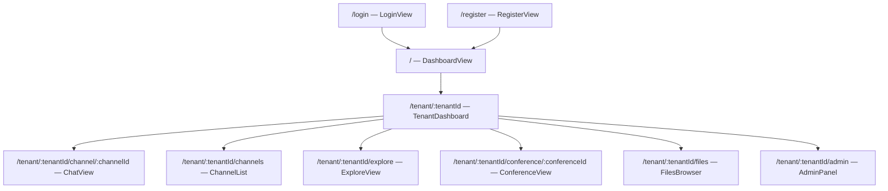

# Frontend

The frontend is a Vue 3 single-page application using Vuetify 3, Pinia, and Vue Router.

## Page Map



## Routes

| Path | Name | Component | Auth | Description |
|------|------|-----------|------|-------------|
| `/login` | `login` | `LoginView` | Guest | Login page |
| `/register` | `register` | `RegisterView` | Guest | Registration page |
| `/` | `dashboard` | `DashboardView` | Yes | Global dashboard (tenant list) |
| `/tenant/:tenantId` | `tenant-dashboard` | `TenantDashboard` | Yes | Tenant-specific dashboard |
| `/tenant/:tenantId/channel/:channelId` | `channel-chat` | `ChatView` | Yes | Channel chat view |
| `/tenant/:tenantId/channels` | `channels` | `ChannelList` | Yes | Channel browser |
| `/tenant/:tenantId/explore` | `explore` | `ExploreView` | Yes | Explore public channels |
| `/tenant/:tenantId/conference/:conferenceId` | `conference` | `ConferenceView` | Yes | Video conference |
| `/tenant/:tenantId/files` | `files` | `FilesBrowser` | Yes | File manager |
| `/tenant/:tenantId/admin` | `admin` | `AdminPanel` | Yes | Tenant admin panel |

Auth guard: authenticated routes redirect to `/login` if no `access_token` in localStorage. Guest routes redirect to `/` if token exists.

## Layout

All authenticated routes are wrapped in `AppLayout.vue`, which provides:
- Navigation sidebar (channel tree, tenant selector)
- Top toolbar
- Main content area

## Views

### Auth

| View | File | Description |
|------|------|-------------|
| LoginView | `views/auth/LoginView.vue` | Username/email + password login |
| RegisterView | `views/auth/RegisterView.vue` | Registration with optional tenant creation |

### Dashboard

| View | File | Description |
|------|------|-------------|
| DashboardView | `views/dashboard/DashboardView.vue` | Lists all tenants the user belongs to |
| TenantDashboard | `views/dashboard/TenantDashboard.vue` | Stats and quick actions for a tenant |

### Chat

| View | File | Description |
|------|------|-------------|
| ChatView | `views/chat/ChatView.vue` | Message list, input, threads |

### Channels

| View | File | Description |
|------|------|-------------|
| ChannelList | `views/channels/ChannelList.vue` | Browse joined channels |
| ExploreView | `views/channels/ExploreView.vue` | Discover and join public channels |

### Conference

| View | File | Description |
|------|------|-------------|
| ConferenceView | `views/conference/ConferenceView.vue` | Video conference room |

### Files

| View | File | Description |
|------|------|-------------|
| FilesBrowser | `views/files/FilesBrowser.vue` | Upload, browse, download files |

### Admin

| View | File | Description |
|------|------|-------------|
| AdminPanel | `views/admin/AdminPanel.vue` | Tenant settings, roles, members |

## Components

| Component | File | Description |
|-----------|------|-------------|
| AppLayout | `components/layout/AppLayout.vue` | Main layout wrapper (sidebar + toolbar) |
| MessageBubble | `components/chat/MessageBubble.vue` | Single message display with reactions, attachments |
| ChannelTreeItem | `components/channels/ChannelTreeItem.vue` | Recursive tree node for channel hierarchy |
| ConfirmDialog | `components/common/ConfirmDialog.vue` | Reusable confirmation dialog |

## Pinia Stores

8 stores manage the application state:

| Store | File | State | Key Actions |
|-------|------|-------|-------------|
| `auth` | `stores/auth.ts` | User profile, tokens | `login`, `register`, `logout`, `refresh`, `fetchMe` |
| `tenant` | `stores/tenant.ts` | Tenant list, current tenant | `fetchTenants`, `createTenant`, `setCurrentTenant` |
| `channels` | `stores/channels.ts` | Channel list, current channel | `fetchChannels`, `createChannel`, `joinChannel`, `leaveChannel` |
| `messages` | `stores/messages.ts` | Message list, threads | `fetchMessages`, `sendMessage`, `editMessage`, `deleteMessage`, `togglePin` |
| `conference` | `stores/conference.ts` | Conference state, participants | `createConference`, `startConference`, `joinConference`, `leaveConference` |
| `files` | `stores/files.ts` | File list | `uploadFile`, `fetchFiles`, `deleteFile`, `recognizeFile` |
| `tasks` | `stores/tasks.ts` | Background task list | `fetchTasks`, `pollTask`, `downloadTaskOutput` |
| `ws` | `stores/ws.ts` | WebSocket connection state | `connect`, `disconnect`, `send`, message handlers |

## Composables

| Composable | File | Description |
|------------|------|-------------|
| `useAuth` | `composables/useAuth.ts` | Auth state and guards for components |
| `useWebSocket` | `composables/useWebSocket.ts` | WebSocket lifecycle management |

## Build

```bash
cd ui
npm install
npm run dev       # Development server (Vite)
npm run build     # Production build (vue-tsc + vite build)
npm run preview   # Preview production build
```
